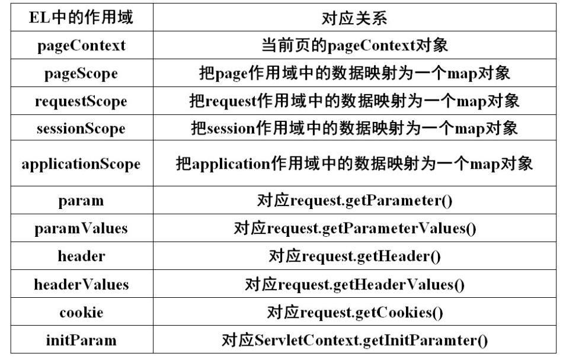
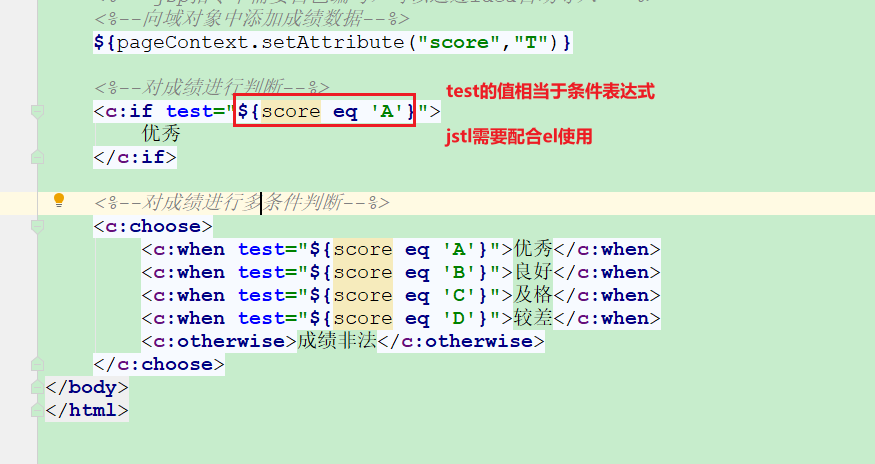
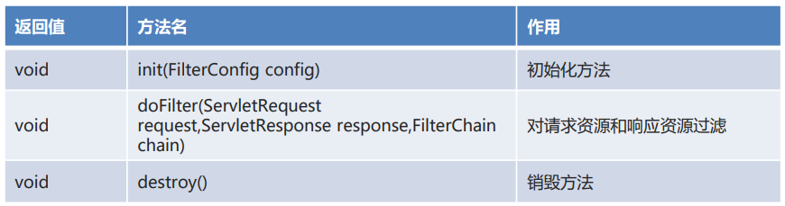
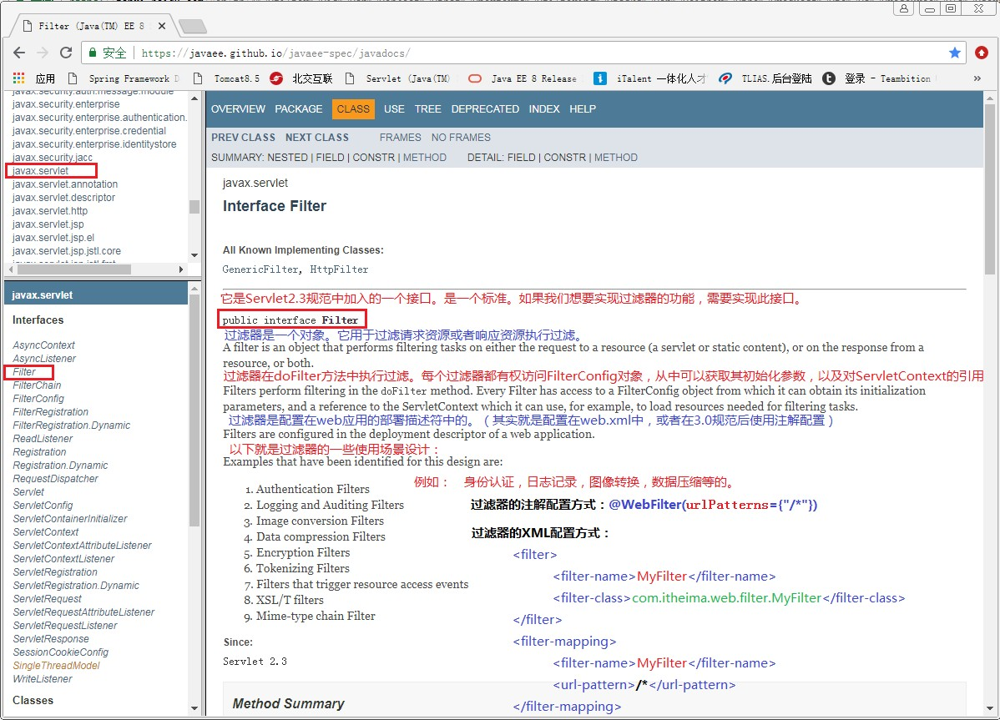
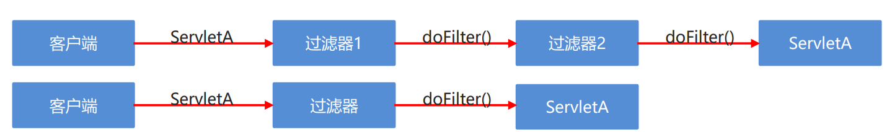
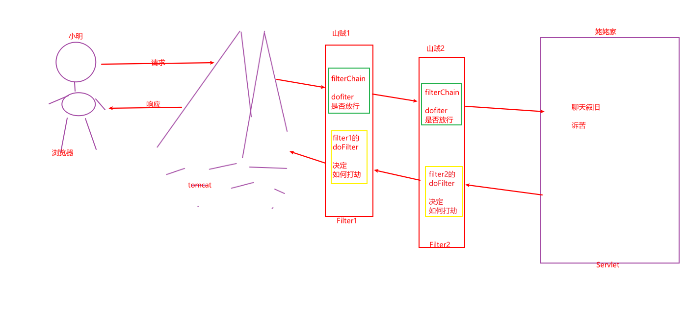

## 1.EL(重点)

### 1.1 概念

EL (Expression Language) 表达式语言

JavaEE的规范之一，出现的目的是为了简化jsp页面中java代码块或者jsp表达式。

使用前

```jsp
<% out.println(request.getSession().getAttribute("username"))%>
<%=request.getSession().getAttribute("username")%>
```

使用后

```jsp
${username}
```


### 1.2 入门案例

```jsp
<%--1.向域对象中添加数据--%>
<% request.setAttribute("username","zhangsan"); %>

<%--2.获取数据--%>
Java代码块：<% out.println(request.getAttribute("username")); %> <br>

JSP表达式：<%= request.getAttribute("username")%> <br>

EL表达式：${username}
```


### 1.3 EL获取不同类型数据及注意事项

```jsp
<%--1.获取基本数据类型--%>
<% pageContext.setAttribute("num",10); %>
基本数据类型：${num} <br>

<%--2.获取自定义对象类型--%>
<%
    Student stu = new Student("张三",23);
    stu = null;
    pageContext.setAttribute("stu",stu);
%>
<%--EL表达式中没有空指针异常--%>
自定义对象：${stu} <br>
<%--stu.name 实现原理 getName()--%>
学生姓名：${stu.name} <br>
学生年龄：${stu.age} <br>

<%--3.获取数组类型--%>
<%
    String[] arr = {"hello","world"};
    pageContext.setAttribute("arr",arr);
%>
数组：${arr}  <br>
0索引元素：${arr[0]} <br>
1索引元素：${arr[1]} <br>
<%--EL表达式中没有索引越界异常--%>
8索引元素：${arr[8]} <br>
<%--EL表达式中没有字符串拼接--%>
0索引拼接1索引的元素：${arr[0]}+${arr[1]} <br>
0索引拼接1索引的元素：${arr[0]}${arr[1]} <br>

<%--4.获取List集合--%>
<%
    ArrayList<String> list = new ArrayList<>();
    list.add("aaa");
    list.add("bbb");
    pageContext.setAttribute("list",list);
%>
List集合：${list} <br>
0索引元素：${list[0]} <br>

<%--5.获取Map集合--%>
<%
    HashMap<String,Student> map = new HashMap<>();
    map.put("hm01",new Student("张三",23));
    map.put("hm02",new Student("李四",24));
    pageContext.setAttribute("map",map);
%>
Map集合：${map}  <br>
第一个学生对象：${map.hm01}  <br>
第一个学生对象的姓名：${map.hm01.name}
```


### 1.4 EL 运算符

```jsp
<%--empty
    判断对象是否为空
    判断字符串或者集合/数组的长度是否为0
--%>
<%
    String str1 = null;
    String str2 = "";
    int[] arr = {};
%>
${empty str1} <br>
${empty str2} <br>
${empty arr} <br>

<%--
    EL中不能进行逻辑判断或循环。但是可以使用三元实现简单的判断效果
    三元运算符。获取性别的数据，在对应的按钮上进行勾选
--%>
<% pageContext.setAttribute("gender","women"); %>
<input type="radio" name="gender" value="men" ${gender == "men" ? "checked" : ""}>男
<input type="radio" name="gender" value="women" ${gender == "women" ? "checked" : ""}>女
```


### 1.5 使用细节

```jsp
<%@ page contentType="text/html;charset=UTF-8" language="java" %>
<html>
<head>
    <title>EL表达式使用细节</title>
</head>
<body>
    <%--获取四大域对象中的数据
        按照域对象的范围从小到大开始查找，找到就使用；找不到不显示。
    --%>
    <%
        pageContext.setAttribute("username","zhangsan1");
        request.setAttribute("username","zhangsan2");
        session.setAttribute("username","zhangsan3");
        application.setAttribute("username","zhangsan4");
    %>
    ${username} <br>
    ${pageScope.username}
    ${requestScope.username}
    ${sessionScope.username}
    ${applicationScope.username}


    <%--获取JSP中其他八个隐式对象  获取虚拟目录名称
        可以通过pageContext对象获取另外8大隐式(内置)对象
    --%>
    <%= request.getContextPath()%>
    ${pageContext.request.contextPath}
    
     <%--  HTML中如何写项目的虚拟路径，一般情况下写死
     	JSP中，可以使用${pageContext.request.contextPath}动态获取项目虚拟路径
     --%>
    <form action="/stu/addStudentServlet">  
        
</body>
</html>
```


### 1.6 EL内置对象及使用（了解）





```jsp
<%--pageContext对象 可以获取其他三个域对象和JSP中八个隐式对象--%>
${pageContext.request.contextPath} <br>

<%--applicationScope sessionScope requestScope pageScope 操作四大域对象中的数据--%>
<% request.setAttribute("username","zhangsan"); %>
${username} <br>
${requestScope.username} <br>

<%--header headerValues  获取请求头数据--%>
${header["connection"]} <br>
${headerValues["connection"][0]} <br>

<%--param paramValues 获取请求参数数据--%>
${param.username} <br>
${paramValues.hobby[0]} <br>
${paramValues.hobby[1]} <br>

<%--initParam 获取全局配置参数--%>
${initParam["pname"]}  <br>

<%--cookie 获取cookie信息--%>
${cookie}  <br> <%--获取Map集合--%>
${cookie.JSESSIONID}  <br> <%--获取map集合中第二个元素--%>
${cookie.JSESSIONID.name}  <br> <%--获取cookie对象的名称--%>
${cookie.JSESSIONID.value} <%--获取cookie对象的值--%>
```


## 2. JSTL(重点)

### 2. 1 概念

JSTL（Java Server Pages Standarded Tag Library）JSP的标准标签库 

### 2.2 和el的区别

EL 是JavaEE内置规范，不需要导包，即可直接使用。功能比较简单，不能进行循环判断等逻辑处理。

JSTL是Apache基金会jakarta小组的产品，是一个第三方标签库，需要导包。替换复杂的Java代码。功能会更强大。


注意：jstl和el一般配合使用，从域对象中获取值，并填充到jsp页面中。


core

### 2.3 jstl使用



判断流程控制

```jsp
<%@ page contentType="text/html;charset=UTF-8" language="java" %>
<%@ taglib prefix="c" uri="http://java.sun.com/jsp/jstl/core" %>
<html>
<head>
    <title>流程控制</title>
</head>
    <body>
    
        <%-- jsp指令不需要自己编写，可以通过idea自动导入 --%>
        <%--向域对象中添加成绩数据--%>
        ${pageContext.setAttribute("score","T")}
    
        <%--对成绩进行判断--%>
        <c:if test="${score eq 'A'}">
            优秀
        </c:if>
    
        <%--对成绩进行多条件判断--%>
        <c:choose>
            <c:when test="${score eq 'A'}">优秀</c:when>
            <c:when test="${score eq 'B'}">良好</c:when>
            <c:when test="${score eq 'C'}">及格</c:when>
            <c:when test="${score eq 'D'}">较差</c:when>
            <c:otherwise>成绩非法</c:otherwise>
        </c:choose>
    </body>
</html>

```


循环流程控制

```jsp
<%@ page import="java.util.ArrayList" %>
<%@ page contentType="text/html;charset=UTF-8" language="java" %>
<%@taglib uri="http://java.sun.com/jsp/jstl/core" prefix="c"%>
<html>
<head>
    <title>循环</title>
</head>
<body>
    <%--向域对象中添加集合--%>
    <%
        ArrayList<String> list = new ArrayList<>();
        list.add("aa");
        list.add("bb");
        list.add("cc");
        list.add("dd");
        pageContext.setAttribute("list",list);
    %>

    <%--遍历集合--%>
    <c:forEach items="${list}" var="str">
        ${str} <br>
    </c:forEach>
</body>
</html>
```


标准输出（从域对象取值）

```jsp
<%--向域对象中添加集合--%>
<%
    String str1 = "aaa";
    pageContext.setAttribute("str1", str1);
%>


<%--out 标准输出 --%>
<%-- 输出指定的内容 --%>
<c:out value="aaa"/><br>

<%--
    从域对象中获取数据并输出
    效果等同于 ${str}
--%>
<c:out value="${str1}"/> <br>
${str1} <br>

<%--
    从域对象中获取内容输出并设置默认值
    获取失败则输出默认值
--%>
<c:out value="${str2}" default="bbb"/>
```


标出输入（往域对象中添加内容）

```jsp
<%-- 向域对象中设置值，默认pageScope --%>
<c:set var="username" value="第一个"/>

<%-- 向指定的域对象中设置值--%>
<c:set var="username" value="第二个" scope="application"/>


<%-- 获取值 --%>
<br><br><br><br><br>
username：${username} <br>
pageScope.username：${pageScope.username} <br>
requestScope.username：${requestScope.username} <br>
sessionScope.username：${sessionScope.username} <br>
applicationScope.username：${applicationScope.username} <br>
```


## 3. Filter(理解)

### 3.1 概念

Filter是Java EE规范的一部分。

所有的请求到达Servlet之前，都可以先经过Filter（过滤器）。

如果请求的资源路径符合FIlter的映射匹配规则，Filter会拦截下来该请求，进行一个额外的特殊操作（登录验证、统一编码的处理、敏感词过滤替换），在决定是否允许该请求到达对应的Servlet。如果允许了，请求可以到达Servlet并处理请求和响应；否则，请求无法到达目的Servlet。


JavaEE中Filter 是一个接口。如果想实现过滤器的功能，必须实现该接口！接口方法规定如下。

**过滤的逻辑写在FIlter接口实现类的doFilter中**




**Filter应用场景**：

1. 登录验证
2. 统一编码
3. ...


API




### 3.2 FilterChain

FilterChain 是一个接口，代表过滤器链对象。由 Servlet 容器提供实现类对象。直接使用即可。

过滤器可以定义多个，就会组成过滤器链。

核心方法

```java
void doFilter(ServletRequest request,ServletResponse response) //放行方法
```

注意：

> 如果有多个过滤器，在第一个过滤器中调用下一个过滤器，依次类推。直到到达最终访问资源。
>
> 如果只有一个过滤器，放行时，就会直接到达最终访问资源。

### 3.3 Filter和FilterChain中核心方法区别

Filter中doFilter方法内编写过滤逻辑

FilterChain中doFilter方法用于放行请求到下个节点。


### 3.4 FIlterChain执行图示




### 3.5 Filter基本使用

```java
/*
    过滤器基本使用
 */
@WebFilter("/*")
public class FilterDemo01 implements Filter{

    @Override
    public void doFilter(ServletRequest servletRequest, ServletResponse servletResponse, FilterChain filterChain) throws IOException, ServletException {
        System.out.println("filterDemo01执行了...");

        // filter  常用做 登录验证、统一编码处理、关键词过滤

        // 1. 登录验证
        HttpServletRequest req = (HttpServletRequest) servletRequest;
        HttpSession session = req.getSession();
        // 判断session中是否含有指定的用户

        // 如果没有用户，说明没登录，不放行；强转servletResponse为HTTPServletRespone对象，重定向到某个登录页面

        // 2. 敏感词过滤


        // 3. 请求对象设置编码，解决post请求乱码问题
        // 处理响应乱码
        servletResponse.setContentType("text/html;charset=UTF-8");

        // 放行
        filterChain.doFilter(servletRequest,servletResponse);
    }
}
```


### 3.5 Filter配置方式

编写FIlter

```java
/*
    过滤器基本使用
 */
public class FilterDemo01 implements Filter{

    @Override
    public void doFilter(ServletRequest servletRequest, ServletResponse servletResponse, FilterChain filterChain) throws IOException, ServletException {
        System.out.println("filterDemo01执行了...");
        FilterChain.doFilter(servletRequest,servletResponse);
    }
}
```

配置web.xml

```xml
<filter>
    <filter-name>filterDemo01</filter-name>
    <filter-class>com.itheima.filter.FilterDemo01</filter-class>
</filter>
<filter-mapping>
    <filter-name>filterDemo01</filter-name>
    <url-pattern>/*</url-pattern>
</filter-mapping>

```


### 3.6 Filter执行顺序

如果有多个filter被匹配到，执行顺序是

> 通过web.xml配置的时候，执行顺序就是<filter-mapping>的配置顺序。

> 通过注解配置的时候，执行顺序就是filter类名的字典顺序
>


### 3.7 多个Filter的执行过程



filterDemo6

```java
/*
    过滤器基本使用
 */
@WebFilter("/*")
public class FilterDemo06 implements Filter{

    @Override
    public void doFilter(ServletRequest servletRequest, ServletResponse servletResponse, FilterChain filterChain) throws IOException, ServletException {
        System.out.println("filterDemo06前置过滤...");

        //处理乱码
        servletResponse.setContentType("text/html;charset=UTF-8");

        //放行
        filterChain.doFilter(servletRequest,servletResponse);

        System.out.println("filterDemo06后置过滤...");
    }
}
```

filterDemo7

```java
/*
    过滤器基本使用
 */
@WebFilter("/*")
public class AFilterDemo07 implements Filter{

    @Override
    public void doFilter(ServletRequest servletRequest, ServletResponse servletResponse, FilterChain filterChain) throws IOException, ServletException {
        System.out.println("filterDemo007前置过滤...");

        //处理乱码
        servletResponse.setContentType("text/html;charset=UTF-8");

        //放行
        filterChain.doFilter(servletRequest,servletResponse);
        System.out.println("filterDemo007后置过滤...");
    }
}
```

ServletDemo2

```java
@WebServlet("/servletDemo02")
public class ServletDemo02 extends HttpServlet {
    @Override
    protected void doGet(HttpServletRequest req, HttpServletResponse resp) throws ServletException, IOException {
        System.out.println("servletDemo02执行了...");
        //resp.setContentType("text/html;charset=UTF-8");
        resp.getWriter().write("servletDemo02执行了...");
    }

    @Override
    protected void doPost(HttpServletRequest req, HttpServletResponse resp) throws ServletException, IOException {
        doGet(req,resp);
    }
}
```


> 访问：http://localhost:8080/filter/servletDemo02

执行结果

> filterDemo007前置过滤...
>
> filterDemo06前置过滤...
>
> servletDemo02执行了...
>
> filterDemo06后置过滤...
>
> filterDemo007后置过滤...


### 3.8 Filter生命周期(理解)

创建：项目启动的时候就实例化Filter

服务：整个项目运行期间

销毁：项目被卸载/服务器关闭

```java
/*
    过滤器生命周期
 */
@WebFilter("/*")
public class FilterDemo03 implements Filter{

    /*
        初始化方法
     */
    @Override
    public void init(FilterConfig filterConfig) {
        System.out.println("对象初始化成功了...");
    }

    /*
        提供服务方法
     */
    @Override
    public void doFilter(ServletRequest servletRequest, ServletResponse servletResponse, FilterChain filterChain) throws IOException, ServletException {
        System.out.println("filterDemo03执行了...");

        //处理乱码
        servletResponse.setContentType("text/html;charset=UTF-8");

        //放行
        filterChain.doFilter(servletRequest,servletResponse);
    }

    /*
        对象销毁
     */
    @Override
    public void destroy() {
        System.out.println("对象销毁了...");
    }
}
```


### 3.9 FilterConfig

filter初始化参数，配置方式类似于Servlet

```xml
<filter>
    <filter-name>filterDemo04</filter-name>
    <filter-class>com.itheima.filter.FilterDemo04</filter-class>
    <init-param>
        <param-name>username</param-name>
        <param-value>zhangsan</param-value>
    </init-param>
</filter>
<filter-mapping>
    <filter-name>filterDemo04</filter-name>
    <url-pattern>/*</url-pattern>
</filter-mapping>
```


在代码中通过filterConfig对象获取配置好的filter初始化参数

```java
/*
    过滤器配置对象的使用
 */
@WebFilter("/*")
public class FilterDemo04 implements Filter{

    /*
        初始化方法
        
        注解配置执行结果
        	对象初始化成功了...
			filterName = com.itheima.filter.FilterDemo04
			username = null
     */
    @Override
    public void init(FilterConfig filterConfig) {
        System.out.println("对象初始化成功了...");

        //获取过滤器名称
        String filterName = filterConfig.getFilterName();
        System.out.println("filterName = " + filterName);

        //根据name获取value
        String username = filterConfig.getInitParameter("username");
        System.out.println("username = " + username);
    }

    /*
        提供服务方法
     */
    @Override
    public void doFilter(ServletRequest servletRequest, ServletResponse servletResponse, FilterChain filterChain) throws IOException, ServletException {
        System.out.println("filterDemo04执行了...");

        //处理乱码
        servletResponse.setContentType("text/html;charset=UTF-8");

        //放行
        filterChain.doFilter(servletRequest,servletResponse);
    }

    /*
        对象销毁
     */
    @Override
    public void destroy() {
        System.out.println("对象销毁了...");
    }

```


### 3.10 五种拦截行为 (了解)

在filter-mapping标签中配置不同的拦截行为

```xml
<filter>
    <filter-name>filterDemo05</filter-name>
    <filter-class>com.itheima.filter.FilterDemo05</filter-class>
    <!--配置开启异步支持，当dispatcher配置ASYNC时，需要配置此行-->
    <async-supported>true</async-supported>
</filter>
<filter-mapping>
    <filter-name>filterDemo05</filter-name>
    <!--<url-pattern>/error.jsp</url-pattern>-->
    <url-pattern>/index.jsp</url-pattern>
    <!--过滤请求：默认值。-->
    <dispatcher>REQUEST</dispatcher>
    <!--过滤全局错误页面：当由服务器调用全局错误页面时，过滤器工作-->
    <dispatcher>ERROR</dispatcher>
    <!--过滤请求转发：当请求转发时，过滤器工作。-->
    <dispatcher>FORWARD</dispatcher>
    <!--过滤请求包含：当请求包含时，过滤器工作。它只能过滤动态包含，jsp的include指令是静态包含，过滤器不会起作用-->
    <dispatcher>INCLUDE</dispatcher>
    <!--过滤异步类型，它要求我们在filter标签中配置开启异步支持-->
    <dispatcher>ASYNC</dispatcher>
</filter-mapping>

<!--配置全局错误页面-->
<error-page>
    <exception-type>java.lang.Exception</exception-type>
    <location>/error.jsp</location>
</error-page>
<error-page>
    <error-code>404</error-code>
    <location>/error.jsp</location>
</error-page>
```


ServletDemo03

```java
@WebServlet("/servletDemo03")
public class ServletDemo03 extends HttpServlet {
    @Override
    protected void doGet(HttpServletRequest req, HttpServletResponse resp) throws ServletException, IOException {
        System.out.println("servletDemo03执行了...");

        //int i = 1/ 0;

        //请求转发
        //req.getRequestDispatcher("/index.jsp").forward(req,resp);

        //请求包含
        req.getRequestDispatcher("/index.jsp").include(req,resp);
    }
}
```


### 3.11 Filter应用场景(重点)

登录验证

统一编码处理（SpringMVC统一编码处理的方案）

敏感词过滤


## 4. Listener(理解)

### 4.1 概念

A对象持续不断的检测某个事情B的发生，B可能是被C触发的。

**组成：**

> 事件源：C，触发事件的对象
>
> 事件：B，B由事件源触发
>
> 监听器：A，一直持续监听事件B


Servlet中的监听器分为：3类8种

> 对象的创建销毁（3个对象）、
>
> - **ServletContext**
>
> - HttpSession
>
> - ServletRequest
>
> 域对象中属性的变化（3个对象）
>
> - ServletContext
>
> - HttpSession
>
> - ServletRequest
>
> 会话相关的感知型监听器
>
> - 对象和会话域绑定
>
> - 会话中对象的活化和钝化


Servlet 规范中共计 8 种监听器，监听器都是以接口形式提供，具体功能需要我们自己来完成。


### 4.2 监听对象创建销毁(有重点)


#### 4.2.1 ServletContextListener(重点)

##### 4.2.1.1 作用

用于监听 ServletContext 对象的创建和销毁


##### 4.2.1.2 方法

| 返回值 | 方法名                                      | 作用                               |
| ------ | ------------------------------------------- | ---------------------------------- |
| void   | contextInitialized(ServletContextEvent sce) | ServletContext对象创建时执行该方法 |
| void   | contextDestroyed(ServletContextEvent sce)   | ServletContext对象销毁时执行该方法 |


##### 4.2.1.3 参数

| 项目       | 对应关系                   |                                          |
| ---------- | -------------------------- | ---------------------------------------- |
| 事件       | ServletContextEvent对象    | 参数。该对象封装了事件源对象             |
| 事件源对象 | ServletContext对象         |                                          |
| 监听器对象 | ServletContextListener对象 | 监听ServletContext对象创建或者销毁的操作 |


##### 4.2.1.4 代码演示

编写普通类并实现Listener接口（ServletContextListener）

```java
/*
    ServletContext对象的创建和销毁的监听器
 */
//@WebListener
public class ServletContextListenerDemo implements ServletContextListener{
    /*
        ServletContext对象创建的时候执行此方法
     */
    @Override
    public void contextInitialized(ServletContextEvent sce) {
        System.out.println("监听到了对象的创建...");

        //获取对象
        ServletContext servletContext = sce.getServletContext();
        //System.out.println(servletContext);

        //添加属性
        servletContext.setAttribute("username","zhangsan");

        //替换属性
        servletContext.setAttribute("username","lisi");

        //移除属性
        servletContext.removeAttribute("username");
    }

    /*
        ServletContext对象销毁的时候执行此方法
     */
    @Override
    public void contextDestroyed(ServletContextEvent sce) {
        System.out.println("监听到了对象的销毁...");
    }
}
```

基于web.xml的配置(或使用注解配置)

```xml
<listener>
    <listener-class>com.itheima.listener.ServletContextListenerDemo</listener-class>
</listener>
```


##### 4.2.1.5 应用场景

> Spring容器所依赖的核心配置文件通过  （全局初始化参数+ServletContextListener） 完成加载和解析。


伪代码模拟一下加载Spring配置文件 beans.xml

```java
/*
    伪代码模拟一下加载Spring配置文件 beans.xml
    
    要求：
    	在项目启动时就加载Spring配置文件并解析
    	
    	项目启动  --》  ServletContext对象产生  --》
    	ServletContextListener监听到  --》执行contextInitialized方法
    	
    	全局初始化参数
    		在项目启动的时候，被加载进ServletContext域
    		
        1. web.xml配置全局初始化参数

        
        <!-- 通过全局初始化参数配置Spring的核心配置文件 -->
        <context-param>
            <param-name>location</param-name>
            <param-value>beans.xml</param-value>
        </context-param>
        
        
        2. ServletContext获取初始化参数
 */
//@WebListener
public class ServletContextListenerDemo implements ServletContextListener{
    /*
         ServletContext对象创建的时候执行此方法
      */
    @Override
    public void contextInitialized(ServletContextEvent sce) {
        // 获取ServletContext对象
        ServletContext servletContext = sce.getServletContext();

        // 通过全局初始化参数获取配置文件的名字
        String locationValue = servletContext.getInitParameter("location");

        // 通过代码实现Spring配置文件的加载
        String realpath = servletContext.getRealPath(locationValue);
        // 解析beans.xml文件
    }
}
```


#### 4.2.2 HttpSessionListener

##### 4.2.2.1 作用

用于监听 HttpSession 对象的创建和销毁


##### 4.2.1.2 方法

| 返回值 | 方法名                                | 作用                            |
| ------ | ------------------------------------- | ------------------------------- |
| void   | sessionCreated(HttpSessionEvent se)   | HttpSession对象创建时执行该方法 |
| void   | sessionDestroyed(HttpSessionEvent se) | HttpSession对象销毁时执行该方法 |


##### 4.2.1.3 参数

| 项目       | 对应关系                |                                       |
| ---------- | ----------------------- | ------------------------------------- |
| 事件       | HttpSessionEvent对象    | 参数。该对象封装了事件源对象          |
| 事件源对象 | HttpSession对象         |                                       |
| 监听器对象 | HttpSessionListener对象 | 监听HttpSession对象创建或者销毁的操作 |


####  4.2.3 ServletRequestListener

##### 4.2.3.1 作用

用于监听 ServletRequest 对象的创建和销毁


##### 4.2.3.2 方法

| 返回值 | 方法名                                      | 作用                               |
| ------ | ------------------------------------------- | ---------------------------------- |
| void   | requestInitialized(ServletRequestEvent sre) | ServletRequest对象创建时执行该方法 |
| void   | requestDestroyed(ServletRequestEvent sre)   | ServletRequest对象销毁时执行该方法 |


##### 4.2.3.3 参数

| 项目       | 对应关系                   |                                          |
| ---------- | -------------------------- | ---------------------------------------- |
| 事件       | ServletRequestEvent对象    | 参数。该对象封装了事件源对象             |
| 事件源对象 | ServletRequest对象         |                                          |
| 监听器对象 | ServletRequestListener对象 | 监听ServletRequest对象创建或者销毁的操作 |


### 4.3 域对象中属性变化

#### 4.3.1 ServletContextAttributeListener

##### 4.3.1.1 作用

用于监听 ServletContext 应用域中属性的变化


##### 4.3.1.2 方法

| 返回值 | 方法名                                               | 作用                                   |
| ------ | ---------------------------------------------------- | -------------------------------------- |
| void   | attributeAdded(ServletContextAttributeEvent scae)    | ServletContext域中添加属性时执行该方法 |
| void   | attributeRemoved(ServletContextAttributeEvent scae)  | ServletContext域中移除属性时执行该方法 |
| void   | attributeReplaced(ServletContextAttributeEvent scae) | ServletContext域中替换属性时执行该方法 |


##### 4.3.1.3 参数

| 项目       | 对应关系                            |                                            |
| ---------- | ----------------------------------- | ------------------------------------------ |
| 事件       | ServletContextAttributeEvent对象    | 参数。该对象封装了事件源对象               |
| 事件源对象 | ServletContext对象                  |                                            |
| 监听器对象 | ServletContextAttributeListener对象 | 监听域中添加、移除、替换会话域中属性的操作 |


##### 4.3.1.4 代码演示

```java
/*
    应用域对象中的属性变化的监听器
 */
//@WebListener
public class ServletContextAttributeListenerDemo implements ServletContextAttributeListener{
    /*
        向应用域对象中添加属性时执行此方法
     */
    @Override
    public void attributeAdded(ServletContextAttributeEvent scae) {
        System.out.println("监听到了属性的添加...");

        //获取应用域对象
        ServletContext servletContext = scae.getServletContext();
        //获取属性
        Object value = servletContext.getAttribute("username");
        System.out.println(value);
    }

    /*
        向应用域对象中替换属性时执行此方法
     */
    @Override
    public void attributeReplaced(ServletContextAttributeEvent scae) {
        System.out.println("监听到了属性的替换...");

        //获取应用域对象
        ServletContext servletContext = scae.getServletContext();
        //获取属性
        Object value = servletContext.getAttribute("username");
        System.out.println(value);
    }

    /*
        向应用域对象中移除属性时执行此方法
     */
    @Override
    public void attributeRemoved(ServletContextAttributeEvent scae) {
        System.out.println("监听到了属性的移除...");

        //获取应用域对象
        ServletContext servletContext = scae.getServletContext();
        //获取属性
        Object value = servletContext.getAttribute("username");
        System.out.println(value);
    }
}
```


#### 4.3.2 HttpSessionAttributeListener 

##### 4.3.2.1 作用

用于监听 HttpSession 会话域中属性的变化

##### 4.3.1.2 方法

| 返回值 | 方法名                                        | 作用                                |
| ------ | --------------------------------------------- | ----------------------------------- |
| void   | attributeAdded(HttpSessionBindingEvent se)    | HttpSession域中添加属性时执行该方法 |
| void   | attributeRemoved(HttpSessionBindingEvent se)  | HttpSession域中移除属性时执行该方法 |
| void   | attributeReplaced(HttpSessionBindingEvent se) | HttpSession域中替换属性时执行该方法 |


##### 4.3.1.3 参数

| 项目       | 对应关系                         |                                            |
| ---------- | -------------------------------- | ------------------------------------------ |
| 事件       | HttpSessionBindingEvent对象      | 参数。该对象封装了事件源对象               |
| 事件源对象 | HttpSession对象                  |                                            |
| 监听器对象 | HttpSessionAttributeListener对象 | 监听域中添加、移除、替换会话域中属性的操作 |


#### 4.3.3 ServletRequestAttributeListener

##### 4.3.3.1 作用

用于监听 ServletRequest 请求域中属性的变化


##### 4.3.3.2 方法

| 返回值 | 方法名                                               | 作用                                   |
| ------ | ---------------------------------------------------- | -------------------------------------- |
| void   | attributeAdded(ServletRequestAttributeEvent srae)    | ServletRequest域中添加属性时执行该方法 |
| void   | attributeRemoved(ServletRequestAttributeEvent srae)  | ServletRequest域中移除属性时执行该方法 |
| void   | attributeReplaced(ServletRequestAttributeEvent srae) | ServletRequest域中替换属性时执行该方法 |


##### 4.3.3.3 参数

| 项目       | 对应关系                            |                                            |
| ---------- | ----------------------------------- | ------------------------------------------ |
| 事件       | ServletRequestAttributeEvent对象    | 参数。该对象封装了事件源对象               |
| 事件源对象 | ServletRequest对象                  |                                            |
| 监听器对象 | ServletRequestAttributeListener对象 | 监听域中添加、移除、替换会话域中属性的操作 |


### 4.4  会话相关的感知型监听器

感知性监听器：不需要注册即可生效的监听器


#### 4.4.1 HttpSessionBindingListener

##### 4.4.1.1 作用

用于感知对象和会话域绑定的监听器

##### 4.4.1.2 方法

| 返回值 | 方法名                                      | 作用                                 |
| ------ | ------------------------------------------- | ------------------------------------ |
| void   | valueBound(HttpSessionBindingEvent event)   | 数据添加到会话域中(绑定)时执行该方法 |
| void   | valueUnbound(HttpSessionBindingEvent event) | 数据从会话域中移除(解绑)时执行该方法 |


##### 4.4.1.3 参数

| 项目       | 对应关系                         |                                  |
| ---------- | -------------------------------- | -------------------------------- |
| 事件       | HttpSessionBindingEvent对象      | 参数。该对象封装了事件源对象     |
| 事件源对象 | HttpSession对象                  |                                  |
| 监听器对象 | HttpSessionAttributeListener对象 | 添加、移除会话域中对象数据的操作 |


#### 4.4.2 HttpSessionActivationListener

##### 4.4.2.1 作用

用于感知会话域中对象钝化和活化的监听器


##### 4.4.2.2 方法

| 返回值 | 方法名                                    | 作用                         |
| ------ | ----------------------------------------- | ---------------------------- |
| void   | sessionWillPassivate(HttpSessionEvent se) | 会话域中数据钝化时执行该方法 |
| void   | sessionDidActivate(HttpSessionEvent se)   | 会话域中数据活化时执行该方法 |


##### 4.4.2.3 参数

| 项目       | 对应关系                          |                              |
| ---------- | --------------------------------- | ---------------------------- |
| 事件       | HttpSessionEvent对象              | 参数。该对象封装了事件源对象 |
| 事件源对象 | HttpSession对象                   |                              |
| 监听器对象 | HttpSessionActivationListener对象 | 会话域中数据钝化、活化的操作 |


## 5. 学生管理系统