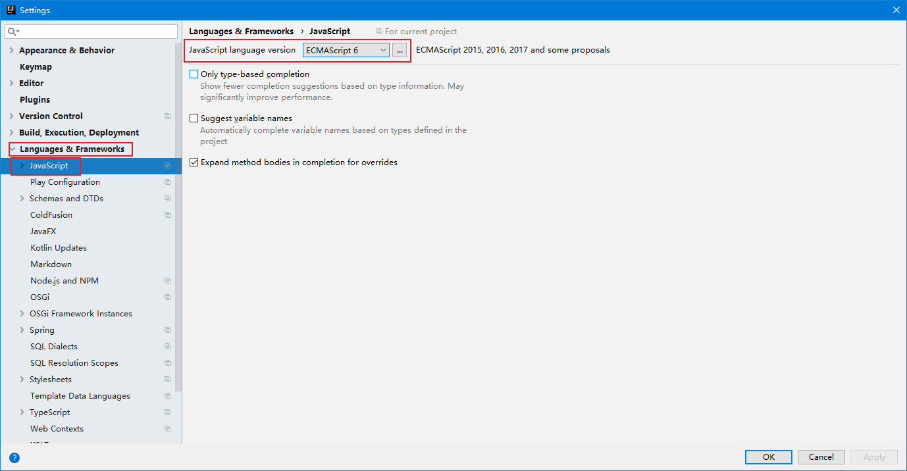
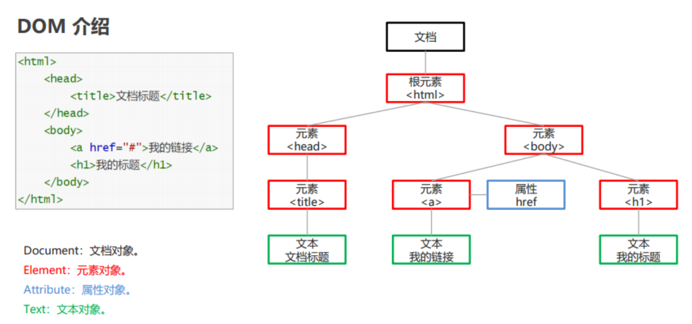
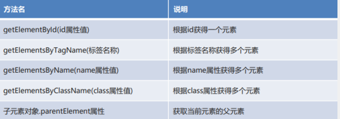

## 1. `JavaScript`概念

### 1.1 概述

1.1.1 前端三剑客

- HTML
  负责网页的骨架和基本内容填充
- CSS
  负责页面的美化
- JavaScript
  增强页面与用户的交互，添加动态效果

### 1.2 概念

- JavaScript 是一种客户端脚本语言。运行在客户端浏览器中，每一个浏览器都具备解析 JavaScript 的引擎。
  脚本语言：不需要编译，就可以被浏览器直接解析执行了。

### 1.4 发展史

JavaScript在1995年由NetScape（网景）公司的Brendan Erich(布兰奇.艾奇)，仅用10天时间开发设计完成

欧洲计算机制造联盟（ECMA）在1997年制定了脚本语言规范ECMAScript1（es1）
		==2009年发布了ECMAScript5（es5），2015年发布了ECMAScript6（es6），最新版本是es8==
		**目前主流版本就是es5和es6**

### 	1.5 作用

增强页面与用户的交互，添加动态效果

==交互依赖事件==

==动态效果是通过对页面中元素的增删改查实现，DOM树模型==

### 1.6 组成

- ECMAScript		基础语法+基础对象
- BOM（Browser Object Model）浏览器对象模型
  - 对浏览器进行操作的
- DOM（Document Object Model）文档对象模型  xml/html
  - 对页面中元素进行操作
  - 与HTML标签对应

### 1.7 和Java的关系、区别

- 没有关系		

- 区别：面向对象、运行方式、跨平台、数据类型

  | 项目     | Java                               | JavaScript                           |
  | -------- | ---------------------------------- | ------------------------------------ |
  | 面向对象 | 完全面向对象的语言                 | 基于对象与事件的编程语言             |
  | 运行方式 | java-》.class-》jvm                | 浏览器直接解析运行，没有任何中间代码 |
  | 跨平台   | 支持。只要有jvm就可以运行          | 支持。只要有浏览器就可以运行         |
  | 数据类型 | 强类型。定义变量需要声明具体的类型 | 弱类型。值的类型决定变量的类型。     |
  
  ​		

### 1.8 引入方式

- 行内方式
  写在Html标签内部（可配合事件属性使用）
- 内部方式
  在head标签中的Script标签内部编写JS代码
  上课使用的方式，不用来回切换
- 外部方式
  在head标签中的script标签中，通过scr输入引入js文件，js代码写在js文件中
  开发中推荐的方式，耦合低，可复用
- **注意**
  1. 内部方式和外部方式不能同时出现在同一个Script标签中，多个标签不受此限制。
  2. 在多个位置对同一个元素同一个事件多次定义，文档后面的会覆盖前面的。
  3. `script`标签不要自闭合


```js
<!DOCTYPE html>
<html lang="en">
<head>
    <meta charset="UTF-8">
    <title>Title</title>
</head>
<body>
    <!-- 行内方式：，只对当前标签有效，不推荐使用 -->
    <button id="btn" onclick="alert('点我干嘛3');">点我试试</button>

</body>
<!-- 外部方式：可以多个页面复用，工作中推荐使用 -->
<script src="js/xxx.js"></script>
<!-- 内部方式：当前页面中所有标签可用，学习过程中使用 -->
<script >
    document.getElementById("btn").onclick = function () {
        // 逻辑
        alert("点我干嘛");
    }
</script>
</html>
```


### 1.9 开发工具安装

...

idea


## ==2. ECMAScript基础语法==

### 	2.1注释

- 单行注释

  ```js
   // 注释的内容
  ```

- 多行注释 

  ```js
  /*
     注释的内容
  */
  ```

### 2.2输入输出

- 弹框

  BOM中window对象的三个方法

  - **alert(message)  编码测试时弹窗**
    				message					 要在 window 上弹出的对话框中显示的纯文本
  - **confirm(message)  确认框，显示带有一段消息以及确认按钮和取消按钮的对话框。**
    				message					要在 window 上弹出的对话框中显示的纯文本
  - prompt(text,defaultText)  显示可提示用户输入的对话框。
    				text  可选。要在对话框中显示的纯文本（而不是 HTML 格式的文本）。
    				defaultText 可选。默认的输入文本。		

- 控制台输出

  - console.log(message)  输出到控制台，检查代码错误
    				F12 --》console
    				主要用于查看后台响应的数据
  - **页面内容输出**
    			document.write(message)
          			向页面写字符串或HTML代码
  
  ```js
  <script>
      //1.输入框
      // prompt("请输入数据");
  
      //2.弹出警告框，学习过程中使用比较多，用作中间结果展示，像java中sout打印结果调试程序使用。
      // alert("hello");
  
      //3.控制台输出  java中sout
      //console.log("hello js");
  
  
      // 5. 确认提示框
      confirm("你确定要删除吗？");
  
      //4.页面内容输出，
      document.write("hello js");
      document.write("<br>");
      document.write("hello js");
  </script>
  ```
  
  

### 2.3 变量和常量

JS是一中弱类型语言，所有变量使用统一的关键字定义
- var是es5的定义方式，允许重复定义

- let是es6新特性，同一个作用范围内不允许重复定义，有作用范围的概念
  - 变量必须先赋值再使用，否则undefined
  - 常量必须在定义的时候赋值，且不能再次修改
  
  ```js
  <script>
  
      /*
      * 定义变量/常量的方式：es5/es6
      * es5  var   idea默认的支持版本
      * es6  let
      *
      *
      * */
  
      //1.定义局部变量，变量的类型由其值确定的
      let name = "张三";
      let age = 23;
      document.write(name + "," + age + "<br>");
  
      {
          let name ="";
          //定义局部变量
          let l1 = "aa";
          //2.定义全局变量
          l2 = "bb";
      }
      // js中某一个代码出了问题，之后的代码不会继续执行。
      // document.write(l1);
      document.write(l2 + "<br>");
  
      //3.定义常量
      const PI = 3.1415926;
      //PI = 3.15;
      document.write(PI);
  
  
  
      document.write("---------------------");
      var xxx = "123";
      var xxx ="456";
      {
          var xxx = "789";
      }
      /*
      * var可以重复定义多个同名变量，后面的覆盖前面的，没有全局的概念
      * let 在同一个范围内不可以重复定义（类似java），在 不同的范围内可以重复定义
      * */
  
  
      // let name = "李四";
      document.write(xxx);
      document.write(name);
  
  
      // 变量必须先赋值再使用，否则其值为undefined，但是不可以不声明就直接使用。
      let gender;
      document.write(gender);
  
  </script>
  ```
  





### 2.4 数据类型

- Undefined		Undefined 类型只有一个值，即 undefined。
  				声明的变量未初始化，或未声明该变量
    		当函数无明确返回值时，返回的也是值 "undefined"
  
- Null（关联Object）
  		Null类型只有一个值，即null
    只有对象变量的值才能为null
  
- Boolean
  		两个值 true 和 false （即两个 Boolean 字面常量）。
  
- Number
  		包括整数和浮点数
    		直接输入的任何数字都被看做 Number 类型
  
  - NaN
    		特殊的Number值，not a number
      		常出现在类型（String、Boolean 等）转换成数字失败的占位符
      		不能参与运算，且不等于其本身
      		isNaN() 用户判断是否是非数字
  
- String
  		js中只有字符串，没有字符
    使用单引号双引号均可
  
- Bigint
  		新类型，范围更大，运算更精准
  
- typeof
  		写法：`typeof 变量名`  或者  `typeof(变量名)`
    		返回指定的变量或常量类型的运算符
    		返回值
    			undefined - 如果变量是 Undefined 类型的
    			boolean - 如果变量是 Boolean 类型的
    			number - 如果变量是 Number 类型的
    			string - 如果变量是 String 类型的
    			object - 如果变量是一种引用类型或 Null 类型的
  
  ```js
  <script>
  
      /*
      * typeof()  和  typeof空格 效果一样，都可以查看变量和常量的类型
      * NULL 在java中可以理解成引用类型的占位符
      *      在js中，也可以这样理解，理解成Object类型的占位符
      * */
  
      let l1 = true;
      document.write(typeof(l1) + "<br>");    // boolean
  
      let l2 = null;
      document.write(typeof(l2) + "<br>");    //    object  js原始的一个错误
  
      let l3;
      document.write(typeof(l3) + "<br>");    // undefined
  
      let l4 = 10;
      document.write(typeof(l4) + "<br>");    // number  NaN  占位符，当其他类型的值转换成数字失败的时候NaN != NaN
  
      let l5 = "hello";
      document.write(typeof(l5) + "<br>");    // string
  
      let l6 = 100n;
      document.write(typeof(l6) + "<br>");    // bigint
  </script>
  ```
  
  

### 2.5 运算符

​	与Java大体类似

- 不同之处：
  
  - == 和 ===
    前者只比较内容，内容一样就为true
    先比较类型，不一样就false；类型内容都一样，才为true
  - 非`+`运算符中有字符串和数字参与运算的时候
  
  
  
  ```js
  <script>
      let num = "10";
      document.write(num + 5 + "<br>");   // 105
      document.write(num + "5" + "<br>"); // 105
      document.write(num - 5 + "<br>");   // 5
      document.write(num * 5 + "<br>");   // 50  字符串类型数字进行运算，会自动类型转换
  
      let num2 = 10;
      document.write(num == num2);    // true  == 只比较值是否相同
      document.write(num === num2);   // false === 比较数据类型和值是否相同
  </script>
  ```
  
  

### 2.6 条件控制和循环控制

​	和Java大体一样

- if…else只是在声明变量时不一样
- switch关键字后的变量类型不受限制
- 可以根据自动类型转换简化循环/判断
- 经验分享
  idea默认不支持ES6，修改即可
- 类型转换
  其他类型转Boolean，方便进行判断
  number --> boolean      0/NaN为false，其他都为true
  String --> boolean 		""为false，其他都为true
  Object --> boolean		 null ---> 		false，其他为true
  undefined		false

```js
<script>
    //if语句
    let month = 3;
    let month1;
    /*
        其他类型自动转换到boolean类型
        Number  0是false，非0就是true
        String  ""是false，其他是true
        Object  null是false，其他是true
        undefined   就是false

    */
    // java中
    while(month == 3){

    }

    // js中，这里会有自动类型转换
    while(month){

    }


    if(month) {
        document.write("春季");
    }else if(month >= 6 && month <= 8) {
        document.write("夏季");
    }else if(month >= 9 && month <= 11) {
        document.write("秋季");
    }else if(month == 12 || month == 1 || month == 2) {
        document.write("冬季");
    }else {
        document.write("月份有误");
    }

    document.write("<br>");

    //switch语句，switch后面括号里面变量的类型不受限制
    switch(month){
        case 3:
        case 4:
        case 5:
            document.write("春季");
            break;
        case 6:
        case 7:
        case 8:
            document.write("夏季");
            break;
        case 9:
        case 10:
        case 11:
            document.write("秋季");
            break;
        case 12:
        case 1:
        case 2:
            document.write("冬季");
            break;
        default:
            document.write("月份有误");
            break;
    }

    document.write("<br>");

    //for循环
    for(let i = 1; i <= 5; i++) {
        document.write(i + "<br>");
    }

    //while循环
    let n = 6;
    while(n <= 10) {
        document.write(n + "<br>");
        n++;
    }

   /*
    * boolean     true  false
    * undefined   == false
    * number      0 NaN ==false，其他都是true
    * String      长度0位false ，其他为true
    * null        == false
    * */

    while (true){
        console.log(1);
    }


</script>
```


## 3. `ECMAScript`对象

### 3.1 数组(理解)

后台进行数据的遍历操作更安全。

- 数组长度获取和索引范围与Java中相同，但长度可变

- 定义格式
  let 数组名 = [元素1, 元素2];

- 不同点

  - `js`中数组长度可变。

  - 无索引越界异常

  - 不存在的索引的元素未初始化，值为undefined

  - ~~高级运算符...~~

    ~~复制数组~~
    			语法： [...被复制的数组]
    			let arr2 = [...arr];
    ~~合并数组~~
    			语法：[...被合并数组1, 被合并数组2 ]
    			字符串转数组（相当于Java中的toCharArray）
  
  ```js
  <script>
      /*
      * ECMAScript基础对象：数组 （基本使用即可） +  函数  （重点）
      *
      *
      * */
  
      //定义数组
      let arr = [10, 20, 30];
      arr[3] = 40;  // js中的数组长度可变
      //遍历数组
      for (let i = 0; i < arr.length; i++) {
          document.write(arr[i] + "<br>");
      }
  
      // js中数组长度可变，没有索引越界异常，使用到没有定义的元素，其值为undefined
      document.write(arr[8] + "<br>");
  
  
      ////////////////////////////////////////////////////////////一下内容不需要掌握
  
      document.write("==============<br>");
  
      // 数组高级运算符 ...
      //复制数组
      let arr2 = [...arr];
      //遍历数组
      for (let i = 0; i < arr2.length; i++) {
          document.write(arr2[i] + "<br>");
      }
      document.write("==============<br>");
  
      //合并数组
      let arr3 = [40, 50, 60];
      let arr4 = [...arr2, ...arr3];
      //遍历数组
      for (let i = 0; i < arr4.length; i++) {
          document.write(arr4[i] + "<br>");
      }
      document.write("==============<br>");
  
      //将字符串转成数组
      let arr5 = [..."heima"];
      //遍历数组
      for (let i = 0; i < arr5.length; i++) {
          document.write(arr5[i] + "<br>");
      }
  </script>
  ```
  
  

### ==3.1 函数(重点)==

对应Java中的方法，封装JS业务代码，方便复用

#### 3.1.1 命名函数

**定义格式**

```js
function 函数名(参数列表){
	函数体；
	[return 返回值;] // 可以没有
}
```

**调用方式**
		let 返回值变量 = 函数名(实参列表);

**应用场景**
		常规js业务代码封装

#### 3.1.2 匿名函数

**定义格式**

```js
[let 变量名 = ]function (参数列表){  //[]表示可以没有
	函数体；
	[return 返回值;] // 可以没有
}
```

**调用方式**
				let 返回值变量 = 变量名(实参列表);	//效果与命名函数相同，无意义

​		 // 在定义函数的时候，就已经把函数对象和事件绑定在了一起，只要事件触发了，对应的函数就会执行。

​		事件 = function(参数列表){方法体};   

**应用场景**
				配合JS绑定事件，实现动态交互效果。

#### 3.1.3 函数定义注意事项

1. 不需要在函数上定义返回值类型

2. 没有访问权限修饰符

3. 形参不需要使用let/var设置类型，直接写变量名字即可

4. 调用与赋值

   let result = fun();	//调用fun函数，并将返回值赋值给result变量
   let xxx = fun;	//把fun函数对象赋值给xxx，之后可以使用xxx或者fun调用该函数。

#### 3.1.4 函数对象与事件绑定

元素对象.onclick = fun;   // 把fun和onclick()绑定在一起

元素对象.onclick = fun(){函数体};//定义匿名函数并将该函数绑定给事件

#### 3.1.5 函数重载与调用传参

- JS中没有函数重载，会自动覆盖前面已定义的同名函数
  调用函数时可以传递任意个数的实参，不受形参个数影响

- 这里的可变参数没用
  
- 调用函数传参原理

  1. 每个函数内部都有一个函数的内置数组对象arguments[]，用来接收调用函数时传的实参

  2. arguments[N]，用来接收调用时传递过来的第N+1个实参

     eg：arguments[0]接收调用时传递的第1的参数

     有几个实参，数组长度就是多长

  3. 执行函数时，将arguments[N]的值赋值给第N+1个形参

     eg：arguments[0]的值 赋值给第一个形参

     有几个形参，就从数组中取多少个数据赋值给形参，超出数组有效长度的就是undefined

  ```js
  <script>
      /*
      * 分类：
      *   命名函数：一般做常规js业务逻辑的封装
      *   匿名函数：一般配合事件完成动态交互。
      *   如果把匿名函数对象赋值给一个变量，可以通过变量名调用该函数，效果和命名函数一样。
      *
      * 注意事项：
      *   没有返回值类型、访问权限修饰符、形参列表中的数据类型
      *
      * Js中没有函数重载
      *   如果存在[参数个数不一样的]同名函数，后面的会覆盖前面的。
      *
      * JS中函数调用传参的原理
      *   JS函数中，内置了一个数组对象arguments，调用方法时传递的参数都会被封装到这个数组中，方便使用。
      *   函数执行时，会自动把数组中的元素按个遍历复制给形参。
      *   我们可以使用形参进行运算，也可以直接跳过形参，使用arguments来进行运算。
      *
      * */
  
      //无参无返回值的方法
      function println(){
          document.write("hello js" + "<br>");
      }
      //调用方法
      println();
  
      //有参有返回值的方法
      function getSum(num1,num2){
          return num1 + num2;
      }
      //调用方法
      let result = getSum(10,20);
      document.write(result + "<br>");
  
  
  
      //可变参数  对n个数字进行求和
      function getSum(...params) {
          let sum = 0;
          for(let i = 0; i < params.length; i++) {
              sum += params[i];
          }
          return sum;
      }
      //调用方法
      let sum = getSum(10,20,30);
      document.write(sum + "<br>");
  
      //匿名函数
      let fun = function(){
          document.write("hello" + "<br>");
      }
      fun();
  
  
  
  
  
      //有参有返回值的方法
      function getSum2(num1,num2){
          return 10;
      }
  
  
      //有参有返回值的方法
      function getSum2(num1,num2,num3){
          alert(arguments[0]);
          alert(arguments[1]);
          alert(arguments[2]);
          return 20;
      }
  
      //调用方法
      // let result2 = getSum2(10,20);
      // document.write(result2 + "<br>");
  
  
      //调用方法
      // let result3 = getSum2(10,20,30);
      // document.write(result3 + "<br>");
  
      //调用方法
      let result4 = getSum2(10);
      document.write(result4 + "<br>");
  
  
  </script>
  ```
  
  

## ==4. `ECMAScript DOM`==


#### 4.1 概念

DOM（Document Object Model）

`XML`解析分为两种方式`DOM和SAX`。`DOM`方式就是把xml文档中的标签和属性封装成一个个对象，并组织成一个树形结构。

HTML的DOM也是一样的原理，无非解析的不再是XML而变成了HTML。每个页面都会被解析成一个属性DOM对象，页面中元素对应的对象名如下：

- 页面	Document
- ~~标签	Element~~
- ~~属性	Attribute~~
- ~~文本	Text~~

上述四个对象其实是属于XML的DOM对象，在HTML不常用！

如果想要操作HTML内的元素及其相关内容，可以直接通过HTML的对象及其属性完成，不需要通过上述四个对象



#### ==4.2 元素的查询==

- 推荐用法
  document.querySelector(CSS selectors)
  			根据CSS选择器返回第一个元素对象
  elementList = document.querySelectorAll(selectors)	
  			返回文档中匹配指定 CSS 选择器的所有元素
  
- selectors			选择器字符串表示形式		
  
- 不推荐用法

  

```js
<script>
    // CSS 选择器  可以按照指定规则获取页面中符合要求的元素（标签）
    // document  dom的根对象，也是一个内置对象
    // 参数selectors    参数，css样式的字符串形式
    // querySelector 根据指定的选择器获取第一个符合要求的元素
    // querySelectorAll 根据指定的选择器获取所有符合要求的元素
    // 简单的获取方式
    // querySelector 根据选择 器获取单个对象
    let element = document.querySelector("#div1");
    alert(element);

    // querySelectorAll 根据选择器获取多个对象
    let elements = document.querySelectorAll(".cls");
    alert(elements.length)

    let elementByName = document.querySelectorAll("div");
    alert(elementByName.length)
    //1. getElementById()   根据id属性值获取元素对象
    let div1 = document.getElementById("div1");
    //alert(div1);

    //2. getElementsByTagName()   根据元素名称获取元素对象们，返回数组
    let divs = document.getElementsByTagName("div");
    //alert(divs.length);

    //3. getElementsByClassName()  根据class属性值获取元素对象们，返回数组
    let cls = document.getElementsByClassName("cls");
    //alert(cls.length);

    //4. getElementsByName()   根据name属性值获取元素对象们，返回数组
    let username = document.getElementsByName("username");
    //alert(username.length);


    //5. 子元素对象.parentElement属性   获取当前元素的父元素
    let body = div1.parentElement;
    // alert(body);


</script>
```


#### 4.3 元素的增删改(了解)

文档位置：`XML--》XML DOM--》Element、Document`

```js
<script>
    //1. createElement()   创建新的游离元素
    let option = document.createElement("option");
    //为option添加文本内容
    option.innerText = "深圳";
    // <option>深圳</option>

    //2. appendChild()     将子元素添加到父元素中
    let select = document.getElementById("s");
    select.appendChild(option);

    //3. removeChild()     通过父元素删除子元素
    //select.removeChild(option);

    //4. replaceChild()    用新元素替换老元素
    let option2 = document.createElement("option");
    option2.innerText = "杭州";
    select.replaceChild(option2,option);
</script>
```


#### 4.4 属性(了解)

```js
<head>
    <meta charset="UTF-8">
    <meta name="viewport" content="width=device-width, initial-scale=1.0">
    <title>属性的操作</title>
    <style>
        .aColor{
            color: blue;
        }
    </style>
</head>
<body>
    <a class="aColor" >点我呀</a>
</body>
<script>
    //1. setAttribute()    添加属性
    let a = document.getElementsByTagName("a")[0];
    // a.setAttribute("href","https://www.baidu.com");
    // 对象.属性名  可以获取或者设置属性的值
    a.href = "https://www.baidu.com";

    //2. getAttribute()    获取属性
    // let value = a.getAttribute("href");

    // 对象.属性名  可以获取或者设置属性的值
    // let value = a.href;
    // alert(value);

    //3. removeAttribute()  删除属性
    //a.removeAttribute("href");

    //4. style属性   添加单个样式
    //a.style.color = "red";

    //5. className属性   添加指定样式集合，同构css的类选择器
    a.className = "aColor";

</script>
```


#### ==4.5 文本(重点)==

```js
<body>
    <div id="div">00544</div>
</body>
<script>
    //1. innerText   获取/添加文本内容，不解析标签
    let div = document.getElementById("div");
    let text = div.innerText;
    alert(text);

    div.innerText += "我是div";	//+= 在原文本后面拼接新的文本
    //div.innerText = "<b>我是div</b>";

    //2. innerHTML   获取/添加文本内容，解析标签
    div.innerHTML += "<b>44944</b>";

</script>
```


## ==5. 事件==

事件指的就是当某些组件(页面中的元素)执行了某些操作后，会自动触发指定代码的执行。

### 5.1 常见事件

onclick	单击事件

onfocus		(输入框)获取焦点

onblur		(输入框)失去焦点

onmouseover	鼠标悬停

onmouseout	鼠标移出

onchange		(输入框)内容发生改变

onload			当前页面加载完毕

onsubmit		表单提交

ondblclick	双击事件

onkeyup			按键弹起


### 5.2 事件绑定方式


- **动态绑定**

  通过标签对象的属性，把匿名函数绑定在元素上。

  本质：将函数对象赋值给元素对象的onXxxx 属性

  格式1：

  > up.onclick = function(){	
  >
  > ​	down(); //调用down这个函数
  >
  > }

  格式2：

  > up.onclick = up;
  >
  >  function up(){	
  >
  > ​	down(); //调用down这个函数
  >
  > }

- **静态绑定**

  直接在标签体上，为标签的事件属性赋值，值为该事件触发时要执行的代码。

  本质：onclick属性的值里面的代码

  格式：

  > <button onclick="xxx()">


- **两者联系**

  静态绑定被浏览器解析完，是动态绑定的效果。onXxx的值会被放在动态绑定的函数体内。


- **代码**

```js
<script>
    /*
    * 事件绑定两种方式
    *   1. 动态绑定   --  推荐使用
    *       通过为元素对象的事件属性赋值，本质上是把函数对象赋值给了元素的属性
    *       两种格式：配置匿名函数或者命名函数实现,，方式1：
    *       upBtn.onclick = up;
    *       function up(){
                let img = document.getElementById("img");
                img.setAttribute("src","img/01.png");
            }

            方式2：
            upBtn.onclick = function(){
                let img = document.getElementById("img");
                img.setAttribute("src","img/01.png");
            }

    *
    *
    *   2. 静态绑定
    *       把一些代码赋值给了标签的事件属性，当对应的事件触发的时候，会自动执行相应的代码。
    *       本案例中，这段代码就是调用down这个函数
    *       静态绑定底层是通过动态绑定实现的。
    *       <button id="down" onclick="down();">下一张</button>
    *       就相当于
    *       <button id="down">下一张</button>
    *       let downBtn = document.getElementById("down");
            downBtn.onclick = function () {
                down();
            }
    *
    *
    * */


   /* //显示第一张图片的方法
    function up(){
        let img = document.getElementById("img");
        img.setAttribute("src","img/01.png");
    }*/


    //  动态绑定。为上一张按钮绑定单击事件，把up这个函数对象赋值给了upBtn元素对象的onclick属性
    let upBtn = document.getElementById("up");
    // upBtn.onclick = up;
    upBtn.onclick = function (){
        let img = document.getElementById("img");
        img.setAttribute("src","img/01.png");
    };

    // 静态绑定
    //显示第二张图片的方法
    function down(){
        let img = document.getElementById("img");
        img.setAttribute("src","img/02.png");
    }


    // 静态绑定底层是通过动态绑定来实现的
    /*
    let downBtn = document.getElementById("down");
    downBtn.onclick = function () {

        down();
    }*/

</script>
```


### 5.3 onload事件

```js
    <script>
        // 函数的入口
        window.onload = function () {


           //显示第二张图片的方法
            function down() {
                let img = document.getElementById("img");
                img.setAttribute("src", "img/02.png");
            }

            // 为下一张按钮绑定单击事件
            // 动态绑定，通过获取元素对象，为其onclick属性绑定某个函数对象
            let downBtn = document.getElementById("down");
            // 这里的down不能带小括号，因为需要把一个函数对象绑定给onclick，而不是把函数调用完的返回值赋值给onclick
            downBtn.onclick = down; // down  是一个函数对象，该操作会为下一页的按钮绑定一个名叫down的函数的对象


        };
		// 显示第一张图片
        function up() {
            let img = document.getElementById("img");
            img.setAttribute("src", "img/01.png");
        }
    </script>
</head>
<body>

<br>
<!-- 在标签的属性位置通过onXxxx属性知道要执行的代码 -->
<button id="up" onclick="up()">上一张</button>
&nbsp;&nbsp;&nbsp;&nbsp;&nbsp;&nbsp;&nbsp;&nbsp;&nbsp;&nbsp;&nbsp;&nbsp;&nbsp;&nbsp;&nbsp;&nbsp;&nbsp;&nbsp;&nbsp;&nbsp;&nbsp;&nbsp;&nbsp;&nbsp;&nbsp;&nbsp;&nbsp;&nbsp;&nbsp;&nbsp;&nbsp;&nbsp;&nbsp;&nbsp;&nbsp;&nbsp;&nbsp;&nbsp;&nbsp;&nbsp;&nbsp;&nbsp;&nbsp;&nbsp;&nbsp;
<button id="down">下一张</button>
</body>

</html>
```


### 5.4 onsubmit事件

onSubmit：监听表单的提交，如果该事件绑定的函数返回true，表单将提交；否则不提交。

```js
<!DOCTYPE html>
<html lang="en">
<head>
    <meta charset="UTF-8">
    <meta name="viewport" content="width=device-width, initial-scale=1.0">
    <title>事件</title>
</head>
<!--<body>
    <form action="#" id="userform" >
        <input type="text" name="username" id="username">
        <input type="submit">
    </form>
</body>
<script>
    // 动态绑定
    let formObj = document.querySelector("#userform");
    formObj.onsubmit = function () {

        // onsubmit事件常用于绑定在form表单上，当表单提交的时候，会触发该事件。
        // onsubmit事件绑定的函数如果返回的是true，表单就会提交；否则，表单不会提交。
        // return false;
    }

</script>-->


<body>
    <form action="#" id="userform" onclick="return xxsubmit();">
        <input type="text" name="username" id="username">
        <input type="submit">
    </form>
</body>
<script>

   /* let formObj = document.querySelector("#userform");
    formObj.onsubmit = function () {
        return xxsubmit();
    }*/


    // 静态绑定
     function xxsubmit () {

        // onsubmit事件常用于绑定在form表单上，当表单提交的时候，会触发该事件。
        // onsubmit事件绑定的函数如果返回的是true，表单就会提交；否则，表单不会提交。
        return false;
    }

</script>
</html>
```


## 6. 综合案例


```js
<!DOCTYPE html>
<html lang="en">
<head>
    <meta charset="UTF-8">
    <title>动态表格</title>

    <style>
        table{
            border: 1px solid;
            margin: auto;
            width: 500px;
        }

        td,th{
            text-align: center;
            border: 1px solid;
        }
        div{
            text-align: center;
            margin: 50px;
        }
    </style>

</head>
<body>

<div>
    <input type="text" id="name" placeholder="请输入姓名" autocomplete="off" value="ceshi">
    <input type="text" id="age"  placeholder="请输入年龄" autocomplete="off">
    <input type="text" id="gender"  placeholder="请输入性别" autocomplete="off">
    <input type="button" value="添加" id="add">
</div>

    <table id="tb">
        <caption>学生信息表</caption>
        <!--<section>-->
            <tr>
                <th>姓名</th>
                <th>年龄</th>
                <th>性别</th>
                <th>操作</th>
            </tr>

            <tr>
                <td>张三</td>
                <td>23</td>
                <td>男</td>
                <td><a href="JavaScript:void(0);" onclick="drop(this)">删除</a></td>
            </tr>

            <tr>
                <td>李四</td>
                <td>24</td>
                <td>男</td>
                <!--
                    当前事件是谁的属性，this就代表谁
                    所以：this代表当前a对象
                 -->
                <td><a href="JavaScript:void(0);" onclick="drop(this)">删除</a></td>
            </tr>
        <!--</section>-->
    </table>

</body>
<script>
    //一、添加功能
    //1.为添加按钮绑定单击事件
    document.getElementById("add").onclick = function(){


        // 2. 获取每个输入框的内容
        var nameValue = document.querySelector("#name").value;
        var ageValue = document.querySelector("#age").value;
        var genderValue = document.querySelector("#gender").value;


        // 获取表格对象，
        var tableEmlement = document.querySelector("#tb");

        // 获取标签的文本
        tableEmlement.innerHTML += "<tr>\n" +
            "            <td>"+nameValue+"</td>\n" +
            "            <td>"+ ageValue +"</td>\n" +
            "            <td>"+ genderValue +"</td>\n" +
            "            <td><a href=\"JavaScript:void(0);\" onclick=\"drop(this)\">删除</a></td>\n" +
            "        </tr>";


    }

    //二、删除的功能
    //1.为每个删除超链接标签添加单击事件的属性
    //2.定义删除的方法
    function drop(obj){
        //3.获取table元素
        let table = obj.parentElement.parentElement.parentElement;

        // table默认会给所有tr添加一个父标签 section ，所以tr不是table儿子，而是table的孙子，不能直接remove
        // var table = document.querySelector("#tb");
        // alert(table.parentElement);
        //4.获取tr元素
        let tr = obj.parentElement.parentElement;
        //5.通过table删除tr
        table.removeChild(tr);
    }
    
</script>
</html>
```


