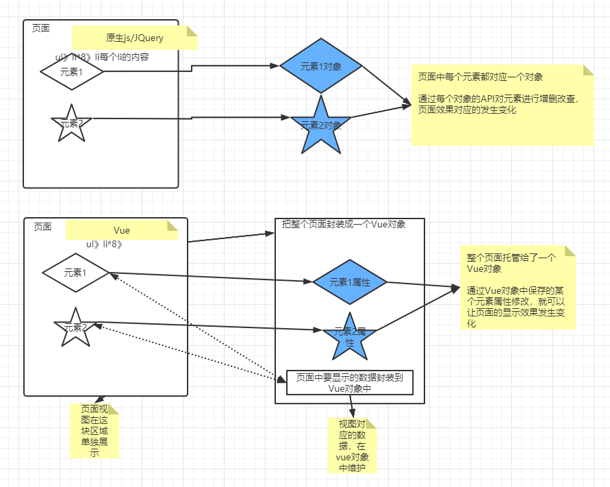
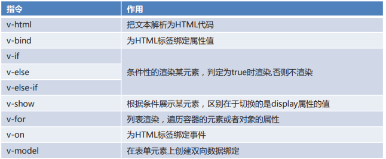
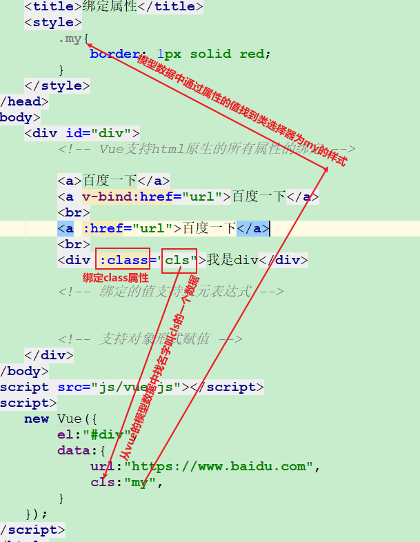

### 今天内容

`Vue`：非常火的前端渐进式框架，能够实现视图和数据的分离。

`ElementUI`：饿了么公司开源的一个前端组件（已经设计好的更好看的标签组模板）库。

综合案例


## 1. `Vue`简介


### 1.1 相关概念

`Vue`：构建用户界面的渐进式框架，实现视图和数据的分离。

<font color="red">前端使用`Vue`开发之后，我们就不需要再去获取各种元素对象并且进行增删改查了，而是把页面(中某部分内容)托管给一个`Vue`对象，通过操作`Vue`对象的属性的值（Vue里面的数据模型），这些修改会自动同步到页面上，就可以完成对页面的增删改查。</font>

**特点**：

1. 易用
2. 灵活
3. 性能好

### 1.2 与原生`js`/`jQuery`的区别




- 数据和视图的组织方式不同
  - `js/jq`一般都是视图和数据写在一起
  - `Vue`的视图和数据是分离的
- 操作数据的方式
  - `js/jq`通过获取页面元素（视图）的对象，然后通过该对象读写元素的值
  - `Vue`通过一个统一的`Vue`对象，在该对象的数据模型中，通过和对应的视图绑定，来读写视图的值。

### 1.3 `Vue`快速入门

**步骤**

1. 编写视图
2. 导入`Vue`的`js`文件
3. 使用`Vue`对象绑定视图（为视图添加数据）

**演示代码：**

```html
<body>
    <!-- 视图 -->
    <div id="div">
        <!--
            vue插值表达式
            视图和数据分离
            msg  对应的vue对象中数据模型的某个属性值
            Vue会把自己对象中模型数据的该属性值自动填充渲染到这个位置
         -->
        {{msg}}
    </div>


</body>
<script src="js/vue.js"></script>
<script>
    // 脚本
    let divVue = new Vue({
        el:"#div",  //el是固定写法，这里表示把页面中id为div的部分托管给了vue对象。一般都是id选择器。
        data:{      //data也是固定写法，其值为模型数据
            msg:"Hello Vue" //模型数据的key：value，vue对象会将该值自动渲染更新到页面视图对应的位置(插值表达式)
        }
    });
</script>
</html>
```


### 1.4 `Vue`快速入门详解

- `Vue`程序需要使用一个`Vue`对象做为程序的入口

  ```js
  // 使用变量接收，方便多次使用其中属性和方法
  let vm = new Vue({
      el:"选择器字符串",  //根据选择器获取指定元素，将该元素托管给vue对象，一般用id选择器
      data:{			  // 属性(模型数据)，用于为视图绑定数据，可以使用当前vue对象调用
          vue属性名1:值1,
          // .....
      },
      methods{		  // 方法，可以使用当前vue对象调用
      	fun1:function(){
      		//....
  		}
  		//, fun2.....
  	}
  });

  // {{变量名(vue模型数据中属性的值)}}  在视图位置绑定Vue的属性
  ```
  


```html
<body>
    <!-- 视图 -->
    <div id="div">
        <div>姓名：{{name}}</div>
        <div>班级：{{classRoom}}</div>
        <button onclick="hi()">打招呼</button>
        <button onclick="update()">修改班级</button>
    </div>
</body>
<script src="js/vue.js"></script>
<script>
    // 脚本
    // 定义变量名方便使用Vue对象
    let vm = new Vue({
        el:"#div",
        data:{
            name:"张三",
            classRoom:"黑马程序员"
        },
        methods:{
            study(){
               alert(this.name + "正在" + this.classRoom + "好好学习!"); // this代表当前Vue对象
            },
        }
    });

    //定义打招呼方法
    //自己定义的一个非Vue方法，该方法调用了vue对象的study()方法
    function hi(){
        vm.study();	//调用Vue对象的方法
    }

    //定义修改班级
    // 自己定义的一个非Vue方法，修改vue对象模型数据中classRoom的值，Vue对象自动渲染该值到页面。
    function update(){
        vm.classRoom = "传智播客";  //通过变量为Vue对象的属性赋值
    }
</script>
</html>
```


## ==2. `Vue`的指令==

### 2.1 概念

`指令`：`Vue`为网页元素添加的特殊属性，这些属性会被`Vue`识别并解析。值可以使用 `JS` 的对象(`json`)。

常见的指令包括

- 


### 2.2 文本插值

为页面标签添加内容

```html
<body>
    <div id="div">
        <!-- {{}}}  对应的是 jq.text()，可以做拼接，不会覆盖原有插值之外的其他内容 。不会解析标签内容 -->
        <div>xxxx{{msg}}{{msg}}</div>
        <!-- v-html  对应但是jq.html() ，会覆盖标签体原来的所有内容。会解析标签内容-->
        <div v-html="msg">xxxx</div>
    </div>
</body>
<script src="js/vue.js"></script>
<script>
    new Vue({
        el:"#div",
        data:{
            msg:"<b>Hello Vue</b>"
        }
    });
</script>
```


### 2.3 绑定属性

为页面标签添加属性

`Vue`绑定属性支持所有`html`标签的原生属性，支持三元表达式和对象形式赋值

```css
    <style>
        .my{
            border: 1px solid red;
        }
		.you{
            border: 1px solid red;
        }
    </style>
```


```html
<body>
    <div id="div">
        <!-- v-bind 支持HTML标签所有原生的属性
            但是只是单向绑定，从data -》 标签属性

            使用v-bind:href
                就可以实现视图和数据的分离，这个时候，只需要修改vue对象中数据的值，视图中对应位置就会自动更新。
            如果不适用vue，就需要将a标签封装成对象，通过其href属性修改


            v-bind:HTML原生属性  可以简写为  :HTML原生属性
         -->
        <!--<a href="http://baidu.com">百度一下</a>-->


        <a v-bind:href="url">百度一下</a>
        <br>
        <a :href="url">百度一下</a>
        <br>

        <!--<div class="you">我是div</div>-->

        <div v-bind:class="cls">我是div</div>
        <div v-bind:class="cls == 1? 'my': 'you'">我是div</div>
    </div>
</body>
<script src="js/vue.js"></script>
<script>
    let app = new Vue({
        el:"#div",
        data:{
            url:"https://www.baidu.com",
            cls:"you"
        }
    });

    // app.url = "";
</script>
```



### 2.4 条件渲染

> 择性的让页面中某个元素显示或者不显示
>

```js
<body>
    <div id="div">
        <!-- 判断num的值，对3取余  余数为0显示div1  余数为1显示div2  余数为2显示div3 -->
        <!--
            v-if如果不成立，元素根本就不被会浏览器解析渲染
            某个标签就在渲染的时候来决定是否显示，不显示就不添加到文档树中
         -->
        <div v-if="num % 3 == 0">div1</div>
        <div v-else-if="num % 3 == 1">div2</div>
        <div v-else="num % 3 == 2">div3</div>

        <!-- 下面效果一样。但是判断三次，不推荐使用 -->
        <div v-if="num % 3 == 0">div1</div>
        <div v-if="num % 3 == 1">div2</div>
        <div v-if="num % 3 == 2">div3</div>

        <!--
            v-show条件不成立时，标签也会被渲染，只是添加一个display:none的样式，让标签隐藏
            某个标签需要多次的显示和隐藏，使用该方式不需要修改文档树，性能更好
         -->
        <div v-show="flag">div4</div>

        <!--

            v-if 会根据条件不同，修改文档的属性结构中的元素（增删），性能消耗较大
            v-show，仅仅是修改了某个元素的样式，性能消耗较少

            如果要反复显隐某个元素，建议使用v-show

            如果从一开始就决定要渲染某个元素，用v-if
        -->
    </div>
</body>
<script src="js/vue.js"></script>
<script>
    let vm = new Vue({
        el:"#div",
        data:{
            num:1,
            flag:false
        }
    });
</script>
```


### 2.5 列表渲染

遍历`Vue`模型数据中的数组或者对象

```js
<div id="div">
    <ul>
        <!--
            v-for 写在要展示多个的标签上


            遍历数组
                格式 v-for="(元素值,值的索引) in 数组/集合

         -->
        <li v-for="(value,index) in names">
            {{index}}-----{{value}}
        </li>


        <!--
            遍历对象
                格式 v-for="(属性值,属性名,属性的索引) in 对象

        -->

        <!--
            注意点：
                    1. v-for所在的标签会出现多次，次数由数组长度决定
                    2. 遍历出来的元素会放在vue对象的数据模型中，之后可以使用插值表达式获取
                    3. 遍历数据的时候，变量的位置决定了其接收内容
        -->

        <li v-for="(value,key,index) in student">
            {{value}} ----- {{key}}---{{index}}
        </li>
    </ul>
</div>
</body>
<script src="js/vue.js"></script>
<script>
    new Vue({
        el: "#div",
        data: {
            names: ["张三", "李四", "王五"],
            student: {
                name: "张三",
                age: 23
            }
        }
    });
</script>
```


### 2.6 事件渲染

支持所有`js`原生的事件

```html
<body>
    <div id="div">
        <div>{{name}}</div>
        <button v-on:click="change()">改变div的内容</button>
        <button v-on:dblclick="change()">改变div的内容</button>

        <button @click="change()">改变div的内容</button>
    </div>
</body>
<script src="js/vue.js"></script>
<script>
    new Vue({
        el:"#div",
        data:{
            name:"黑马程序员"
        },
        methods:{
            change(){
                this.name = "传智播客"
            }
        }
    });
</script>
```


### 2.7 表单value双向绑定

之前所有的`vue`对象模型数据和对应视图的绑定是单向绑定的，模型数据修改后，视图会跟着自动修改；反之，不行。


`v-model`可以实现表单项`value属性`和`模型数据`双向绑定的效果。

`MVVM` 对`MVC`的升级，双向监听，监听到一方的改变之后立马同步到另外一方。

```html
<body>
    <!--MVVM 对MVC的升级，
        M   Model       Vue对象的data
        V   View        html页面(里面的元素)
        VM  ViewMode    双向监听，监听到一方的改变之后立马同步到另外一方。
    -->
<div id="div">
    <form autocomplete="off">
        姓名：<input type="text" name="username" v-model="username">{{username}}
        <br>
        年龄：<input type="number" name="age" v-model="age">{{age}}
        <button @click="submit()"></button>
    </form>
</div>
</body>
<script src="js/vue.js"></script>
<script>
    let app = new Vue({
        el: "#div",
        data: {
            username: "张三",
            age: 23
        }
    });
</script>
```


## 3. Element(理解)

饿了么公司开源的一个封装好的前端页面组件库，是基于`Vue`。

组件	-->	`Vue`中的视图  --> `html`中各种元素/标签

我们在学习过程中，只需要能复制粘贴，弄明白这些视图组件是怎么和`vue`中数据产生关联，而不应该把重点放在样式和外观等这些内容上。


### 3.1 Element介绍

Element，一套为开发者、设计师和产品经理准备的基于 `Vue` 2.0 的桌面端组件库。

使用该组件库可以轻松的设计出来一套样式漂亮的页面。

### 3.2 Element快速入门

**重点步骤**：

1. 引入三个文件`Vue.js`、`Element的index.js`、`Element的index.css`(先`Vue.js`，后`index.js`)
2. 使用`Vue`对象托管显示区域
3. CV官网代码简单修改

```html
<head>
    <meta charset="UTF-8">
    <meta name="viewport" content="width=device-width, initial-scale=1.0">
    <title>快速入门</title>
    <link rel="stylesheet" href="element-ui/lib/theme-chalk/index.css">
    <!-- 先引入vue的js，再引入elementui的js -->
    <script src="js/vue.js"></script>
    <script src="element-ui/lib/index.js"></script>
</head>
<body>
    <button>我是按钮</button>
    <br>
    <div id="div">
        <el-row>
            <el-button>默认按钮</el-button>
            <el-button type="primary">主要按钮</el-button>
            <el-button type="success">成功按钮</el-button>
            <el-button type="info">信息按钮</el-button>
            <el-button type="warning">警告按钮</el-button>
            <el-button type="danger">危险按钮</el-button>
          </el-row>
          <br>
          <el-row>
            <el-button plain>朴素按钮</el-button>
            <el-button type="primary" plain>主要按钮</el-button>
            <el-button type="success" plain>成功按钮</el-button>
            <el-button type="info" plain>信息按钮</el-button>
            <el-button type="warning" plain>警告按钮</el-button>
            <el-button type="danger" plain>危险按钮</el-button>
          </el-row>
          <br>
          <el-row>
            <el-button round>圆角按钮</el-button>
            <el-button type="primary" round>主要按钮</el-button>
            <el-button type="success" round>成功按钮</el-button>
            <el-button type="info" round>信息按钮</el-button>
            <el-button type="warning" round>警告按钮</el-button>
            <el-button type="danger" round>危险按钮</el-button>
          </el-row>
          <br>
          <el-row>
            <el-button icon="el-icon-search" circle></el-button>
            <el-button type="primary" icon="el-icon-edit" circle></el-button>
            <el-button type="success" icon="el-icon-check" circle></el-button>
            <el-button type="info" icon="el-icon-message" circle></el-button>
            <el-button type="warning" icon="el-icon-star-off" circle></el-button>
            <el-button type="danger" icon="el-icon-delete" circle></el-button>
          </el-row>
    </div>
</body>
<script>
    new Vue({
        el:"#div"
    });
</script>
```


### 3.3  Layout 布局

通过基础的 24 分栏，迅速简便地创建布局。每行最多可以拆分成24个列，每个元素可以占据多个列。

`<el-row>`划分行，`<el-col>`划分列

```html
<head>
    <meta charset="UTF-8">
    <meta name="viewport" content="width=device-width, initial-scale=1.0">
    <title>基础布局</title>
    <link rel="stylesheet" href="element-ui/lib/theme-chalk/index.css">
    <script src="js/vue.js"></script>
    <script src="element-ui/lib/index.js"></script>
    <style>
        .el-row {
            /* 行距为20px */
            margin-bottom: 20px;
        }
        .bg-purple-dark {
            background: red;
        }
        .bg-purple {
            background: blue;
        }
        .bg-purple-light {
            background: green;
        }
        .grid-content {
            /* 边框圆润度 */
            border-radius: 4px;
            /* 行高为36px */
            min-height: 36px;
        }
      </style>
</head>
<body>
    <div id="div">
      <el-row>
        <el-col :span="24"><div class="grid-content bg-purple-dark"></div></el-col>
      </el-row>
      <el-row>
        <el-col :span="5"><div class="grid-content bg-purple"></div></el-col>
        <el-col :span="19"><div class="grid-content bg-purple-light"></div></el-col>
      </el-row>
      <el-row>
        <el-col :span="8"><div class="grid-content bg-purple"></div></el-col>
        <el-col :span="8"><div class="grid-content bg-purple-light"></div></el-col>
        <el-col :span="8"><div class="grid-content bg-purple"></div></el-col>
      </el-row>
      <el-row>
        <el-col :span="6"><div class="grid-content bg-purple"></div></el-col>
        <el-col :span="6"><div class="grid-content bg-purple-light"></div></el-col>
        <el-col :span="6"><div class="grid-content bg-purple"></div></el-col>
        <el-col :span="6"><div class="grid-content bg-purple-light"></div></el-col>
      </el-row>
      <el-row>
        <el-col :span="4"><div class="grid-content bg-purple"></div></el-col>
        <el-col :span="4"><div class="grid-content bg-purple-light"></div></el-col>
        <el-col :span="4"><div class="grid-content bg-purple"></div></el-col>
        <el-col :span="4"><div class="grid-content bg-purple-light"></div></el-col>
        <el-col :span="4"><div class="grid-content bg-purple"></div></el-col>
        <el-col :span="4"><div class="grid-content bg-purple-light"></div></el-col>
      </el-row>
    </div>
</body>
<script>
    new Vue({
        el:"#div"
    });
</script>
```


### 3.4 Container 布局容器

 用于布局的容器组件，方便快速搭建页面的基本结构：

==`<el-container>`：外层容器。当子元素中包含 `<el-header>` 或 `<el-footer>` 时，全部子元素会垂直上下排列，否则会水平左右排列。可以多层嵌套==

`<el-header>`：顶栏容器。

`<el-aside>`：侧边栏容器。

`<el-main>`：主要区域容器。

`<el-footer>`：底栏容器。

> Container容器布局和Layout布局可以嵌套使用，比较麻烦的是数据如何填充。

```html
<head>
    <meta charset="UTF-8">
    <meta name="viewport" content="width=device-width, initial-scale=1.0">
    <title>容器布局</title>
    <link rel="stylesheet" href="element-ui/lib/theme-chalk/index.css">
    <script src="js/vue.js"></script>
    <script src="element-ui/lib/index.js"></script>
    <style>
        .el-header, .el-footer {
            background-color: #d18e66;
            color: #333;
            text-align: center;
            height: 100px;
        }
        .el-aside {
            background-color: #55e658;
            color: #333;
            text-align: center;
            height: 580px;
        }
        .el-main {
            background-color: #5fb1f3;
            color: #333;
            text-align: center;
            height: 520px;
        }
    </style>
</head>
<body>

<!--

    <el-container>：外层容器。当子元素中包含 <el-header> 或 <el-footer> 时，全部子元素会垂直上下排列，否则会水平左右排列。
    <el-header>：顶栏容器。
    <el-aside>：侧边栏容器。
    <el-main>：主要区域容器。
    <el-footer>：底栏容器。

    <el-container> 的子元素可以后四者或者其本身，后四者的父元素只能是 <el-container>。

-->
    <div id="div">
        <el-container>
            <el-header>头部区域</el-header>
            <el-container>
              <el-aside width="200px">侧边栏区域</el-aside>
              <el-container>
                <el-main>主区域</el-main>
                <el-footer>底部区域</el-footer>
              </el-container>
            </el-container>
          </el-container>
    </div>
</body>
<script>
    new Vue({
        el:"#div"
    });
</script>
```


### 3.5 表单组件

```html
<body>
    <div id="div">

        <!--
            el-form         form    表单
            el-form-item            表单项
            el-表单标签      表单标签  具体的某个表单项

            form表单的属性
                :model 为表单双向绑定数据
                :rules  为表单绑定校验规则
                上述两个，都会有对应的数据存在vue对象的data中
                ref    为表单起名

            表单项的属性
              prop  相当于原生input的name值
              v-model   为当前表单项双向绑定数据
        -->
        <el-form :model="ruleForm" :rules="rules" ref="ruleForm" label-width="100px" class="demo-ruleForm">
            <el-form-item label="活动名称" prop="name">
              <el-input v-model="ruleForm.name"></el-input>
            </el-form-item>
            <el-form-item label="活动区域" prop="region">
              <el-select v-model="ruleForm.region" placeholder="请选择活动区域">
                <el-option label="区域一" value="shanghai"></el-option>
                <el-option label="区域二" value="beijing"></el-option>
              </el-select>
            </el-form-item>
            <el-form-item label="活动时间" required>
              <el-col :span="11">
                <el-form-item prop="date1">
                  <el-date-picker type="date" placeholder="选择日期" v-model="ruleForm.date1" style="width: 100%;"></el-date-picker>
                </el-form-item>
              </el-col>
              <el-col class="line" :span="2">-</el-col>
              <el-col :span="11">
                <el-form-item prop="date2">
                  <el-time-picker placeholder="选择时间" v-model="ruleForm.date2" style="width: 100%;"></el-time-picker>
                </el-form-item>
              </el-col>
            </el-form-item>
            <el-form-item label="即时配送" prop="delivery">
              <el-switch v-model="ruleForm.delivery"></el-switch>
            </el-form-item>
            <el-form-item label="活动性质" prop="type">
              <el-checkbox-group v-model="ruleForm.type">
                <el-checkbox label="美食/餐厅线上活动" name="type"></el-checkbox>
                <el-checkbox label="地推活动" name="type"></el-checkbox>
                <el-checkbox label="线下主题活动" name="type"></el-checkbox>
                <el-checkbox label="单纯品牌曝光" name="type"></el-checkbox>
              </el-checkbox-group>
            </el-form-item>
            <el-form-item label="特殊资源" prop="resource">
              <el-radio-group v-model="ruleForm.resource">
                <el-radio label="线上品牌商赞助"></el-radio>
                <el-radio label="线下场地免费"></el-radio>
              </el-radio-group>
            </el-form-item>
            <el-form-item label="活动形式" prop="desc">
              <el-input type="textarea" v-model="ruleForm.desc"></el-input>
            </el-form-item>
            <el-form-item>
                <!-- 绑定单击事件，事件触发的时候，传递了一个当前表单名字的字符串 -->
              <el-button type="primary" @click="submitForm('ruleForm')">立即创建</el-button>
                <!-- 绑定单击事件，事件触发的时候，传递了一个当前表单名字的字符串 -->
              <el-button @click="resetForm('ruleForm')">重置</el-button>
            </el-form-item>
          </el-form>
    </div>
</body>
<script>
    new Vue({
        el:"#div",
        data:{
            ruleForm: {
                name: '',
                region: '',
                date1: '',
                date2: '',
                delivery: false,
                type: [],
                resource: '',
                desc: ''
                },
        rules: {
          name: [
            { required: false, message: '请输入活动名称', trigger: 'blur' },
            { min: 3, max: 5, message: '长度在 3 到 5 个字符', trigger: 'blur' }
          ],
          region: [
            { required: true, message: '请选择活动区域', trigger: 'change' }
          ],
          date1: [
            { type: 'date', required: true, message: '请选择日期', trigger: 'change' }
          ],
          date2: [
            { type: 'date', required: true, message: '请选择时间', trigger: 'change' }
          ],
          type: [
            { type: 'array', required: true, message: '请至少选择一个活动性质', trigger: 'change' }
          ],
          resource: [
            { required: true, message: '请选择活动资源', trigger: 'change' }
          ],
          desc: [
            { required: true, message: '请填写活动形式', trigger: 'blur' }
          ]
        }
        },
        methods:{

            // validate()、resetFields 是elementUI组件库帮你实现好的方法，直接调用即可。

            //  formName  = ruleForm  上述点击事件调用传递的参数，说白了就是当前表单ref的值
            submitForm(formName) {
                // this.$refs[formName]  根据传递的名字，获取当前表单对象
                // validate  根据之前的校验规则，校验当前表中所有的表单项是否符合要求
                // 如果所有表单项都符合要求，形参valid的值为true；否则形参valid的值为false

                // (valid) =>  箭头函数  匿名函数
                // 相当于 function (valid)
                this.$refs[formName].validate((valid) => {
                    // 如果所有表单项都符合规则
                    if (valid) {
                        alert('submit!');
                        //否则
                    } else {
                        console.log('error submit!!');
                        return false;
                    }
                });
            },

            //  formName  = ruleForm  上述点击事件调用传递的参数，说白了就是当前表单ref的值
            resetForm(formName) {
                this.$refs[formName].resetFields();
            }
        }
    });
</script>
```

### 3.6 表格组件

```html
<body>
<!--
    当el-table元素中注入data对象数组后，
    在el-table-column中用prop属性来对应对象中的键名即可填入数据，
    用label属性来定义表格的列名。可以使用width属性来定义列宽。
-->
    <div id="div">
        <template>
            <!-- :data绑定vue对象中的模型数据 -->
            <el-table
              :data="tableData"
              style="width: 100%">
            <!--
                给el-table-column标签的prop属性设置成vue对象中的模型数据的属性名，
                对应的属性值会自动渲染到该列
                label 展示给用户看的表头
                width   宽度
             -->
              <el-table-column
                prop="date"
                label="日期"
                width="180">
              </el-table-column>
              <el-table-column
                prop="name"
                label="姓名"
                width="180">
              </el-table-column>
              <el-table-column
                prop="address"
                label="地址">
              </el-table-column>

              <el-table-column
                label="操作"
                width="180">
              <!--
                    在每一行数据上放置了两个按钮
                    之后会给这两个按钮绑定事件并实现相应的功能
                -->
                <el-button type="warning">编辑</el-button>
                <el-button type="danger">删除</el-button>
              </el-table-column>
            </el-table>
          </template>
    </div>
</body>
<script>
    new Vue({
        el:"#div",
        data:{
            tableData: [{
                date: '2016-05-02',
                name: 'xxx',
                address: '上海市普陀区金沙江路 1518 弄'
            }, {
                date: '2016-05-04',
                name: '王小虎',
                address: '上海市普陀区金沙江路 1517 弄'
            }, {
                date: '2016-05-01',
                name: '王小虎',
                address: '上海市普陀区金沙江路 1519 弄'
            }, {
                date: '2016-05-03',
                name: '王小虎',
                address: '上海市普陀区金沙江路 1516 弄'
            }]
        }
    });
</script>
```


### 3.7 顶部导航栏

```html
<div id="div">

    <!--
    另外，在菜单中通过submenu组件可以生成二级菜单。
    Menu 还提供了background-color、text-color和active-text-color，
    分别用于设置菜单的背景色、菜单的文字颜色和当前激活菜单的文字颜色。

    -->

    <!--
        Menu导航菜单默认为垂直模式，通过mode属性可以使导航菜单变更为水平模式。
            :default-active 默认选中
            <el-menu-item> 普通的导航项
                index   属性，就是编号
            <el-submenu>    有子菜单的导航项
                index   属性，就是编号


    -->
    <el-menu

            :default-active="activeIndex2"
            class="el-menu-demo"
            mode="horizontal"
            @select="handleSelect"
            background-color="#545c64"
            text-color="#fff"
            active-text-color="#ffd04b">
        <!-- 所有的选项标签位置都会被超链接等替代，发起一个请求或者跳转-->
        <el-menu-item index="1">处理中心</el-menu-item>
        <el-submenu index="2">
            <template slot="title">我的工作台</template>
            <el-menu-item index="2-1">选项1</el-menu-item>
            <el-menu-item index="2-2">选项2</el-menu-item>
            <el-menu-item index="2-3">选项3</el-menu-item>
            <el-submenu index="2-4">
                <template slot="title">选项4</template>
                <el-menu-item index="2-4-1">选项1</el-menu-item>
                <el-menu-item index="2-4-2">选项2</el-menu-item>
                <el-menu-item index="2-4-3">选项3</el-menu-item>
            </el-submenu>
        </el-submenu>
        <!-- 导航项等其他众多标签都可以使用disabled属性  起到禁用的效果 -->
        <el-menu-item index="3" disabled>消息中心</el-menu-item>
        <el-menu-item index="4"><a href="http://blog.sunxiaowei.net" target="_blank">订单管理</a></el-menu-item>
    </el-menu>
</div>
</body>
<script>
    let vm = new Vue({
        el: "#div",
        data: {
            activeIndex2: '1'
        },
        methods: {
            handleSelect(index, indexPath) {
                console.log(index+"*****", indexPath);
            }
        }
    });
</script>
```


### 3.8 侧边导航栏

```html
<body>
    <div id="div">
      <el-col :span="3">
        <el-menu
          default-active="2"
          class="el-menu-vertical-demo"
          @open="handleOpen"
          @close="handleClose"
          background-color="#545c64"
          text-color="#fff"
          active-text-color="#ffd04b">
          <el-submenu index="1">
            <template slot="title">
              <i class="el-icon-location"></i>
              <span>导航一</span>
            </template>
            <el-menu-item-group>
              <template slot="title">分组一</template>
              <el-menu-item index="1-1">选项1</el-menu-item>
              <el-menu-item index="1-2">选项2</el-menu-item>
            </el-menu-item-group>
            <el-menu-item-group title="分组2">
              <el-menu-item index="1-3">选项3</el-menu-item>
            </el-menu-item-group>
            <el-submenu index="1-4">
              <template slot="title">选项4</template>
              <el-menu-item index="1-4-1">选项1</el-menu-item>
            </el-submenu>
          </el-submenu>
          <el-menu-item index="2">
            <i class="el-icon-menu"></i>
            <span slot="title">导航二</span>
          </el-menu-item>
          <el-menu-item index="3" disabled>
            <i class="el-icon-document"></i>
            <span slot="title">导航三</span>
          </el-menu-item>
          <el-menu-item index="4">
            <i class="el-icon-setting"></i>
            <span slot="title">导航四</span>
          </el-menu-item>
        </el-menu>
      </el-col>
    </div>
</body>
<script>
    new Vue({
        el:"#div",
        methods:{
          handleOpen(key, keyPath) {
            console.log(key, keyPath);
          },
          handleClose(key, keyPath) {
            console.log(key, keyPath);
          }
        }
    });
</script>
```


