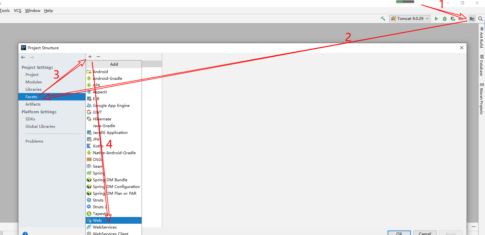
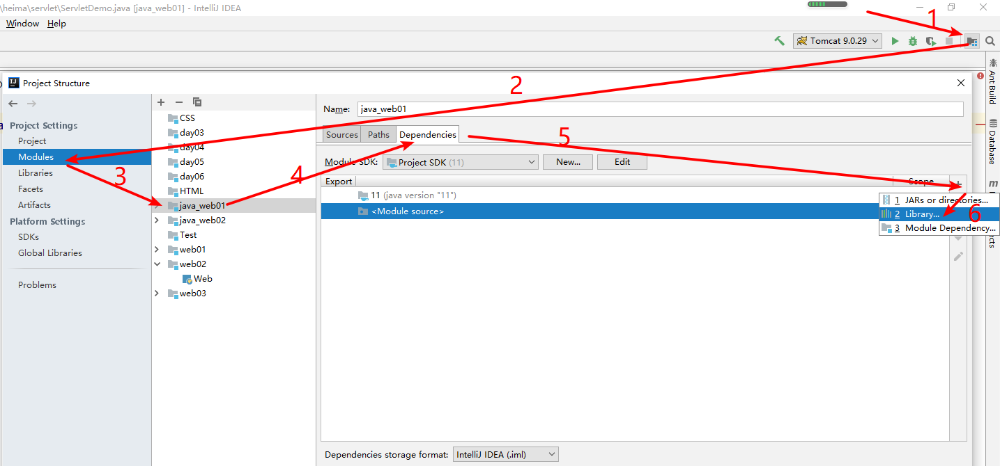
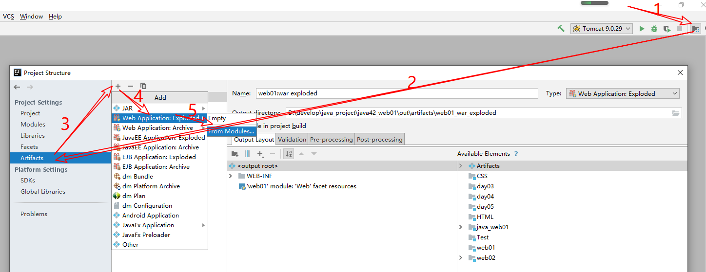
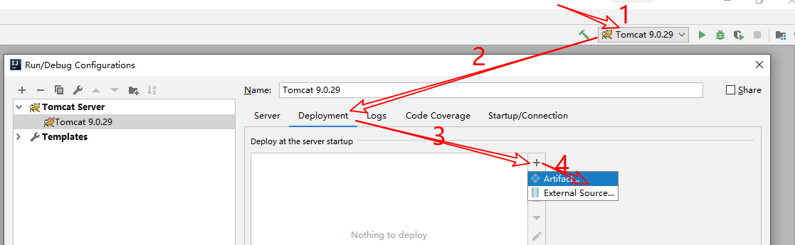

---

---

#### 昨日反馈

```
***	面对疾风吧!
***	666
```

#### 昨日回顾

```
表格标签
	table tr td th
	border width height colspan rowspan
web概念
	静态资源
		html css js (web文件夹下)
	动态资源
		servlet(src下) jsp(web文件夹下)
tomcat安装
```

#### Tomcat

##### 安装

##### 集成

##### 项目发布

##### 三个默认

```
默认端口
	80
默认项目(访问的时候不需要输入项目名)
	ROOT
默认的页面
	<welcome-file-list>
        <welcome-file>index.html</welcome-file>
        <welcome-file>index.htm</welcome-file>
        <welcome-file>index.jsp</welcome-file>
    </welcome-file-list>
```

##### 部署方式

```
1,直接拷贝到webapps下
	http://localhost:8080/test/hello.html
	
2,虚拟目录(把项目剪切到d盘下)
	方式一:修改核心配置文件,在conf/server.xml下的host标签里面
		  <Context docBase="d:/test" path="/hehe" />
		  docBase:资源的真实路径
		  path:资源的访问路径(项目名的别名)
		  弊端:每次修改之后需要重启,如果修改错了,整个服务器就瘫痪了
		
	方式二:在conf\Catalina\localhost配置xml文件
		<Context docBase="d:/test" />
		注意:xml的名字就是访问路径
		好处:不用修改核心配置文件,修改之后,不需要重启服务器
		
3,虚拟主机
	1,修改server.xml的配置文件,在<Engine>下
        <Host name="www.xx.com"  appBase="webapps"
            unpackWARs="true" autoDeploy="true">
            <Context path="" docBase="test" />
        </Host>
	2,修改本地host文件(C:\Windows\System32\drivers\etc\hosts文件)
		127.0.0.1       www.xx.com
		
	3,访问
		http://www.xx.com:8080/test/hello.html
```

##### 手动将java项目改成web项目并发布

1.创建java项目

2,添加web文件夹,添加web标识(打点,让idea能识别这是一个web项目)



3.添加tomcat依赖



4.手动打war包



5,部署项目(告诉Tomcat需要运行哪一个war包),并运行



#### HTTP协议

##### 相关介绍

```
概念
	超文本传输协议
作用
	规定了浏览器和服务器交换数据的格式
	浏览器向服务器发送什么样格式的数据,服务器才能解析,服务器向浏览数发送什么格式的数据,浏览器才能解析
特点
	基于请求和响应模型
	必须先有请求再有响应
	请求和响应必须成对出现
总结
	浏览器发给服务器的信息,我们称之为请求消息
	服务器发给浏览器的信息,我们称之为响应消息
```

##### 请求消息

```
请求行
请求头
请求体(只有post请求中才有)
```

##### 响应消息

```
响应行
响应头
响应体(显示在浏览器中的内容)
```

#### Servlet

##### 相关概念

```
概念
	运行在服务器的小程序,主要用来处理用户的请求,做出响应
	就是一接口.需要我们去实现
	最主要的方法就是service()方法,在这个方法里面处理请求,做出响应
```

##### 快速入门(xml)

```
1,写一个普通的类,实现servlet接口
2,重写里面的service方法
3,在web.xml中设置访问路径
	<servlet>
        <servlet-name>aaa</servlet-name>
        <servlet-class>com.heima.servlet.ServletDemo</servlet-class>
    </servlet>
    <servlet-mapping>
        <servlet-name>aaa</servlet-name>
        <url-pattern>/hhh</url-pattern>
    </servlet-mapping>
```

##### 执行流程

```
1,直接拷贝到webapps下面访问
	http://localhost:8080/test/hello.html
	协议 主机名/ip 端口号 真实项目名 真实资源
	
2,通过idea访问项目
	http://localhost:8080/crm/StudentServlet
	协议 主机名/ip 端口号 虚拟的目录名  虚拟的资源名
	
通过 主机名/ip 可以找到互联网上 唯一一台设备
通过 端口号 可以找到其中运行的web服务器(tomcat软件)
通过 真实/虚拟目录名 可以找到其中运行的项目
通过 真实资源/虚拟的资源名 可以找到我们想要的资源
	如果是真实的资源,直接加载
	如果是虚拟的资源名,就去web.xml下找对应的servlet的名字
	根据这名字找到处理这个资源的全类名,反向创建对象,调用里面的service方法
```

##### 实现方式

```
1.实现Servlet接口
	重新service方法
2.继承GenericServlet抽象类
	重新service方法
3.继承HttpServlet抽象类(右键new一个Servlet)
	重新doGet()和doPost()方法
```

##### 继承体系

```
Servlet 接口
	|
GenericServlet 抽象类 与协议无关的servlet,父类
	|
HTTPServlet    抽象类 跟HTTP协议相关的(以后都是用的这个协议)
```


