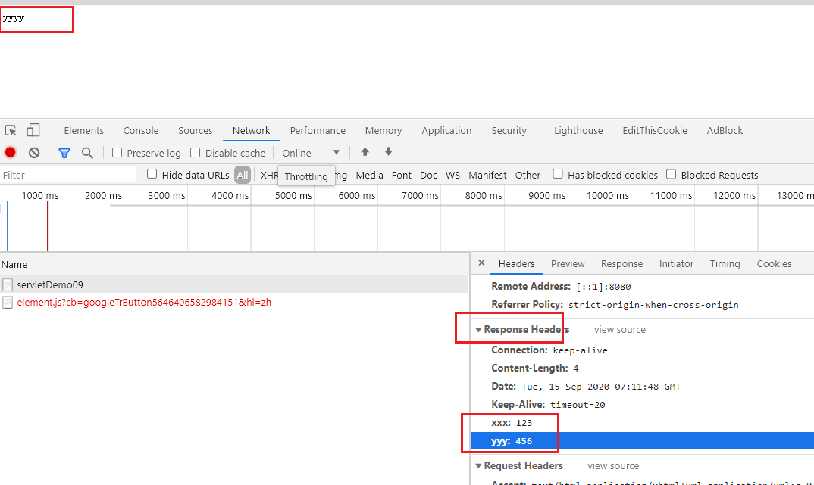
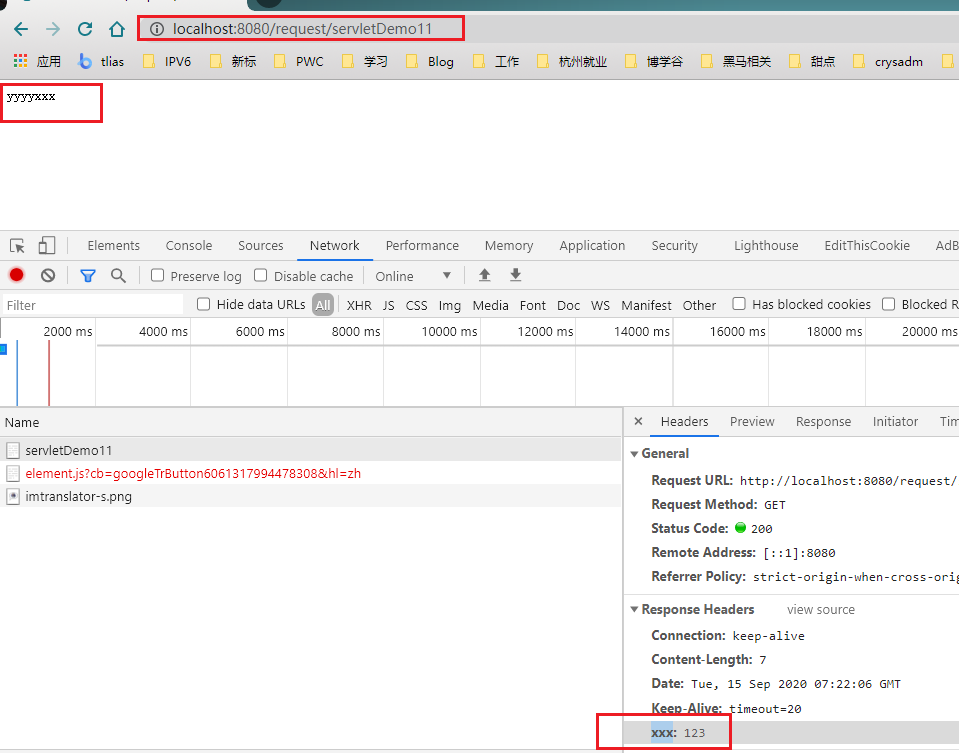
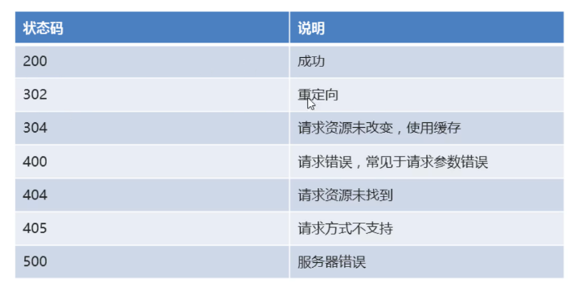
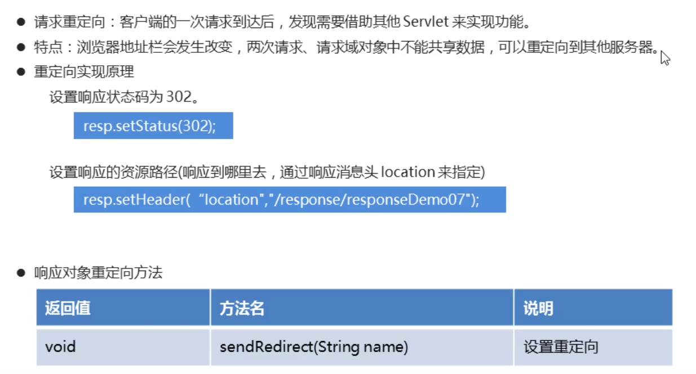

## 复习

**servlet**

是一个规范，运行在服务器端的java小程序。

规范：接口


Servlet书写方式

1. 实现Servlet接口，实现所有的抽象方法
2. 继承GenericServlet（模板类），实现一个Service方法。
3. ==继承HttpServlet，重写dGet()/doPost()==


配置Servlet

1. 基于xml的配置

   <servlet>

   <servlet-mapping>


2. 基于注解的配置

   @WebServlet("/xxxx")


## 1.  Request

### 1.1 概述

Http协议是一种问答机制（一问对应一答），其中问就是请求

请求：客户端（浏览器）携带数据到服务器，tomcat服务器会自动把相关内容封装到一个request对象中，我们如果需要使用其中的数据，找request对象获取即可。


### 1.2 常用方法

#### ==1.2.1 获取路径相关（请求行）==

**String	getContextPath()	获取项目路径（项目的虚拟路径）**	

**String	getServletPath()	获取Servlet的资源路径（servletMapping）**	

String	getRemoteAddr()	获取访问者的IP地址

String	getQueryString()	获取请求参数的字符串  k1=v1&k2=v2

String	getRequestURI()	获取统一资源标识符，范围大，包含了`项目路径+资源路径`

StringBuffer	getRequestURL()	统一资源定位符 范围小，包含了`协议+主机地址+端口+项目路径+资源路径`

```java
/*
    获取路径的相关方法
 */
@WebServlet("/servletDemo01")
public class ServletDemo01 extends HttpServlet {
    @Override
    protected void doGet(HttpServletRequest req, HttpServletResponse resp) throws ServletException, IOException {
        //1.获取项目路径名称 getContextPath()
        String contextPath = req.getContextPath();
        System.out.println("contextPath = " + contextPath);

        //2.获取Servlet映射路径 getServletPath()  资源路径
        String servletPath = req.getServletPath();
        System.out.println("servletPath = " + servletPath);

        //3.获取访问者ip getRemoteAddr()
        String ip = req.getRemoteAddr();
        System.out.println("ip = " + ip);

        //4.获取请求消息的数据 getQueryString()  完整的所有请求的key和value
        String queryString = req.getQueryString();
        System.out.println("queryString = " + queryString);

        //5.获取统一资源标识符 getRequestURI()    /request/servletDemo01   共和国
        String requestURI = req.getRequestURI();
        System.out.println("requestURI = " + requestURI);

        //6.获取统一资源定位符 getRequestURL()    http://localhost:8080/request/servletDemo01  中华人民共和国
        StringBuffer requestURL = req.getRequestURL();
        System.out.println("requestURL = " + requestURL);


        // 7. 获取请求方式（POST/GET）
        String method = req.getMethod();
        System.out.println("method = " + method);
    }

    @Override
    protected void doPost(HttpServletRequest req, HttpServletResponse resp) throws ServletException, IOException {
        doGet(req,resp);
    }
}
```


#### 1.2.2 获取请求头

String	getHeader(String name)	

Enumeration<String>	getHeaders(String name)	

Enumeration<String>	getHeaderNames()	

```java
/*
    获取请求头信息的相关方法
 */
@WebServlet("/servletDemo02")
public class ServletDemo02 extends HttpServlet {
    @Override
    protected void doGet(HttpServletRequest req, HttpServletResponse resp) throws ServletException, IOException {
        //1.根据请求头名称获取一个值
        String ac = req.getHeader("a");
        System.out.println("ac = " + ac);
        System.out.println("--------------");

        //2.根据请求头名称获取多个值
        // 当有多个相同名称的请求头时，这两个方法会有区别
        // getHeader只能获取第一个的值
        // getHeaders能获取所有的指定名称的请求的值（枚举）
        Enumeration<String> values = req.getHeaders("a");
        while(values.hasMoreElements()) {
            String value = values.nextElement();
            System.out.println("value = " + value);
        }
        System.out.println("--------------");

        //3.获取所有的请求头名称
        Enumeration<String> names = req.getHeaderNames();
        while(names.hasMoreElements()) {
            String name = names.nextElement();
            String value = req.getHeader(name);
            System.out.println(name + "=====" + value);
        }

    }

    @Override
    protected void doPost(HttpServletRequest req, HttpServletResponse resp) throws ServletException, IOException {
        doGet(req,resp);
    }
}
```


#### ==1.2.3获取请求参数==

**String	getParameter(String name)		根据请求参数的名称获取对应的值**

String[]	getParameterValues(String name)		根据请求参数的名称获取对应的值们（数组）

Enumeration<String>	getParameterNames()	获取所有的请求参数名称

**Map<String,String[]>	getParameterMap()	 获取所有的请求参数的键值对（封装到map集合中）**


前后台交互主要方式就是字符串（底层为流）

```java
/*
    获取请求参数信息的相关方法
 */
@WebServlet("/servletDemo03")
public class ServletDemo03 extends HttpServlet {
    @Override
    protected void doGet(HttpServletRequest req, HttpServletResponse resp) throws ServletException, IOException {
        //1.根据名称获取数据   getParameter()
        String username = req.getParameter("username");
        System.out.println("username = " + username);
        System.out.println(username);
        String password = req.getParameter("password");
        System.out.println("password = " + password);
        System.out.println("--------------------");

        //2.根据名称获取所有数据 getParameterValues()
        String[] hobbies = req.getParameterValues("hobby");
        for(String hobby : hobbies) {
            System.out.println("hobby = " + hobby);
        }
        System.out.println("--------------------");

        //3.获取所有名称  getParameterNames()
        Enumeration<String> names = req.getParameterNames();
        while(names.hasMoreElements()) {
            String name = names.nextElement();
            System.out.println("name = " + name);
        }
        System.out.println("--------------------");

        //4.获取所有参数的键值对 getParameterMap()
        Map<String, String[]> map = req.getParameterMap();
        for(String key : map.keySet()) {
            String[] values = map.get(key);
            System.out.print(key + ":");
            for(String value : values) {
                System.out.print(value + " ");
            }
            System.out.println();
        }
    }

    @Override
    protected void doPost(HttpServletRequest req, HttpServletResponse resp) throws ServletException, IOException {
        doGet(req,resp);
    }
}
```


#### 1.2.4 请求参数封装-手动

实体类

```java
public class Student {
    /**
     *
     * 要求请求参数的name值和实体类的属性名要一致
     * 1. 代码相对规范
     * 2. 自动封装的时候，要求两者一致。
     *
     * 手动封装的时候无所谓是否一致，但是建议写一样
     */
    private String username;
    private String password;
    private String[] hobby;
}
```


ServletDemo04

```java
/*
    封装对象-手动方式
 */
@WebServlet("/servletDemo04")
public class ServletDemo04 extends HttpServlet {
    @Override
    protected void doGet(HttpServletRequest req, HttpServletResponse resp) throws ServletException, IOException {
        //1.获取所有的数据
        String username = req.getParameter("xxx");
        String password = req.getParameter("password");
        String[] hobbies = req.getParameterValues("hobby");

        //2.封装学生对象
        Student stu = new Student(username, password, hobbies);

        //3.输出对象
        System.out.println("stu = " + stu);

    }

    @Override
    protected void doPost(HttpServletRequest req, HttpServletResponse resp) throws ServletException, IOException {
        doGet(req,resp);
    }
}
```


regist.html页面

```html
<!DOCTYPE html>
<html lang="en">
<head>
    <meta charset="UTF-8">
    <title>注册页面</title>
</head>
<body>
<form action="/request/servletDemo04" method="post" autocomplete="off">
    姓名：<input type="text" name="xxx"> <br>
    密码：<input type="password" name="password"> <br>
    爱好：<input type="checkbox" name="hobby" value="study">学习
    <input type="checkbox" name="hobby" value="game">游戏 <br>
    <button type="submit">注册</button>
</form>
</body>
</html>
```


#### 1.2.5 请求参数封装-反射内省(了解)


实体类

```java
public class Student {
    /**
     *
     * 要求请求参数的name值和实体类的属性名要一致
     * 1. 代码相对规范
     * 2. 自动封装的时候，要求两者一致。
     *
     * 手动封装的时候无所谓是否一致，但是建议写一样
     */
    private String username;
    private String password;
    private String[] hobby;
}
```


ServletDemo05

```java
/*
    封装对象-反射方式
 */
@WebServlet("/servletDemo05")
public class ServletDemo05 extends HttpServlet {
    @Override
    protected void doGet(HttpServletRequest req, HttpServletResponse resp) throws ServletException, IOException {
        //1.获取所有的数据
        Map<String, String[]> map = req.getParameterMap();

        //2.封装学生对象
        Student stu = new Student();
        //2.1遍历集合
        for(String name : map.keySet()) {
            String[] value = map.get(name);
            try {
                //2.2获取Student对象的属性描述器
                // 内省技术，对反射进行了二次封装，主要是反射实体类的getter和setter
                // name就是请求参数的 key  username/password
                //PropertyDescriptor pd = new PropertyDescriptor(name,stu.getClass());
                PropertyDescriptor pd = new PropertyDescriptor(name,Student.class);
                //pd.getReadMethod() //getter
                //pd.getWriteMethod() //setter
                //2.3获取对应的setXxx方法
                // setUsername / setPassword
                Method writeMethod = pd.getWriteMethod();


                //2.4执行方法
                // 反射调用方法的时候，如果形参是可变参数或数组时，调用的规则比较复杂
                // 最常用的的一种方式，如果实际参数是一个长度大于1的数组，一般情况下需要使用一个object对象包裹一下该数组，然后传递给形参
                // 否则，直接传递给形参即可。
                if(value.length > 1) {
                    writeMethod.invoke(stu,(Object)value);
                }else {
                    writeMethod.invoke(stu,value);
                }
            } catch (Exception e) {
                e.printStackTrace();
            }
        }

        //3.输出对象
        System.out.println("stu = " + stu);
    }

    @Override
    protected void doPost(HttpServletRequest req, HttpServletResponse resp) throws ServletException, IOException {
        doGet(req,resp);
    }
}
```


regist.html页面

```html
<!DOCTYPE html>
<html lang="en">
<head>
    <meta charset="UTF-8">
    <title>注册页面</title>
</head>
<body>
<form action="/request/servletDemo05" method="post" autocomplete="off">
    姓名：<input type="text" name="xxx"> <br>
    密码：<input type="password" name="password"> <br>
    爱好：<input type="checkbox" name="hobby" value="study">学习
    <input type="checkbox" name="hobby" value="game">游戏 <br>
    <button type="submit">注册</button>
</form>
</body>
</html>
```


#### 1.2.5 请求参数封装-工具类

导入两个jar包

```java
commons-beanutils-
commons-loging-   
```


实体类

```java
public class Student {
    /**
     *
     * 要求请求参数的name值和实体类的属性名要一致
     * 1. 代码相对规范
     * 2. 自动封装的时候，要求两者一致。
     *
     * 手动封装的时候无所谓是否一致，但是建议写一样
     */
    private String username;
    private String password;
    private String[] hobby;
}
```


ServletDemo06

```java
@WebServlet("/servletDemo06")
public class ServletDemo06 extends HttpServlet {
    @Override
    protected void doGet(HttpServletRequest req, HttpServletResponse resp) throws ServletException, IOException {
        //1.获取所有的数据
        Map<String, String[]> map = req.getParameterMap();

        //2.封装学生对象
        Student stu = new Student();
        try {
            BeanUtils.populate(stu,map);
        } catch (Exception e) {
            e.printStackTrace();
        }

        //3.输出对象
        System.out.println("stu = " + stu);

    }

    @Override
    protected void doPost(HttpServletRequest req, HttpServletResponse resp) throws ServletException, IOException {
        doGet(req,resp);
    }
}
```


regist.html页面

```html
<!DOCTYPE html>
<html lang="en">
<head>
    <meta charset="UTF-8">
    <title>注册页面</title>
</head>
<body>
<form action="/request/servletDemo06" method="post" autocomplete="off">
    姓名：<input type="text" name="xxx"> <br>
    密码：<input type="password" name="password"> <br>
    爱好：<input type="checkbox" name="hobby" value="study">学习
    <input type="checkbox" name="hobby" value="game">游戏 <br>
    <button type="submit">注册</button>
</form>
</body>
</html>
```


#### 1.2.6 通过流对象获取数据


ServletDemo07

```java
/*
    流对象获取数据
 */
@WebServlet("/servletDemo07")
public class ServletDemo07 extends HttpServlet {
    @Override
    protected void doGet(HttpServletRequest req, HttpServletResponse resp) throws ServletException, IOException {

        // 必须是post方式
        // get 提交的参数是在请求的url中，post提交的参数是在请求体中
        // req.getReader()  是从请求体中获取的所以，


        //字符流(必须是post方式)
        /*BufferedReader br = req.getReader();
        String line;
        while((line = br.readLine()) != null) {
            System.out.println(line);
        }*/
        //br.close();

        //字节流
        ServletInputStream is = req.getInputStream();
        byte[] arr = new byte[1024];
        int len;
        while((len = is.read(arr)) != -1) {
            System.out.println(new String(arr,0,len));
        }
        //is.close();
    }

    @Override
    protected void doPost(HttpServletRequest req, HttpServletResponse resp) throws ServletException, IOException {
        doGet(req,resp);
    }
}
```


regist.html页面

```html
<!DOCTYPE html>
<html lang="en">
<head>
    <meta charset="UTF-8">
    <title>注册页面</title>
</head>
<body>
<form action="/request/servletDemo07" method="post" autocomplete="off">
    姓名：<input type="text" name="xxx"> <br>
    密码：<input type="password" name="password"> <br>
    爱好：<input type="checkbox" name="hobby" value="study">学习
    <input type="checkbox" name="hobby" value="game">游戏 <br>
    <button type="submit">注册</button>
</form>
</body>
</html>
```


#### 1.2.7 request域对象

域对象：可以理解成一个容器，可以在自己作用域范围内共享数据

request：作用范围就是单前这次请求，

void setAttribute(String name,Object value)：	

Object getAttribute(String name)：		

Enumeration<String> getAttributeNames()：

void removeAttribute(String name)：	


### 1.3 乱码问题

什么情况下产生乱码

1. 出现非数字、英文字符意外的符号（ASCII），就有可能产生乱码
2. POST请求方式
3. GET请求方式时，tomcat版本低于8


产生乱码原因：

前后台使用的编码不一致，造成的乱码，统一设置即可解决。


经验：

- 要保证你的项目各个地方，一般情况下，编码统一设置为UTF-8


解决方法：

```java
req.setCharacterEncoding("UTF-8");
```


```java
/*
    中文乱码
 */
@WebServlet("/servletDemo08")
public class ServletDemo08 extends HttpServlet {
    @Override
    protected void doGet(HttpServletRequest req, HttpServletResponse resp) throws ServletException, IOException {
        //设置编码格式 设置成和当前项目编码一致即可。
        System.out.println("req.getCharacterEncoding() = " + req.getCharacterEncoding());
        req.setCharacterEncoding("UTF-8");
        System.out.println("req.getCharacterEncoding() = " + req.getCharacterEncoding());
        req.setAttribute("key1", "value1");

        String username = req.getParameter("username");
        System.out.println("username = " + username);
        System.out.println("req.getAttribute(\"key1\") = " + req.getAttribute("key1"));
    }

    @Override
    protected void doPost(HttpServletRequest req, HttpServletResponse resp) throws ServletException, IOException {
        doGet(req,resp);
    }
}
```


### ==1.4 **请求转发**==

​	

- 指将请求转发给别的Servlet处理。	

	 客户端的一次请求到达后ServletA后，A发现需要ServletB来实现功能。整个过程A自己运作未告知客户端。	

**特点**
		

- 浏览器地址栏不变（A自己运作未告知客户端）

- request域对象中的数据不丢失（一个完整的请求链，未结束）

- 由转发的目的地ServletB来响应客户端

- 负责转发的ServletA只可参与响应头，留头不留体


ServletA

```java
/*
    请求转发
 */
@WebServlet("/servletDemo09")
public class ServletDemo09 extends HttpServlet {
    @Override
    protected void doGet(HttpServletRequest req, HttpServletResponse resp) throws ServletException, IOException {
        //往域对象中设置了共享数据
        req.setAttribute("encoding","gbk");

        //获取请求调度对象，设置要转发到的目的Servlet
        RequestDispatcher rd = req.getRequestDispatcher("/servletDemo10");
        //实现转发功能，把当前Servlet的request对象和respone对象传递过去
        // ServletA设置响应头，会被响应到页面
        resp.setHeader("xxx", "123");

        rd.forward(req,resp);

        //  ServletA设置响应体（对请求做出响应），不会响应到页面，
        //  因为转发是由目的ServletB负责响应
        resp.getWriter().write("xxx");


    }

    @Override
    protected void doPost(HttpServletRequest req, HttpServletResponse resp) throws ServletException, IOException {
        doGet(req,resp);
    }
}
```

ServletB

```java
@WebServlet("/servletDemo10")
public class ServletDemo10 extends HttpServlet {
    @Override
    protected void doGet(HttpServletRequest req, HttpServletResponse resp) throws ServletException, IOException {
        //从request域对象中获取 在ServletDemo09中设置的共享数据
        Object encoding = req.getAttribute("encoding");
        System.out.println(encoding);

        System.out.println("servletDemo10执行了...");
        // ServletB设置响应头，也会被响应到页面
        resp.setHeader("yyy", "456");

        // ServletB设置响应体（对请求做出响应），会最终响应到页面，因为转发是由目的Servlet负责响应
        resp.getWriter().write("yyyy");
    }

    @Override
    protected void doPost(HttpServletRequest req, HttpServletResponse resp) throws ServletException, IOException {
        doGet(req,resp);
    }
}
```


**效果**




### **1.5 请求包含**

​	

- ServletA 包含ServletB共同处理本次请求。	

**特点**

- 浏览器地址栏不变（A自己运作未告知客户端）

- request域对象中的数据不丢失（一个完整的请求链，未结束）

- 由ServletA和ServletB共同响应客户端

- 被包含ServletB响应头丢失，留体不留头


ServletA

```java
/*
    请求包含
 */
@WebServlet("/servletDemo11")
public class ServletDemo11 extends HttpServlet {
    @Override
    protected void doGet(HttpServletRequest req, HttpServletResponse resp) throws ServletException, IOException {
        //往域对象中设置了共享数据
        req.setAttribute("encoding","gbk");

        // ServletA设置响应头，会被响应到页面
        resp.setHeader("xxx", "123");

        //获取请求调度对象
        RequestDispatcher rd = req.getRequestDispatcher("/servletDemo12");

        //实现包含功能
        rd.include(req,resp);


        //  ServletA设置响应体（对请求做出响应），不会响应到页面，
        //  因为转发是由目的ServletB负责响应
        resp.getWriter().write("xxx");

        System.out.println("servletDemo11执行了...");
    }

    @Override
    protected void doPost(HttpServletRequest req, HttpServletResponse resp) throws ServletException, IOException {
        doGet(req,resp);
    }
}
```

ServletB

```java

/*
    请求包含
 */
@WebServlet("/servletDemo12")
public class ServletDemo12 extends HttpServlet {
    @Override
    protected void doGet(HttpServletRequest req, HttpServletResponse resp) throws ServletException, IOException {
        //从request域对象中获取 在ServletDemo11中设置的共享数据
        Object encoding = req.getAttribute("encoding");
        System.out.println("encoding = " + encoding);

        // ServletB设置响应头，会丢失
        resp.setHeader("yyy", "456");
        System.out.println("resp.getStatus() = " + resp.getStatus());

        // ServletB设置响应体（对请求做出响应），会最终响应到页面，因为转发是由目的Servlet负责响应
        resp.getWriter().write("yyyy");

        System.out.println("servletDemo12执行了...");
    }

    @Override
    protected void doPost(HttpServletRequest req, HttpServletResponse resp) throws ServletException, IOException {
        doGet(req,resp);
    }
}
```


**效果**




### 1.6 两者区别

在Servlet代码中，使用请求转发较多，很少使用请求包含；

请求包含主要是在jsp页面中，通过jsp动态包含的方式来使用。


respone 请求重定向


其他方法

String getMethod()	

void setCharacterEncoding(String env)	

​	

所有域对象都有基本相同


​	

相关API
		

request对象的 

RequestDispatcher getRequestDispatcher(String path)	获取请求调度对象，参数为第二个Servlet的url-pattern

url-pattern当前项目中某个资源的路径


RequestDispatcher对象的

void forward( request,  response)：	转发请求到第二个Servlet

​	

请求包含

指将另一个Servlet的请求处理流程包含进来，共同处理请求并且响应。

客户端的一次请求到达后ServletA后，A发现自己完成部分后，需要ServletB来实现剩余功能。整个过程A自己运作未告知客户端。


特点

浏览器地址栏不变（A自己运作未告知客户端）

request域对象中的数据不丢失（一个完整的请求链未结束）

ServletA和ServletB共同完成响应

被包含的 ServletB 响应头会丢失
	

相关API

request对象的 

RequestDispatcher getRequestDispatcher(String path)	获取请求调度对象，参数为第二个Servlet的url-pattern

RequestDispatcher对象的

void include( request,  response)：	转发包含第二个Servlet


请求转发和包含区别

相同

1. 都是在一个请求中，访问两个Servlet，一个Servlet去调用执行另一个Servlet

2. 都可以共享request中的数据，因为都是在同一个请求中。

2. 都要使用RequestDispatcher对象
   RequestDispatcher rd = request.getRequestDispatcher("/BServlet");
   
3. 转发的路径都是服务器端路径（url-pattern），相对当前应用

	

不同

1. 调用RequestDispatcher对象的方法不同，前者forward，后者include
2. 前者多用在Servlet中，转发目标大多是Servlet对象，
   后者大多是应用在JSP页面中，完成多页面的合并。


## 2. Respone

### 2. 1 概述

响应：问答机制中的答

响应对象：tomcat帮我们自动创建好的一个对象，负责把数据相应给浏览器


### 2.2响应应状态码



获取相应状态码的方式：response.getStatus()

### 2.3 Response对象常用方法


#### ==2.3.1 字节输出流==

```java
/*
    字节流响应消息及乱码的解决
 */
@WebServlet("/servletDemo01")
public class ServletDemo01 extends HttpServlet {
    @Override
    protected void doGet(HttpServletRequest req, HttpServletResponse resp) throws ServletException, IOException {
        String str = "你好";

        // 方式1：分别设置客户端编码和后天编码
        // 要求客户解码的时候，也使用utf-8
        resp.setHeader("Content-Type","text/html;charset=UTF-8");
        // 设置后台编码
        resp.setCharacterEncoding("UTF-8");

        /*
            这行代码一定要放在获取输出流之前，否则无效。
            该行代码做了两件事：
                1. 设置响应对象的编码（后台）  resp.setCharacterEncoding("UTF-8");
                2. 设置前台编码（让前台以某种编码解析响应的内容）  resp.setHeader("Content-Type","text/html;charset=UTF-8");
         */

        // 方式2：要求客户解码的时候，也使用utf-8
        //resp.setContentType("text/html;charset=UTF-8");

        ServletOutputStream sos = resp.getOutputStream();


        // 编码的时候使用的是UTF-8
        sos.write(str.getBytes("UTF-8"));
        sos.close();
    }

    @Override
    protected void doPost(HttpServletRequest req, HttpServletResponse resp) throws ServletException, IOException {
        doGet(req,resp);
    }
}
```


#### 2.3.2 字符输出流

```java
/*
    字符流响应消息及乱码的解决
 */
@WebServlet("/servletDemo02")
public class ServletDemo02 extends HttpServlet {
    @Override
    protected void doGet(HttpServletRequest req, HttpServletResponse resp) throws ServletException, IOException {
        String str = "你好";
        
        // 解决方式1：分别设置前端和后台编码
        // 设置后台编码
        resp.setCharacterEncoding("utf-8");

        // 设置前端编码
        resp.setHeader("Content-Type","text/html;charset=UTF-8");


        // 解决方式2：同时设置前端和后台编码
        // resp.setContentType 效果等同于上面两个，同时设置了后台和前端的编码
        //解决中文乱码
        //resp.setContentType("text/html;charset=UTF-8");

        //获取字符流对象
        PrintWriter pw = resp.getWriter();

        //pw.println(str);
        pw.write(str);
        pw.close();
    }

    @Override
    protected void doPost(HttpServletRequest req, HttpServletResponse resp) throws ServletException, IOException {
        doGet(req,resp);
    }
}
```


#### 2.3.3 响应图片-展示

```java
/*
    响应图片到浏览器
 */
@WebServlet("/servletDemo03")
public class ServletDemo03 extends HttpServlet {
    @Override
    protected void doGet(HttpServletRequest req, HttpServletResponse resp) throws ServletException, IOException {
        //通过文件的相对（项目根目录的）路径来获取文件的绝对路径（相对于磁盘文件系统的）
        String realPath = getServletContext().getRealPath("img/hm.png");
        System.out.println(realPath);
        BufferedInputStream bis = new BufferedInputStream(new FileInputStream(realPath));

        //获取字节输出流对象
        ServletOutputStream sos = resp.getOutputStream();

        //循环读写
        byte[] arr = new byte[1024];
        int len;
        while((len = bis.read(arr)) != -1) {
            sos.write(arr,0,len);
        }

        bis.close();
    }

    @Override
    protected void doPost(HttpServletRequest req, HttpServletResponse resp) throws ServletException, IOException {
        doGet(req,resp);
    }
}
```


#### 2.3.4 响应图片-下载

```java
/*
    文件下载
 */
@WebServlet("/servletDemo08")
public class ServletDemo08 extends HttpServlet {
    @Override
    protected void doGet(HttpServletRequest req, HttpServletResponse resp) throws ServletException, IOException {
        //1.创建字节输入流，关联读取的文件
        //获取文件的绝对路径
        String realPath = getServletContext().getRealPath("/img/hm.png");
        //创建字节输出流对象
        BufferedInputStream bis = new BufferedInputStream(new FileInputStream(realPath));

        //2.设置响应头支持的类型  应用支持的类型为字节流
        /*
            Content-Type 消息头名称   支持的类型，告诉浏览器，以流的方式解析本次响应的内容
            application/octet-stream   消息头参数  应用类型为字节流
         */
        resp.setHeader("Content-Type","application/octet-stream");

        //3.设置响应头以下载方式打开  以附件形式处理内容
        /*
            Content-Disposition  消息头名称  处理的形式
            attachment;filename=  消息头参数  附件形式进行处理
         */
        resp.setHeader("Content-Disposition","attachment;filename=" + System.currentTimeMillis() + ".png");

        //4.获取字节输出流对象
        ServletOutputStream sos = resp.getOutputStream();

        //5.循环读写文件
        byte[] arr = new byte[1024];
        int len;
        while((len = bis.read(arr)) != -1) {
            sos.write(arr,0,len);
        }

        //6.释放资源
        bis.close();
    }

    @Override
    protected void doPost(HttpServletRequest req, HttpServletResponse resp) throws ServletException, IOException {
        doGet(req,resp);
    }
}
```


#### 2.3.5 缓存（过期时间）

```java
/*
    缓存
 */
@WebServlet("/servletDemo04")
public class ServletDemo04 extends HttpServlet {
    @Override
    protected void doGet(HttpServletRequest req, HttpServletResponse resp) throws ServletException, IOException {
        String news = "这是一条很火爆的新闻~~";

        //设置缓存时间，设置过期的时刻，单位是毫秒
        resp.setDateHeader("Expires",(System.currentTimeMillis()+1*60*60*1000L));

        //设置编码格式
        resp.setContentType("text/html;charset=UTF-8");
        //写出数据
        resp.getWriter().write(news);
        System.out.println("aaa");
    }

    @Override
    protected void doPost(HttpServletRequest req, HttpServletResponse resp) throws ServletException, IOException {
        doGet(req,resp);
    }
}

```


#### 定时刷新

```java
/*
    定时刷新
 */
@WebServlet("/servletDemo05")
public class ServletDemo05 extends HttpServlet {
    @Override
    protected void doGet(HttpServletRequest req, HttpServletResponse resp) throws ServletException, IOException {
        String news = "您的用户名或密码错误，3秒后自动跳转到登录页面...";

        //设置编码格式
        resp.setContentType("text/html;charset=UTF-8");
        //写出数据
        resp.getWriter().write(news);

        //设置响应消息头定时刷新
        //resp.setHeader("Refresh","3;URL=/response/login.html");
        resp.setHeader("Refresh","3;URL=http://baidu.com");
    }

    @Override
    protected void doPost(HttpServletRequest req, HttpServletResponse resp) throws ServletException, IOException {
        doGet(req,resp);
    }
}
```


#### ==2.3.6 请求重定向==




ServletA

```java
/*
    请求重定向
 */
@WebServlet("/servletDemo06")
public class ServletDemo06 extends HttpServlet {
    @Override
    protected void doGet(HttpServletRequest req, HttpServletResponse resp) throws ServletException, IOException {
        //设置请求域数据
        req.setAttribute("username","zhangsan");

        //设置重定向
        // req.getContextPath()可以获取当前项目的虚拟路径，最终拼接出来的是/response/servletDemo07
        resp.sendRedirect(req.getContextPath() + "/servletDemo07");
        //resp.sendRedirect( "/response/servletDemo07");

		 //resp.sendRedirect("https://www.baidu.com");
    }

    @Override
    protected void doPost(HttpServletRequest req, HttpServletResponse resp) throws ServletException, IOException {
        doGet(req,resp);
    }
}
```


ServletB

```java
/*
    请求重定向
 */
@WebServlet("/servletDemo07")
public class ServletDemo07 extends HttpServlet {
    @Override
    protected void doGet(HttpServletRequest req, HttpServletResponse resp) throws ServletException, IOException {
        System.out.println("servletDemo07执行了...");
        Object username = req.getAttribute("username");
        System.out.println(username);
    }

    @Override
    protected void doPost(HttpServletRequest req, HttpServletResponse resp) throws ServletException, IOException {
        doGet(req,resp);
    }
}
```

如果不需要共享数据，就可以用重定向，否则用请求转发。

​	