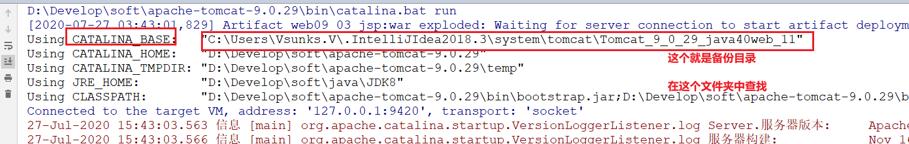

1. 会话管理技术

   1. cookie
   2. session

2. 页面技术(模板)

   1. jsp

3. 综合案例

   

## 1. 会话

### 1.1 相关概念

#### 1.1.1 会话

从打开浏览器访问服务器开始，到访问服务器结束(关闭浏览器、到了过期时间)期间，产生的多次请求和响应加在一起就称之为两者之间的一次会话。

会话默认的超时时间是30分钟。


会话管理技术存在的意义是什么？

在`客户端或者服务器端`保存当前`会话过程`中产生的一些`数据`。

会话技术保证在`同一个会话`的中`多次请求`、`多个页面跳转`时数据不会丢失。


Cookie：客户端会话管理技术

Session：服务器端会话管理技术


## 1.2 cookie

### 1.2.1 概念

Cookie：浏览器端的会话管理技术。

Cookie的作用：把同一个会话中多次请求响应时产生的数据保存浏览器端并且共享。


cookie本质就是把一个字符串形式的键值对存储到客户端消息头(请求头/响应头)里面。


消息头会以字符串的形式体现，


在服务器创建一个cookie对象，设置name和vaule（String），resp.addCookie；如果响应对象向客户端响应了内容，响应对象会自动把设置好的cookie对象中的内容(name、value、path....)作为响应头传递给客户端。

当下次发起请求时，会自动携带刚才的cookie发起请求，后台可以通过request对象获取到之前已经存在的cookie并使用。


### 1.2.2 API


### 1.2.3 cookie的常见属性和方法

最重要的两个是name和value

```java
/*
	可以当做一个普普通通类来使用，先手动创建对象，再使用。
*/
public class Cookie implements Cloneable, Serializable {
    private static final CookieNameValidator validation;
    private static final long serialVersionUID = 1L;
    /* 必须属性，被final，所以一旦赋值，不能修改。所以没有set方法*/
    private final String name;
    
    /* 必须属性，不要使用中文 */
    private String value;
    
    private int version = 0;
    private String comment;
    private String domain;
    private int maxAge = -1;
    private String path;
    private boolean secure;
    private boolean httpOnly;
    
    /* 唯一的构造方法，决定了name和value是必须属性  */
    public Cookie(String name, String value) {
        validation.validate(name);
        this.name = name;
        this.value = value;
    }
    
    /* name没有setter */
    public String getName() {
        return this.name;
    }
    
    /* 其他的setter和getter成对出现 */
}
```


### 1.3 cookie的设置和获取

HttpServletResponse接口中定义的设置cookie方法。随着响应写入到了客户端。

```java
void addCookie(Cookie var1);
```

HttpServletRequest接口中定义了获取cookie的方法，随着请求再次传递到了浏览器。

```java
Cookie[] getCookies();// 获取请求对象中所有的cookie数组
```

#### 1.3.1==注意==

**先设置，下才能获取到**


### 1.4 Cookie的使用

```java
/*
    Cookie的使用
 */
@WebServlet("/servletDemo01")
public class ServletDemo01 extends HttpServlet{
    @Override
    protected void doGet(HttpServletRequest req, HttpServletResponse resp) throws ServletException, IOException {
        //1.通过响应对象写出提示信息
        resp.setContentType("text/html;charset=UTF-8");
        PrintWriter pw = resp.getWriter();
        pw.write("欢迎访问本网站，您的最后访问时间为：<br>");

        //2.创建Cookie对象，用于记录最后访问时间
        Cookie cookie = new Cookie("time",System.currentTimeMillis()+"");

        //3.设置最大存活时间
        cookie.setMaxAge(3600);
        //cookie.setMaxAge(0);    // 立即清除

        //4.将cookie对象添加到客户端，该Cookie对象及其对应的消息头只有在下次请求时才会被提交到后台
        // 后台通过request对象获取之后，使用
        resp.addCookie(cookie);

        //5.获取cookie
        Cookie[] arr = req.getCookies();
        for(Cookie c : arr) {
            System.out.println("c.getPath() = " + c.getPath());
            if("time".equals(c.getName())) {
                //6.获取cookie对象中的value，进行写出
                String value = c.getValue();
                SimpleDateFormat sdf = new SimpleDateFormat("yyyy-MM-dd HH:mm:ss");
                pw.write(sdf.format(new Date(Long.parseLong(value))));
            }
        }
    }

    @Override
    protected void doPost(HttpServletRequest req, HttpServletResponse resp) throws ServletException, IOException {
        doGet(req,resp);
    }
}
```


> 判断cookie写入客户端成功？

开发者工具，查看当次请求的响应头，查找是否有一个叫`set-Cookie`

> 查看本次提交是否携带cookie？

开发者工具，查看当次请求的请求头，查找是否有一个叫`cookie`


**效果**


#### name和age属性说明

```java
/*
	name
		Cookie 的名称只能包含 ASCII 码表中的字母、数字字符。
		不能包含逗号、分号、空格，不能以 $ 开头。
	value
		Cookie 的值不建议使用中文
	
	数量
		API中表示20个/domain，300个/总量。
		这是最开始的量，现在已经变大了，每个浏览器不一样，不用重点关注
		
    大小
    	不能超过4k/个
		
	maxAge
		默认单位是秒
        	负数	cookie保存在浏览器内存中；关闭浏览器 ，cookie失效
        	0	cookie不保存；立即失效，无法使用
        	正数	cookie保存在本地文件，指定的时间（单位为秒）后失效
		

    Cookie的路径(path)限制
    	取自第一次访问的资源路径前缀（/servlet）
    	只要以这个前缀为开头(包括子级路径)，可以获取到
    	反之获取不到
    	
    	
   经验：
        1. 尽量少用path范围广的cookie
        2. 范围广的cookie，如果要使用，尽量控制合理的有效期
 */
@WebServlet("/servlet/servletDemo02")
public class ServletDemo02 extends HttpServlet{
    @Override
    protected void doGet(HttpServletRequest req, HttpServletResponse resp) throws ServletException, IOException {
        //创建Cookie并添加
        Cookie cookie = new Cookie("username","zhangsan");
        cookie.setMaxAge(3600);
        // cookie.setPath("/");
        resp.addCookie(cookie);
    }

    @Override
    protected void doPost(HttpServletRequest req, HttpServletResponse resp) throws ServletException, IOException {
        doGet(req,resp);
    }
}
```


其他Servlet核心代码

```java
@WebServlet("/servlet/servletDemo03")  //前缀相同，可以获取到cookie
public class ServletDemo03 extends HttpServlet{
    @Override
    protected void doGet(HttpServletRequest req, HttpServletResponse resp) throws ServletException, IOException {
        //获取Cookie
        Cookie[] arr = req.getCookies();
        for(Cookie c : arr) {
            if("username".equals(c.getName())) {
                String value = c.getValue();
                resp.getWriter().write(value);
            }
        }
    }
}
```

```java
@WebServlet("/servlet/aaa/servletDemo04")//前缀相同，可以获取到cookie
public class ServletDemo04 extends HttpServlet{
    @Override
    protected void doGet(HttpServletRequest req, HttpServletResponse resp) throws ServletException, IOException {
        //获取Cookie
        Cookie[] arr = req.getCookies();
        for(Cookie c : arr) {
            if("username".equals(c.getName())) {
                String value = c.getValue();
                System.out.println("servletDemo04   c.getPath() = " + c.getPath());
                System.out.println("servlet/servletDemo04");
                resp.getWriter().write(value);
            }
        }
    }
}
```

```java
@WebServlet("/bbb/servletDemo05")//前缀不同，获取不到cookie。如果想获取到，可以在添加cookie的时候为其设置path  在ServletDemo02中  cookie.setPath("/");
public class ServletDemo05 extends HttpServlet{
    @Override
    protected void doGet(HttpServletRequest req, HttpServletResponse resp) throws ServletException, IOException {
        //获取Cookie
        Cookie[] arr = req.getCookies();
        for(Cookie c : arr) {
            if("username".equals(c.getName())) {
                String value = c.getValue();
                System.out.println("servletDemo05   c.getPath() = " + c.getPath());
                System.out.println("servlet/servletDemo05");
                resp.getWriter().write(value);
            }
        }
    }
}
```


## 1.3 SESSION

受限于cookie这种会话管理技术的数量和大小限制，避免网络资源的浪费和不安全，就有了session这种服务器端的会话管理技术。


### 1.3.1 HttpSession概念

Session会话管理技术的接口

> 举例类比：某同学有巨额财富

| 生活中                | Java中                     |
| --------------------- | -------------------------- |
| 巨额财富              | 需要保存的数据             |
| 购物、吃饭等消费      | 每次消费对应一个请求       |
| 账户                  | session对象                |
| 给储户一个银行卡/卡号 | 给客户端一个简单的特殊标识 |

总结：session中存的数据是保存在服务器端的，浏览器端会持有一个与服务器session匹配的一个简单的特殊标记。

### 1.3.2 HttpSession作用

作为域对象存储数据


### 1.3.3 常用 方法


### 1.3.4 HttpSession的获取方式


建议使用第一种


### 1.3.5 HttpSession的使用

基本使用

```java
/*
    Session的基本使用
 */
@WebServlet("/servletDemo01")
public class ServletDemo01 extends HttpServlet{
    @Override
    protected void doGet(HttpServletRequest req, HttpServletResponse resp) throws ServletException, IOException {
        //1.获取请求的用户名
        String username = req.getParameter("username");

        //2.获取HttpSession的对象
        HttpSession session = req.getSession();
        System.out.println(session);
        System.out.println(session.getId());

        //3.将用户名信息添加到共享数据中
        session.setAttribute("username",username);
    }

    @Override
    protected void doPost(HttpServletRequest req, HttpServletResponse resp) throws ServletException, IOException {
        doGet(req,resp);
    }
}
```

```java
package com.itheima.servlet;

import javax.servlet.ServletException;
import javax.servlet.annotation.WebServlet;
import javax.servlet.http.HttpServlet;
import javax.servlet.http.HttpServletRequest;
import javax.servlet.http.HttpServletResponse;
import javax.servlet.http.HttpSession;
import java.io.IOException;

/*
    Session的基本使用
 */
@WebServlet("/servletDemo02")
public class ServletDemo02 extends HttpServlet{
    @Override
    protected void doGet(HttpServletRequest req, HttpServletResponse resp) throws ServletException, IOException {
        //1.获取HttpSession对象
        HttpSession session = req.getSession();
        System.out.println(session);
        System.out.println(session.getId());

        //2.获取共享数据
        Object username = session.getAttribute("username");

        //3.将数据响应给浏览器
        resp.getWriter().write(username+"");
    }

    @Override
    protected void doPost(HttpServletRequest req, HttpServletResponse resp) throws ServletException, IOException {
        doGet(req,resp);
    }
}

```


### 1.3.6 使用细节

> - 获取JSessionID

在前端

开发者工具里面，查看一个请求头cookie，值中含有“JSessionID=xxxxx”

在后台

session对象.getId();

> - 禁用cookie后无法获取session的解决办法

**产生原因：**

​	session需要保存一个唯一标示在客户端，通过cookie技术；禁用cookie以后就不能保存该id，后面的方法就不能带着之前的session请求，所以无法获取。

**解决办法：**

```java
/*
    Session的禁用的解决办法
 */
@WebServlet("/servletDemo01")
public class ServletDemo01 extends HttpServlet{
    @Override
    protected void doGet(HttpServletRequest req, HttpServletResponse resp) throws ServletException, IOException {
        //1.获取请求的用户名
        String username = req.getParameter("username");

        //2.获取HttpSession的对象
        HttpSession session = req.getSession();
        System.out.println(session);
        System.out.println(session.getId());

        //3.将用户名信息添加到共享数据中
        session.setAttribute("username",username);
		
        // 解决方式二：每个respone响应都要重写。与业务无关的代码不应该高频出现在业务代码中。
        // 这种方式不推荐。
        //实现url重写  相当于在地址栏后面拼接了一个jsessionid
        resp.getWriter().write("<a href='"+resp.encodeURL("http://localhost:8080/session/servletDemo03")+"'>go servletDemo03</a>");

    }

    @Override
    protected void doPost(HttpServletRequest req, HttpServletResponse resp) throws ServletException, IOException {
        doGet(req,resp);
    }
}

```

```java
/*
    Cookie的禁用
 */
@WebServlet("/servletDemo03")
public class ServletDemo03 extends HttpServlet{
    @Override
    protected void doGet(HttpServletRequest req, HttpServletResponse resp) throws ServletException, IOException {
        //1.获取HttpSession对象
        HttpSession session = req.getSession(false);
        System.out.println(session);
        if(session == null) {
            resp.setContentType("text/html;charset=UTF-8");
            // 解决方式1：响应提示，提醒客户不要禁用cookie 推荐方式
            resp.getWriter().write("为了不影响正常的使用，请不要禁用浏览器的Cookie~");
        }
    }

    @Override
    protected void doPost(HttpServletRequest req, HttpServletResponse resp) throws ServletException, IOException {
        doGet(req,resp);
    }
}

```


> - session的钝化和活化

目的是为了节省服务器内存

会话开始：第一次访问时产生session

会话结束：关闭浏览器、调用session对象的销毁方法、会话超时（30min以上）


### 1.4 session的应用场景

常配合cookie使用，完成`保存用户登录状态等信息`、`购物车`等功能。


### 1.5 session和cookie的区别


## 2. JSP

### 2.1 概念相关

#### 2.1.1 规范

JavaEE的13大规范之一，是一种动态网页技术。

#### 2.1.2 代码中

`JSP ≈ html + servlet`

页面（视图）模板，本质就是servlet。


之前怎么响应数据

```java
response.getWriter().write("xxx");   // 没有html结构

// 有页面结构的写法    很繁琐
response.getWriter().write("<html>"); 
response.getWriter().write("<a href='http://baidu.com'>"); 
response.getWriter().write("</html>"); 
```


如果使用jsp之后，就不需要这么麻烦了

> 直接在jsp中编写HTML代码，他会自动解析，还可以吧后台响应是数据填充到解析后的页面中。

### 2.2 JSP 快速入门

JSP中支持所有在HTML中可用的标签，并能成功解析

```jsp
<html>
  <head>
    <title>JSP</title>
  </head>
  <body>
    <h1>这是我的第一个jsp</h1>
  </body>
</html>
```


### 2.3 JSP执行过程

相对Servlet来说。多了翻译成java文件和编译成class文件这个步骤。（统一建模语言UML之一：时序图）


#### 2.4 JSP生成的源码分析

#### 2.4.1 idea做的工作

idea会为每一个web项目在idea的配置文件夹中创建一个tomcat配置的副本文件夹，jsp翻译的内容就在该文件夹中。

tomcat启动时，会在控制台输出如下内容：




会自动生成一个java文件和class文件，文件名：“jsp文件名_jsp.xxxx”。

### 2.4.2 jsp继承关系

jsp生成的java文件源码

```java
// 由继承关系决定，jsp本质就是一个Servlet
public final class index_jsp extends org.apache.jasper.runtime.HttpJspBase{
    
}
```

HttpJspBase.java

```java
public abstract class HttpJspBase extends HttpServlet implements HttpJspPage {
}
```


### 2.4.3 JSP做了什么事情

```java
public final class index_jsp extends org.apache.jasper.runtime.HttpJspBase{
    // _jspService功能和servlet中service方法一致
    public void _jspService(HttpServletRequest request, final HttpServletResponse response){
     	response.setContentType("text/html;charset=UTF-8");
       		 // 输出流对象out  功能和respone.getWriter();一样
              javax.servlet.jsp.JspWriter out = null;
              out = pageContext.getOut();

			// jsp帮我们完成了繁琐的页面布局内容的输出，会被浏览器解析
        // 页面就变得有数据 + 样式布局  好看
              out.write("\n");
              out.write("<html>\n");
              out.write("  <head>\n");
              out.write("    <title>JSP</title>\n");
              out.write("  </head>\n");
              out.write("  <body>\n");
              out.write("    <h1>这是我的第一个jsp</h1>\n");
              out.write("  </body>\n");
              out.write("</html>\n");
    }
}
```


### 2.5 jsp语法

```java
<%@ page contentType="text/html;charset=UTF-8" language="java" %>
<html>
<head>
    <title>jsp语法</title>
</head>
<body>
    <%--
        1. 这是注释
    --%>

    <%--
        2.java代码块
        System.out.println("Hello JSP"); 普通输出语句，输出在控制台
        out.println("Hello JSP");
            out是JspWriter对象，输出在页面上
            println不会自动换行，请使用输出<br>换行

        注意点：
            写在<%%>java代码块中的内容，会被放在_jspServie()方法中
    --%>
    <%
        System.out.println("Hello JSP");
        out.println("Hello JSP<br>");
        String str = "hello<br>";
        out.println(str);
    %>

    <%--
        3.jsp表达式 简化java代码块
        <%="Hello"%>  相当于 out.println("Hello");
    --%>
    <%="Hello<br>"%>

    <%--
        4.jsp中的声明(变量或方法)
        把声明的内容放在成员位置

        如果加!  代表的是声明的是成员变量
        如果不加!  代表的是声明的是局部变量
    --%>
    <%! String s = "abc";%>
    <% String s = "def";%>
    <%=s%>

    <%-- 这个getSum是一个成员方法 --%>
    <%! public void getSum(){}%>
    <%-- 这个是想在_jspService() 方法中定义getSum2()。语法错误 --%>
    <%--<% public void getSum2(){}%>--%>
</body>
</html>
```


### 2.6 jsp指令

**重点**

> taglib指令  引入第三方的标签库
>
> <%@ taglib uri=标签库的地址 prefix=前缀名称 %>

```jsp
<%--
    1.page指令 文档声明，完成Java代码相关功能。不用。
--%>
<%@ page contentType="text/html;charset=UTF-8" language="java" errorPage="/error.jsp" %>

<%--
    2.include指令。整合其他jsp页面。不常用。
--%>
<%@ include file="/include.jsp"%>

<%--
    3.taglib指令  引入第三方的标签库
--%>
<%@ taglib uri=标签库的地址 prefix=前缀名称 %>
<html>
<head>
    <title>jsp指令</title>
</head>
<body>
    <%--<% int result = 1 / 0; %>--%>
    <%=s%>
    <% out.println("aa");
    %>
</body>
</html>

```


**page指令标签的属性及作用（了解）**


**inclue指令标签（理解）**

```jsp
<%@ include file="/include.jsp"%>
```


JSP有两种包含

静态包含：就是include指令。把被include的页面完整的复制过来

动态包含： <jsp:include > (本质是servlet中的请求包含)


**taglib指令标签（后期重点学习）**

```jsp
<%@taglib prefix="" uri="" %>
```


### 2.7 jsp九大内置对象

为了方便在jsp页面中使用servlet或者jsp中常用的对象，而把他们直接定义并初始化好，我们可以直接使用。


### 2.8 四大域对象

三个servlet中的域对象和一个jsp中的域对象

从上到下，范围一次变大，能用小的，尽量不用大的。

九大内置对象中有四个本身就是域对象，通过pageContext这个内置对象（域对象）获取到另外三个域对象


## 3. web层MVC模型

> ⚫ M(Model)：模型。用于封装数据，封装的是数据模型！
>
> ⚫ V(View)：视图。用于显示数据，动态资源用 JSP 页面，静态资源用 HTML 页面！
>
> ⚫ C(Controller)：控制器。用于处理请求和响应，例如 Servlet！


MVC  软件三层 两码事

## 综合案例

登录和查询的业务逻辑与昨天一样。


> 添加功能：

登录成功之后，将用户名添加进session对象，用于保存用户在本次会话的登录状态


> 修改功能：

优化查询所有学生信息的响应逻辑：

查询到所有学生之后，不再直接响应到页面（通过输出流写入到响应体），而是存储在session域对象中；

在页面通过域对象获取值，填充在页面的表格中。