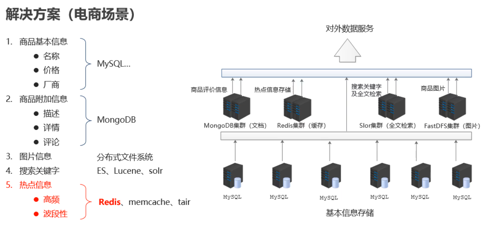
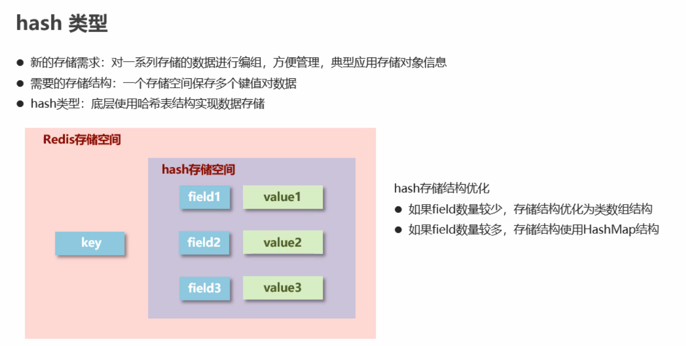

## 今日内容

`Redis`入门

`Redis`下载安装及基本使用

==`Redis`常用命令及**应用场景**(理解)==

==`jedis`入门及使用==

`jedis`可视化工具

`Redis`持久化

## 1. `Redis`入门

### 1.1 背景

电商等高并发网站现状

- 用户比较多、海量用户
- 特定时刻高并发

关系型数据库数据存储的问题

- 性能瓶颈：磁盘IO性能低下
- 扩展瓶颈：数据关系复杂，扩展性差，不便于大规模集群
- 随着数据量增长，查询速度显著降低

解决思路

- 降低磁盘IO次数，越少越好。
- 去除数据间关系，越简单越好。

把这两个特征一合并一起，就有了一个新的概念：`NoSQL`。


### 1.2 `NoSQL`概念

`NoSQL`：即 `Not-Only SQL`（ 非关系型的数据库/不仅仅是数据存储），<span style="color:red">基于内存的数据存储，数据间没有关系。</span>

**作用：**作为关系型数据库的补充，应对基于海量用户和海量数据前提下的数据处理问题。

**常见的非关系型数据库及应用场景**




### 1.3 `Redis`

`Redis(Remote Dictionary Server)`是用 C 语言开发的一个开源的**基于内存的高性能键值对（key-value）缓存和存储系统**。

**特征：**

- 高性能。

  内存存储，不走磁盘`IO`，在大数据量下也可以高性能运行。

  官方提供测试数据，50个并发执行100000个请求,读110000 次/s,写81000次/s

- 数据结构丰富

  支持五种数据类型：string（字符串），hash（哈希），list（列表），set（集合）及`zset`(sorted set：有序集合)。

- 原子性

  核心读写部分是单线程的，排队执行，对应的操作便具有了原子性，避免了多线程操作带来的复杂性和不安全因素。

- 易拓展。

  关系型数据库中记录、表关系复杂，扩容难度高；`NoSQL`中数据无关系，`Redis`3.0开始支持集群，扩容简单。

- 高可用。

  `Redis`3.0开始支持集群，可以多主多从，当某个节点发生异常时，可以由其他对应节点顶替，保持整个集群的高可用。

- 可持久化

  支持把数据持久化存储到磁盘中，以便下次启动或遇到故障时，从磁盘加载恢复数据。


**支持的数据类型**

- | 支持类型     | 表示形式          |
  | ------------ | ----------------- |
  | 字符串类型   | `string`          |
  | 列表类型     | `list`            |
  | 散列类型     | `hash`            |
  | 集合类型     | `set`             |
  | 有序集合类型 | `zset/sorted_set` |


<span style="color:red">**应用场景：**</span>

- <span style="color:red">缓存</span>。查询频率较高，长久保存，但又不经常变化的数据。
- <span style="color:red">即时信息</span>。临时性的，经常变化的数据。
- `Session`共享。解决分布式系统中`session`共享的问题。
- 其他。诸如：时效性信息、消息队列等


### 1.4 `windows`下载安装、启动&测试

- 需要在`GitHub`上下载，非`redis`官方维护。最高版本3.0.503

  > [https://github.com/ServiceStack/redis-windows](https://github.com/ServiceStack/redis-windows)

- 解压即完成安装

- 启动

  解压目录两个文件分别启动服务端和客户端，双击启动(默认端口(6379)、默认配置文件启动)。

  ```bash
  redis-server.exe #启动服务端
  redis-cli.exe	#启动客户端
  ```


- 指定端口/配置文件启动

  ```bash
  # 在解压目录打开cmd
  
  # 默认端口启动服务端
  redis-server.exe
  
  # 指定端口使用默认配置文件启动
  redis-server.exe --port 6380
  
  # 指定端口、指定配置文件启动
  redis-server.exe redis.conf --port 6380
  ```

- 客户端连接服务端

  ```bash
  # 客户端连接本机上服务端默认端口
  redis-cli.exe
  
  # 客户端连接本机上服务端指定端口
  redis-cli.exe -p 6380
  
  # 客户端连接本机上服务端指定端口
  redis-cli.exe -h 1692.168.115.130 -p 6380
  ```

- 测试是否可连接(在客户端)

  ```bash
  127.0.0.1:6379> ping
  PONG
  127.0.0.1:6379> set blog blog.sunxiaowei.net
  OK
  127.0.0.1:6379> get blog
  "blog.sunxiaowei.net"
  127.0.0.1:6379> flushdb	#清空当前数据库
  OK
  127.0.0.1:6379> keys *
  (empty list or set)		#数据库为空
  
  # 切库 select n
  ```

  > 退出(`quit`、`exit`、`ctrl + C` 、`Ctrl +D`)

### 1.4 `linux`下载安装、启动&测试

- 下载

  登录`redis.cn`下载`5.0.5`的`linux`稳定版本

  ```bash
  http://download.redis.io/releases/redis-5.0.5.tar.gz
  ```

  

- 安装和启动

  ```bash
  # 0.准备工作1：安装wget
  yum install wget
  
  # 0.准备工作2：安装gcc编译环境
  yum install gcc-c++
  
  # 0.在/usr/loca目录（用户软件安装目录）创建redis文件夹（包括data文件夹、log文件夹）
  mkdir /usr/local/redis
  
  
  # 1.上传/下载redis安装包到centos，下面两个步骤（1.1和1.2）任选其一即可
  # 1.1 上传离线安装包，上传redis安装包到centos7
  # crt工具 Alt + p 打开sftp窗口，通过put命令上传到登录用户的home目录
  put redis-linux-5.0.5.tar.gz
  
  # 剪切压缩包到安装目录
  mv /root/redis-linux-5.0.5.tar.gz /usr/local/redis/redis-5.0.5.tar.gz
  
  # 1.2 在线下载安装包（需要安装好了wget）
  wget -P /usr/local/redis http://download.redis.io/releases/redis-5.0.5.tar.gz
  
  # 2. 进入redis目录
  cd  /usr/local/redis
  
  # 3. 解压到当前目录
  tar -zxvf redis-5.0.5.tar.gz
  
  # 4. 进入解压目录，执行编译
  cd redis-5.0.5
  make
  
  # 5. 进入src目录，可以看到服务端和客户端的启动程序
  cd src
  ./redis-server
  ./redis-cli
  
  # # 6.新建数据目录和日志目录
  
  mkdir /usr/local/redis/redis-5.0.5/data
  mkdir /usr/local/redis/redis-5.0.5/log
  mkdir /usr/local/redis/redis-5.0.5/conf
  
  # 7. 在任意位置位置启动Redis-server
  # 打开linux配置path的文件,
  vim /etc/profile
  #在文件末尾添加下面两行,其中REDIS_HOME的值是redis安装的根目录
  export REDIS_HOME=/usr/local/redis/redis-5.0.5
  export PATH=$REDIS_HOME/src:$PATH
  
  # 重新加载配置文件
  source /etc/profile
  ```

- 指定端口/配置文件启动

  ```bash
  # 在解压目录打开cmd
  
  # 默认端口启动服务端
  redis-server
  
  # 指定端口使用默认配置文件启动
  redis-server --port 6380
  
  # 指定端口、指定配置文件启动
  redis-server ../redis.conf
  
  # 客户端连接非默认端口的服务端
  redis-cli -p 6380
  ```

  

- 测试是否可连接(在客户端)

  ```bash
  127.0.0.1:6379> ping
  PONG
  127.0.0.1:6379> set blog blog.sunxiaowei.net
  OK
  127.0.0.1:6379> get blog
  "blog.sunxiaowei.net"
  127.0.0.1:6379> flushdb	#清空当前数据库
  OK
  127.0.0.1:6379> keys *
  (empty list or set)		#数据库为空
  
  # 切库 select n
  ```

  

### 1.5 `redis`配置

- **最简配置**

  ```bash
  # 绑定Ip   指定可以通过本机的哪个网口连接本Redis实例  如果注释（删掉）则任意IP都可以连接
  # 生产环境中，为了安全，需要指定。学习期间为了方便，注释掉
  # 可以在一行绑定本机的多个IP，中间使用空格分割
  # bind 127.0.0.1
  bind 127.0.0.1 192.168.115.130
  
  # 指定Redis的端口
  port 6379
  
  # 当客户端闲置多长时间后关闭连接，如果指定为0，表示关闭该功能
  timeout 0
  
  # 是否以守护进程启动，守护进程表示后台启动，非守护进程表示前台启动
  daemonize no
  
  # 设置日志的级别  debug、verbose、notice、warning，默认为verbose
  loglevel verbose
  
  # 日志文件的名字，当指定为空字符串时，为标准输出，如果redis已守护进程模式运行，那么日志将会输出到  /dev/null 。
  # 如果这里配置了指定的日志文件，就算redis以非守护进程方式启动(前台启动)，日志也只是输入到日志文件，而不会在启动窗口展示
  logfile ""
  ```

  

- **所有配置**

  见中文注释版配置文件


## 2. `redis`操作

### 2.1 数据类型


数据类型指的是`key-value`中的`value的类型`，`key永远是字符串` 。

`Redis`的`value`支持五种数据类型：string（字符串），hash（哈希），list（列表），set（集合）及`zset`(sorted set：有序集合)。

- string   -- Map<String, String>
- hash    -- Map<String,`HashMap`<String,String>>
- list       -- Map<String,List<String>>  有序 可重复
- set       -- Map<String,Set<String>>  无序 不可重复
- `zset`（sorted set）  -- Map<String,`TreeSet`<String>>  不可重复，可以基于score实现排序

会根据数据不同，选择不同的数据类型，保证在不同场景下，存取处理的速度都是最快的。


### 2.2 String

最简单、最常用的单个数据存储的类型。

> 常用命令

<font color="red"  size=5>**set/get/mset/mget/setnx/setex**</font>

> 应用场景

计数器(`incr`、`decr`)、分布式锁(`setnx`、`del`、`expire`)、存储对象（不经常变化的）(`set`、`get`、`json`格式)、验证码(`setex`)

```bash
命令：
    set key value  key存在，则覆盖原值
    get key
    del key
    setnx key value 判定性添加数据；key存在，则添加失败
    mset key1 value1 key2 value2 ...
    mget key1 key2 ..
    strlen key  获取数据字符个数（字符串长度）
    append key value 追加信息到原始信息后部（存在追加，不存在新建）

    incr key   ++ (原值不存在，从0开始累加)
    incrby key increment  +n
    incrbyfloat key increment
    decr key   --
    decrby key increment  -n
    setex key seconds value 
    psetex key milliseconds value

案例：
    在redis中为大V用户设定用户信息，以用户主键和属性值作为key，后台设定定时刷新策略即可
    eg1==> user:id:3506728370:fans 12154121
           user:id:3506728370:blogs 54545
           user:id:3506728370:focuses 83
    eg2==> user:id:3506728370 {"fans":1245445,"blogs":65452,"focuses":83} 

key的设置约定：
	
    数据库中的热点数据key命名惯例
    	user:id:123456:fans 2541256
    	表名：主键名：主键值：字段名（非必须）
```


### 2.3 hash




值为`hash`结构，命令多以`h`开头

> 常用命令：

<font color="red" size=5>**hset/hget/hmset/hmget/hexists**</font>

> 格式：

`redis的key` `field` `value`

> 应用场景：

购物车(`hset`、`hdel`)、存储对象（频繁变化的）(`hset`、`hdel`)

```bash
命令：
	hset key field value
	hget key field
	hgetall key		//对操作数据量可能会比较大的指令，一定要小心，不要阻塞后面命令执行。先获取长度hlen key
	hdel key field1 [field2] ..
	hsetnx key field value
	
	hmset key field1 value1 field2 value2 ...
	hmget key field1 field2 ...
	hlen key
	hexists key field
	
	hkeys key  获取所有键 // 在明确数量之前，慎用
	hvals key  获取所有值 // 在明确数量之前，慎用
	hincrby key field increment
	hincrbyfloat key field increment
	hexists key	判断对应redis的键是否有值
	
案例：
	双11活动日，销售手机充值卡的商家对移动、联通、电信的30元、50元、100元商品推出抢购活动，每种商品抢购上限1000张
		hmset id:001 c30 1000 c50 1000 c100 1000
		hmset id:002 c30 1000 c50 1000 c100 1000
		
		hincrby id:001 c30 -5
		hincrby id:001 c50 -15
		
		工作中主要还是设置和获取，修改的操作通过java代码实现，而不是通过hincryby
```


### 2.4 list

键为字符串，值为`list`。

两端操作的队列，所以可以左右两端操作；

命令中涉及两端操作的，`l`表示 左，`r`表示右；其他情况下命令以`l`开头

没有索引越界异常，获取超出索引返回的是`nil`

> 常用命令：

<font color="red" size=5>**lpush/rpush/lpop/rpop/lrange/llen**</font>

> 应用场景：

数据顺序添加并汇总，`eg`：

消息队列、最新列表

```shell
命令：
	lpush key value1 [value2] ...
	rpush key value2 [value2] ...
	lrange key start stop	// 在不明确list长度的前提下，慎用lrange key 0 -1
	lindex key index  获取指定索引的值
	llen key
	lpop key
	rpop key
	
	lrem key count value  移除指定个数的值
	blpop key1 [key2] timeout  规定时间内获取并移除数据
	brpop key1 [key2] timeout  规定时间内获取并移除数据
	brpoplpush source destination timeout 迁移数据
```


### 2.5 set

与`hash`的`key`结构相同，无序不重复。

命令多以`s`开头

> 常用命令

<font color="red" size=5>**sadd/smembers/sismember/sinter/sunion/sdiff**</font>

> 应用场景

好友关注感兴趣的人的集合操作(`sinter/sunion/sdiff`)、随机展示(`srandmember`)、黑白名单(`sismember`)


```shell
命令：
	sadd key member1 [member2]
	smembers key    // 在明确member数量之前，慎用
	srem key member1 [member2]
	scard key 获取集合数据总量
	sismember key member 判断集合中是否包含指定数据
	srandmember key [count] 随机获取集合中指定数量的数据
	spop key  随机获取集合中的某个数据并将该数据移出集合
	
	sinter key1 [key2] ..  交集
	sunion key1 [key2] ..  并集
	sdiff key1 [key2] ..   差集
	
	sinterstore destination key1 [key2]...  交集到指定集合
	sunionstore destination key1 [key2]...  并集到指定集合
	sdiffstore destination key1 [key2]...   差集到指定集合
```


### 2.6` zset(SortedSet)`

命令多以`z`开头

> 常用命令

<font color="red" size=5>**zadd/zrange**</font>


```shell
zadd key score member
zrange key start stop [withscores]
```


### 2.6.1 综合案例

目的是为了练习数据类型和相关命令，生产环境中只需要通过添加标记字段即可轻松实现，不需要这么麻烦。

### 2.7 key

> 常用命令

<font color="red" size=5>**del/expire/ttl**</font>

```shell
del key  -- 删除键值
expire key seconds -- 设置键的有效时长
ttl key -- 查看键的有效时长

keys *   // 所有不确定范围的操作，都要慎重！！！
type key
exists key  -- 判断key是否存在
persist key -- 将key变为永久有效

// 有效期
永久 -1
失效/不存在 -2
正整数  剩余失效时间 s/ms
```


### 2.8数据库操作(了解)

> `redis`默认有16个数据库，所有数据库都共享`redis`内存，但是每个数据库间的数据相互隔离

```shell
select index  -- 选择数据库 （index的值为0-15）
dbsize  -- 查看当前数据库中键的个数

flushdb  -- 清除当前数据库的内容
flushall -- 清除所有数据库的内容
```


## 3. `jedis`

`java`操作`redis`

- 步骤
  1. 导入`jar`包
  2. 创建连接对象
  3. 通过方法调用命令操作`redis`
  4. 释放资源


- 配置文件（`src/redis.properties`）

```properties
redis.maxTotal=50
redis.maxIdel=10
redis.host=localhost
redis.port=6379
```

- 编写工具类

```java
public class JedisUtils {

    private static JedisPool jp;

    static {
        ResourceBundle bundle = ResourceBundle.getBundle("redis");
        int maxTotal = Integer.parseInt(bundle.getString("redis.maxTotal"));
        int maxIdel = Integer.parseInt(bundle.getString("redis.maxIdel"));
        String host = bundle.getString("redis.host");
        int port = Integer.parseInt(bundle.getString("redis.port"));

        //Jedis连接池配置
        JedisPoolConfig jpc = new JedisPoolConfig();
        jpc.setMaxTotal(maxTotal);
        jpc.setMaxIdle(maxIdel);
        jp = new JedisPool(jpc,host,port);
    }

    public static Jedis getJedis(){
        return jp.getResource();
    }

}
```

- 使用`Jedis`进行操作

```java
public static void main(String[] args) {
        //1.获取连接对象
        Jedis jedis = JedisUtils.getJedis();
        //2.执行操作
//        jedis.set("age","39");
//        String hello = jedis.get("hello");
//        System.out.println(hello);
//        jedis.lpush("list1","a","b","c","d");
//        List<String> list1 = jedis.lrange("list1", 0, -1);
//        for (String s:list1 ) {
//            System.out.println(s);
//        }
        jedis.sadd("set1","abc","abc","def","poi","cba");
        Long len = jedis.scard("set1");
        System.out.println(len);
        //3.关闭连接
        jedis.close();
    }
```


- ==注意事项==

  ```java
  /*
  注意：
  	1. jedis连接的redis服务必须在启动的时候指定了配置文件
  	2. jedis连接的redis服务，配置文件中的bind必须有值，并且不能仅仅是127.0.0.1，需要使用一个redis实例所在服务器的一个具体的网卡地址
  */
  // Jedis jedis = new Jedis("redis实例所在主机的ip",端口);
  ```

- 可视化工具

  了解即可。

## 4. `redis`持久化

> 持久化：把数据保存到可以永久保存的介质中。
>
> `redis`支持两种持久化操作，分别是`rdb`和`aof`
>
> `rdb`是以快照的方式保存某个时间点的真实数据；`aof`是以日志的方式保存整个操作过程中的所有操作命令。
>
> ==注意：==以上两种持久化方案没有好坏之分， 他们在实际开发中是一个互补的方案

> `rdb`：数据体量少，保存效率高，但是因为是某个时间点的数据，会存在数据丢失的风险
>
> `aof`：记录每个操作，数据体量大，保存效率弱于`rdb`，但是可以最大程度保证数据的完整性
>
> ==实际开发中，如果两种持久化技术都使用，优先使用`aof`，保证数据完整。==


### 4.1 `rdb`持久化

- 方式
  - 手动执行save命令，同步操作，会阻塞其他操作命令执行（不推荐）
  - 手动执行`bgsave`命令，会fork一个子进程，在子进程中完成数据持久化动作，不会阻塞其他操作命令（非自动化）
  - 通过配置，自动完成`rdb`持久化，底层是`bgsave`操作（建议方案）
- 自动持久化相关配置

```conf
# 指定在多长时间内，有多少次更新操作，就将数据同步到数据文件，可以多个条件配合
# 这里表示900秒（15分钟）内有1个更改，300秒（5分钟）内有10个更改以及60秒内有10000个更改
# 如果想禁用RDB持久化的策略，只要不设置任何save指令，或者给save传入一个空字符串参数也可以
# 更改次数，指的是成功增、删、改
save 900 1
save 300 100
save 60  1000


# 对于存储到磁盘中的快照(rdb)，可以设置是否进行压缩存储。如果是的话，redis会采用
# LZF算法进行压缩。如果你不想消耗CPU来进行压缩的话，可以设置为关闭此功能
rdbcompression yes

# 在存储快照后，还可以让redis使用CRC64算法来进行数据校验，但是这样做会增加大约
# 10%的性能消耗，如果希望获取到最大的性能提升，可以关闭此功能
rdbchecksum yes

# dbfilename文件存放目录。必须是一个目录，aof文件也会保存到该目录下。
dir ./

#rdb文件的名字。
dbfilename dump.rdb
```

### 4.2 aof持久化

- 相关配置

```conf
# 是否启用aof持久化方式 。否在每次更新操作后进行日志记录，Redis在默认情况下是异步的把数据写入磁盘，如果不开启，可能会在断电时导致一段时间内的数据丢失。
# 因为 redis本身同步数据文件是按上面save条件来同步的，所以有的数据会在一段时间内只存在于内存中。默认为no
appendonly no

# 指定更新日志（aof）文件名，默认为appendonly.aof
appendfilename "appendonly.aof"

#指定更新日志条件，共有3个可选值： 
#  no：表示等操作系统进行数据缓存同步到磁盘（快，持久化没保证） 
#  always：同步持久化，每次发生数据变更时，立即记录到磁盘（慢，安全） 
#  everysec：表示每秒同步一次（默认值,很快，但可能会丢失一秒以内的数据）
# appendfsync always
appendfsync everysec
# appendfsync no

# 指定是否在后台aof文件rewrite期间调用fsync，默认为no，表示要调用fsync（无论后台是否有子进程在刷盘）。
# Redis在后台写RDB文件或重写AOF文件期间会存在大量磁盘IO，此时，在某些linux系统中，调用fsync可能会阻塞。
#如果应用系统无法忍受延迟，而可以容忍少量的数据丢失，则设置为yes。如果应用系统无法忍受数据丢失，则设置为no。
no-appendfsync-on-rewrite no

#当AOF文件增长到一定大小的时候Redis能够调用 BGREWRITEAOF 对日志文件进行重写 。当AOF文件大小的增长率大于该配置项时自动开启重写。
auto-aof-rewrite-percentage 100

#当AOF文件增长到一定大小的时候Redis能够调用 BGREWRITEAOF 对日志文件进行重写 。当AOF文件大小大于该配置项时自动开启重写
auto-aof-rewrite-min-size 64mb
```

