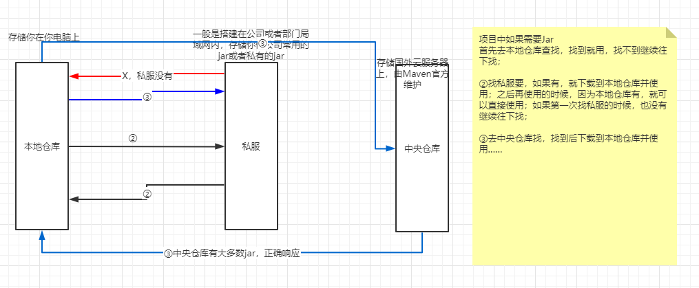
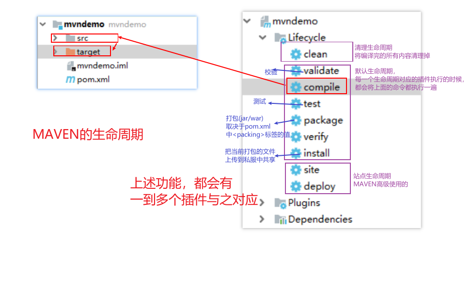
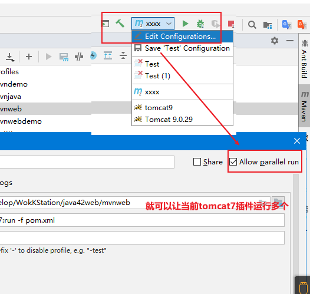

## 1. `Maven`概述

### 1.1 概念

Maven是一个项目管理工具，有两个核心功能：依赖管理(jar包管理)、项目构建(操作维护项目)；

上述两个功能的实现是通过一个POM模型对象来实现，该对象对应的是一个pom.xml文件；

pom.xml是整个Maven中最核心最重要的文件。


### 1.2 目录结构

```java
// java项目结构
/*
Java项目(模块)根目录
├── pom.xml
└── src
    ├── main
    │   ├── java
    │   └── resources
    └── test
        ├── java
        └── resources


*/

// javaweb项目结构
/*
javaweb项目(模块)根目录
├── pom.xml
└── src
    ├── main
    │   ├── java
    │   ├── resources
    │   └── webapp
    │       └── WEB-INF
    │           └── web.xml
    └── test
        ├── java
        └── resources
*/
```


### 1.3 安装

- 解压

  建议所有的开发软件都放在同一个目录（不能有中文、空格及其他特殊字符）

- 配置Path

  配置MAVAEN_HOME，值为Maven安装的根目录

  配置path，引用到刚才的根目录，值为：%MAVAEN_HOME%\bin

- 检测是否成功

  重新打开命令行窗口，键入`mvn`，如果有非错误提示，说明成功。


## 2. 相关概念

### 2.1 仓库

存储jar包的仓库



### 2.2 坐标

可以让Maven通过坐标快速的定位到某个jar，获取并供我们使用。

```xml
<dependency>
    <groupId>junit</groupId>
    <artifactId>junit</artifactId>
    <version>4.12</version>
</dependency>
```


### 3 配置仓库

仓库的配置只需要修改一个配置文件即可：maven安装目录下面的主配置文件conf/settings.xml

- 本地仓库

  解压仓库的压缩包到某个目录，然后在settings.xml中配置如下内容：

  ```xml
  <settings xmlns="http://maven.apache.org/SETTINGS/1.0.0"
            xmlns:xsi="http://www.w3.org/2001/XMLSchema-instance"
            xsi:schemaLocation="http://maven.apache.org/SETTINGS/1.0.0 http://maven.apache.org/xsd/settings-1.0.0.xsd">
      <!-- localRepository
       | The path to the local repository maven will use to store artifacts.
       |
       | Default: ${user.home}/.m2/repository
  		重点是下面的内容
         -->
      <localRepository>D:\Develop\Repository\Maven_Repository\</localRepository>
  ```

  

- 中央仓库镜像

  配置阿里云对中央仓库的镜像，下载速度快。

  注意放在被注释的`mirrors`下面，小心层级关系

  ```xml
  <mirrors>
      <mirror>
          <id>alimaven</id>
          <mirrorOf>central</mirrorOf>
          <name>aliyun maven</name>
          <url>http://maven.aliyun.com/nexus/content/groups/public/</url>
      </mirror>    
  </mirrors>
  ```

- 私服，建议在某个项目的pom.xml文件配置

  ```xml
  <!-- 为当前模块配置私服 -->
  <repositories>
      <repository>
          <!-- 依赖仓库id，不可重复。repositories可以配置多个仓库，如果ID重复后面配置会覆盖之前的配置 -->
          <id>dependencies_Repositories</id>
          <!-- 私服仓库地址，即nexus仓库组的地址 -->
          <url>http://192.168.14.240:8081/repository/maven-public/</url>
  
          <!-- 是否下载releases构件 -->
          <releases>
              <enabled>true</enabled>
          </releases>
  
          <!-- 是否下载snapshots构件 -->
          <snapshots>
              <enabled>true</enabled>
          </snapshots>
      </repository>
  </repositories>
  <!-- 配置插件从私服下载 -->
  <pluginRepositories>
      <pluginRepository>
          <id>plugins_Repositories</id>
          <url>http://192.168.14.240:8081/repository/maven-public/</url>
          <!-- 是否下载release版本构件 -->
          <releases>
              <enabled>true</enabled>
          </releases>
          <!-- 是否下载snapshots版本构件 -->
          <snapshots>
              <enabled>true</enabled>
          </snapshots>
      </pluginRepository>
  </pluginRepositories>
  ```

  


## 4 `Maven`创建和构建

### 4.1 手动创建和构建(了解)

- 目录结构

- pom.xml文件结构

  ```xml
  <!-- 命名空间 -->
  <project xmlns="http://maven.apache.org/POM/4.0.0"
           xmlns:xsi="http://www.w3.org/2001/XMLSchema-instance"
           xsi:schemaLocation="http://maven.apache.org/POM/4.0.0 http://maven.apache.org/xsd/maven-4.0.0.xsd">
      <!-- MavenModel版本号，与Maven的版本号不是一回事 -->
      <modelVersion>4.0.0</modelVersion>
  
      <!-- 公司名称，一般是域名反写 -->
      <groupId>com.itheima</groupId>
      <!-- 项目名字 -->
      <artifactId>yyyy</artifactId>
      <!-- 项目版本号，SNAPSHOT 快照版  RELEASE  发行版   DEBUG 测试版 -->
      <version>1.0-SNAPSHOT</version>
      <!-- 该项目最终打包的方式 -->
      <packaging>jar</packaging>
  
      <!-- 导入依赖 -->
      <dependencies>
          <!--某一个具体的依赖坐标-->
          <dependency>
              <groupId>junit</groupId>
              <artifactId>junit</artifactId>
              <version>4.12</version>
          </dependency>
      </dependencies>
  </project>
  ```


- 各个及对应的插件

  

  


### 4.2 手动命令使用模板(骨架)创建

不推荐


### 4.3 使用`Idea`创建

1. Idea集成Maven，并开启自动导入、设置使用内置骨架和编码

   ```xml
   -DarchetypeCatalog=internal -Dfile.encoding=UTF-8/GBK
   ```

   

2. 创建并管理Java模块(应用、模块、项目、工程)

   

   

3. 创建并管理JavaWeb模块

   

4. Maven模块的导入导出

   

5. 项目中各个文件夹功能失效怎么解决（右击模块，选择 mark directory as ）

## 5. 插件

### 5.1 `Tomcat`插件

### 5.2 `jdk8`编译插件

```xml
<build>
    <plugins>
        <!-- 指定本项目JDK编译的版本为JDK1.8 -->
        <plugin>
            <groupId>org.apache.maven.plugins</groupId>
            <artifactId>maven-compiler-plugin</artifactId>
            <version>2.3.2</version>
            <configuration>
                <source>1.8</source>
                <target>1.8</target>
            </configuration>
        </plugin>
        <!-- Tomcat7的Maven插件 -->
        <plugin>
            <groupId>org.apache.tomcat.maven</groupId>
            <artifactId>tomcat7-maven-plugin</artifactId>
            <version>2.2</version>
            <configuration>
                <path>/</path>
                <port>8080</port>
                <server>tomcat7</server>
            </configuration>
        </plugin>
    </plugins>
</build>
```




## 6. 依赖

### 6.1 配置

## 6.2 依赖传递

依赖之间、项目之间、项目和依赖之间都是有依赖传递

### 6.3 依赖冲突

项目中对于同一个依赖导入多次，并且版本不一致。

解决思路：

- 路径优先，层级越深优先级越底
- 声明优先，被引入时声明的越早，越优先
- ~~[特殊]同一目录中，后面导入的依赖会覆盖导入的依赖~~

### 6.4 依赖排除

不透明	-	私房钱

不需要	-	拒绝


### 6.5 依赖范围

常见的是`compile`、`test`、`provided`

```xml
<!-- 下面三个scope需要配置provided -->
<dependency>
    <groupId>javax.servlet</groupId>
    <artifactId>javax.servlet-api</artifactId>
    <version>3.0.1</version>
    <scope>provided</scope>
</dependency>
<dependency>
    <groupId>javax.servlet.jsp</groupId>
    <artifactId>javax.servlet.jsp-api</artifactId>
    <version>2.3.3</version>
    <scope>provided</scope>
</dependency>
<dependency>
    <groupId>org.projectlombok</groupId>
    <artifactId>lombok</artifactId>
    <version>1.18.10</version>
    <scope>provided</scope>
</dependency>

<!-- 下面一个scope需要配置test -->
<dependency>
    <groupId>junit</groupId>
    <artifactId>junit</artifactId>
    <version>4.12</version>
    <scope>test</scope>
</dependency>
```


