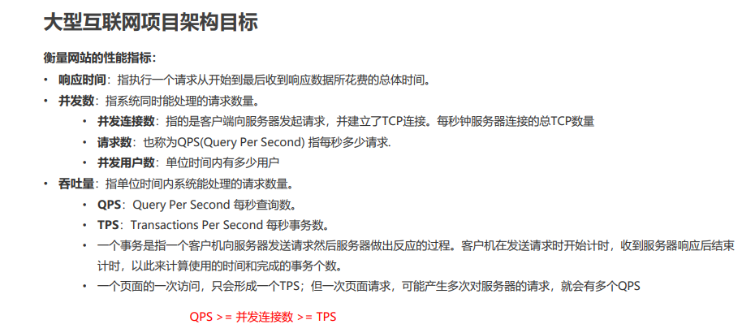
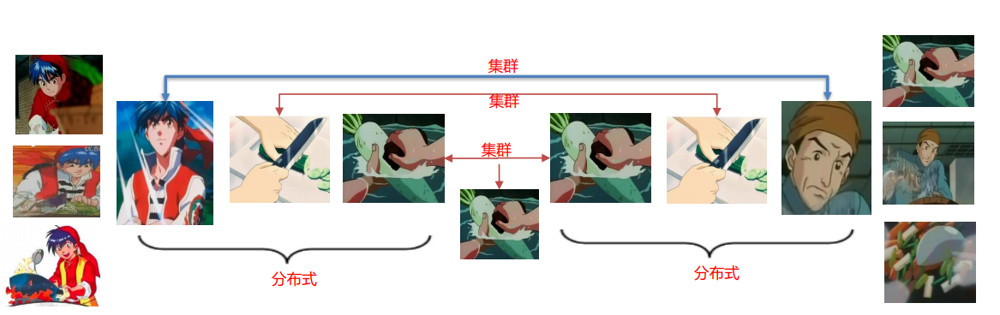
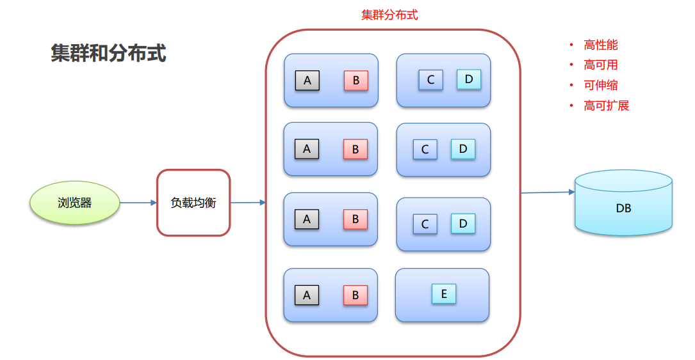
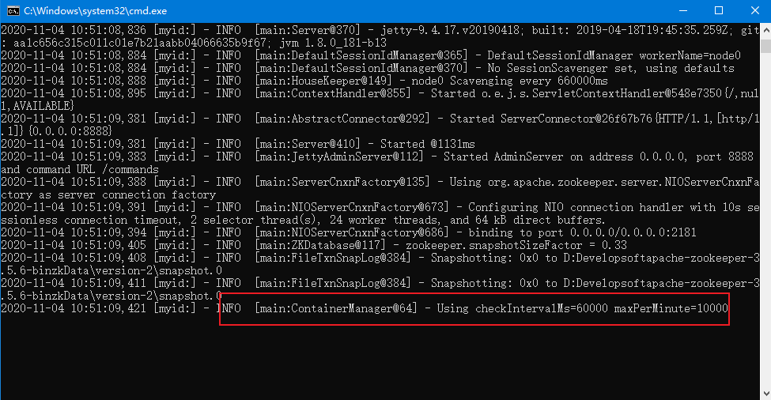
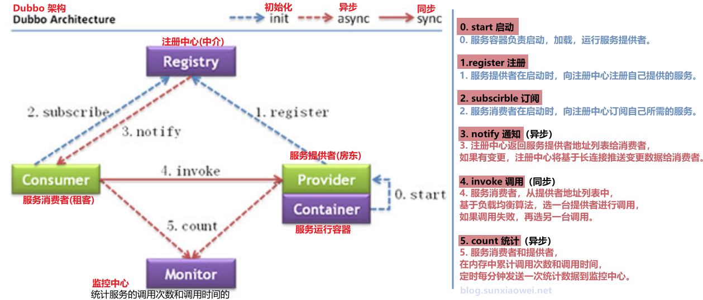
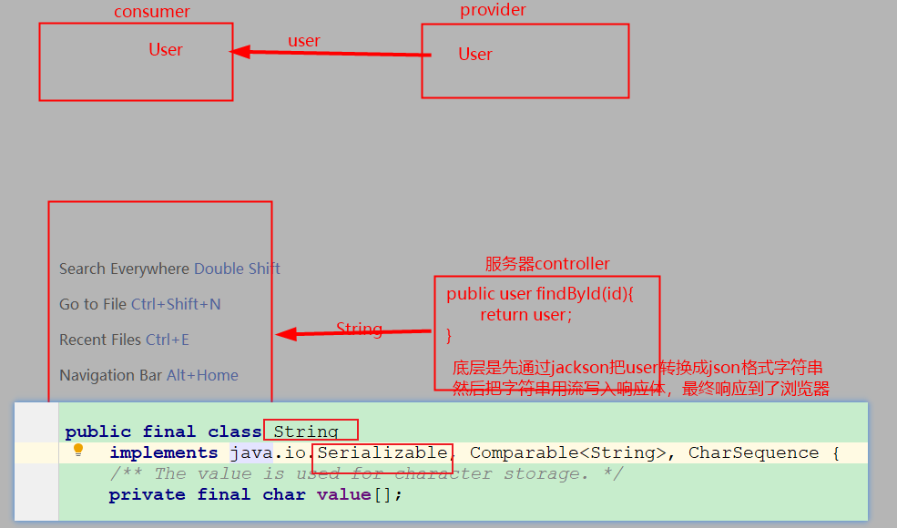

## 今日内容

- [x] 分布式系统中相关概念
- [x] `Dubbo`简单概述
- [x] `Dubbo`快速入门
- [ ] `Dubbo`高级特性


- [ ] 演变过程图片
- [ ] 序列化图示
- [ ] 


## 1. 分布式系统中相关概念

### 1.1 互联网项目特点及目标

**互联网项目三高目标**：高并发、高可用、高可拓展

**其他**：`可伸缩`、`安全性`、`敏捷性`




### 1.2 集群&分布式

**`集群`**：很多人一起干，干一样的事。`一个业务模块，部署在多个服务器上。`是一个横向概念。

**`分布式`**：很多人一起干，干不一样的事。这些不一样的事，合起来是一件大事。

`一个大的业务系统，拆分为多个小的业务模块，分别部署在不同的机器上。`是一个纵向的概念。


集群和分布式能初步实现互联网项目的三高目标。

- 生活中的分布式和集群




- 开发中的分布式和集群




### 1.3. 软件架构的演进过程


- 单体架构
- SOA
- 微服务


#### 1.3.1 工作中如何选用软件架构

如果要使用并实现微服务的架构，整体的技术成本、人力成本、硬件成本、维护成本都会很高。

- 公司/项目非常小，非常适合使用单体架构
- 中型的公司/项目，可以采用垂直/`SOA`架构
- 大型的公司/项目（25+人维护开发一个项目），考虑微服务系统架构


#### 1.3.2 `Dubbo`&`SpringCloud`

`Dubbo`主要是为了解决`SOA`架构下，服务治理的中间件。

`SpringCloud`主要的应用场景就是在微服务的架构之下。


## 2. `Dubbo`简单概述

### 2.1 概念

`web`、`service`拆分出来分别部署到不同的服务器上，`dubbo`为了解决远程调用时候的各种问题的，底层是基于长连接的方式实现RPC。

`Dubbo`是一个基于`Spring`开发的小项目，可以和Spring无缝整合。


• Dubbo是阿里巴巴公司开源的一个高性能、轻量级的 Java RPC 框架。

• 致力于提供高性能和透明化的 RPC 远程服务调用方案，以及 SOA 服务治理方案。


### 2.2 `Zookeeper`注册中心

#### 2.2.1 简单介绍

[Zookeeper](http://zookeeper.apache.org/) 是 Apache Hadoop 的子项目，是一个树型的目录服务，支持变更推送，适合作为 Dubbo 服务的注册中心，工业强度较高，可用于生产环境，并推荐使用。


#### 2.2.2 安装

`linux`和`windows`使用的是同一个安装包，绿色，解压可用。

1. 解压，存放在开发软件目录（路径中不要用中文、空格等特殊符号）

2. 在`conf`目录，复制`zoo_sample.cfg`为`zoo.cfg`

3. 修改配置文件中如下两点：

   ```properties
   # 数据保存路径，建议在安装目录新建一个数据文件夹，并在此 指定
   dataDir=D:\Develop\soft\apache-zookeeper-3.5.6-bin\zkData
   
   # netty port
   # netty服务的端口，建议修改为非8080端口
   admin.serverPort=8888
   ```

4. 双击bin目录下 `zkServer.cmd`即可启动，出现如下内容即为启动成功。

   


### 2.3 `Dubbo`架构及执行流程





> **面试题**：
>
> 如果项目启动了然后注册中心挂掉了，会影响整个项目的运行吗？
>
> 不会影响已有的正常服务的调用，但是无法发现并调用新的服务。


## 3 `Dubbo`快速入门


### 3.1 分模块编写单体架构项目

分模块开发项目，两个模块中分别包含`web`层和`service`层

`dubbo-service`

`dubbo-web`


#### 3.1.1`dubbo-service`

`pom.xml`

```xml
  <properties>
        <spring.version>5.1.9.RELEASE</spring.version>
    </properties>

    <dependencies>
        <!-- servlet3.0规范的坐标 -->
        <dependency>
            <groupId>javax.servlet</groupId>
            <artifactId>javax.servlet-api</artifactId>
            <version>3.1.0</version>
            <scope>provided</scope>
        </dependency>
        <!--spring的坐标-->
        <dependency>
            <groupId>org.springframework</groupId>
            <artifactId>spring-context</artifactId>
            <version>${spring.version}</version>
        </dependency>
        <!--springmvc的坐标-->
        <dependency>
            <groupId>org.springframework</groupId>
            <artifactId>spring-webmvc</artifactId>
            <version>${spring.version}</version>
        </dependency>

        <!--日志-->
        <dependency>
            <groupId>org.slf4j</groupId>
            <artifactId>slf4j-api</artifactId>
            <version>1.7.21</version>
        </dependency>
        <dependency>
            <groupId>org.slf4j</groupId>
            <artifactId>slf4j-log4j12</artifactId>
            <version>1.7.21</version>
        </dependency>
    </dependencies>
```


`applicationcontext.xml`

```xml
<context:component-scan base-package="com.itheima.service" />
```


日志配置文件`log4j.properties`

```properties
# 略
```


UserServiceImpl及其接口

```java
public interface UserService {
    public String sayHello();
}

@Service
public class UserServiceImpl implements UserService {

    public String sayHello() {
        return "hello dubbo!~";
    }
}
```


#### 3.1.1`dubbo-web`

`pom.xml`

```xml
    <groupId>com.itheima</groupId>
    <artifactId>dubbo-web</artifactId>
    <version>1.0-SNAPSHOT</version>
    <packaging>war</packaging>


    <properties>
        <spring.version>5.1.9.RELEASE</spring.version>
    </properties>

    <dependencies>
        <!-- servlet3.0规范的坐标 -->
        <dependency>
            <groupId>javax.servlet</groupId>
            <artifactId>javax.servlet-api</artifactId>
            <version>3.1.0</version>
            <scope>provided</scope>
        </dependency>
        <!--spring的坐标-->
        <dependency>
            <groupId>org.springframework</groupId>
            <artifactId>spring-context</artifactId>
            <version>${spring.version}</version>
        </dependency>
        <!--springmvc的坐标-->
        <dependency>
            <groupId>org.springframework</groupId>
            <artifactId>spring-webmvc</artifactId>
            <version>${spring.version}</version>
        </dependency>

        <!--日志-->
        <dependency>
            <groupId>org.slf4j</groupId>
            <artifactId>slf4j-api</artifactId>
            <version>1.7.21</version>
        </dependency>
        <dependency>
            <groupId>org.slf4j</groupId>
            <artifactId>slf4j-log4j12</artifactId>
            <version>1.7.21</version>
        </dependency>


        <!--Dubbo的起步依赖，版本2.7之后统一为rg.apache.dubb -->
        <dependency>
            <groupId>org.apache.dubbo</groupId>
            <artifactId>dubbo</artifactId>
            <version>${dubbo.version}</version>
        </dependency>
        <!--ZooKeeper客户端实现 -->
        <dependency>
            <groupId>org.apache.curator</groupId>
            <artifactId>curator-framework</artifactId>
            <version>${zookeeper.version}</version>
        </dependency>
        <!--ZooKeeper客户端实现 -->
        <dependency>
            <groupId>org.apache.curator</groupId>
            <artifactId>curator-recipes</artifactId>
            <version>${zookeeper.version}</version>
        </dependency>


        <!--依赖service模块-->
        <dependency>
            <groupId>com.itheima</groupId>
            <artifactId>dubbo-service</artifactId>
            <version>1.0-SNAPSHOT</version>
        </dependency>

    </dependencies>


    <build>
        <plugins>
            <!--tomcat插件-->
            <plugin>
                <groupId>org.apache.tomcat.maven</groupId>
                <artifactId>tomcat7-maven-plugin</artifactId>
                <version>2.1</version>
                <configuration>
                    <port>8000</port>
                    <path>/</path>
                </configuration>
            </plugin>
        </plugins>
    </build>
```


`springmvc.xml`


`web.xml`


`UserController.java`

```java
@RestController
@RequestMapping("/user")
public class UserController {

    //注入Service
    //@Autowired//本地注入
    private UserService userService;


    @RequestMapping("/sayHello")
    public String sayHello(){
        return userService.sayHello();
    }

}
```


### 3.2 改造`service`成为服务提供者

#### 3.2.1 添加依赖

```xml
<properties>
    <dubbo.version>2.7.4.1</dubbo.version>
    <zookeeper.version>4.0.0</zookeeper.version>
</properties>

<!--Dubbo的起步依赖，版本2.7之后统一为rg.apache.dubbo -->
<dependency>
    <groupId>org.apache.dubbo</groupId>
    <artifactId>dubbo</artifactId>
    <version>${dubbo.version}</version>
</dependency>
<!--ZooKeeper客户端实现 -->
<dependency>
    <groupId>org.apache.curator</groupId>
    <artifactId>curator-framework</artifactId>
    <version>${zookeeper.version}</version>
</dependency>
<!--ZooKeeper客户端实现 -->
<dependency>
    <groupId>org.apache.curator</groupId>
    <artifactId>curator-recipes</artifactId>
    <version>${zookeeper.version}</version>
</dependency>
```


### 3.2.2 修改成web项目

修改`pom`中`packaing`打包方式为`war`，添加`tomcat`插件

```xml
<packaging>war</packaging>

<!--tomcat插件-->
<plugin>
    <groupId>org.apache.tomcat.maven</groupId>
    <artifactId>tomcat7-maven-plugin</artifactId>
    <version>2.1</version>
    <configuration>
       <!-- 端口一定要和web模块的端口不同，避免端口冲突 -->
        <port>9000</port>
        <path>/</path>
    </configuration>
</plugin>
```


### 3.2.3 发布服务

`service`层服务实现类上修改如下（注意`service`注解的包，是`dubbo`的）

```java
import org.apache.dubbo.config.annotation.Service;

@Service//将这个类提供的方法（服务）对外发布。将访问的地址 ip，端口，路径注册到注册中心中
public class UserServiceImpl implements UserService {

    public String sayHello() {
        return "hello dubbo hello!~";
    }
}
```


### 3.2.4 配置dubbo服务相关配置

命名空间可以让`idea`提示引入，但是要注意不要引错。

```xml
<!--<context:component-scan base-package="com.itheima.service" />-->

<!--dubbo的配置-->
<!--1.配置项目的名称,唯一-->
<dubbo:application name="dubbo-service"/>
<!--2.配置注册中心的地址-->
<dubbo:registry address="zookeeper://localhost:2181"/>
<!--3.配置dubbo组件扫描-->
<dubbo:annotation package="com.itheima.service.impl" />
```


### 3.3 改造`web`成为服务消费者

#### 3.3.1 添加依赖

```xml
<properties>
    <dubbo.version>2.7.4.1</dubbo.version>
    <zookeeper.version>4.0.0</zookeeper.version>
</properties>

<!--Dubbo的起步依赖，版本2.7之后统一为rg.apache.dubbo -->
<dependency>
    <groupId>org.apache.dubbo</groupId>
    <artifactId>dubbo</artifactId>
    <version>${dubbo.version}</version>
</dependency>
<!--ZooKeeper客户端实现 -->
<dependency>
    <groupId>org.apache.curator</groupId>
    <artifactId>curator-framework</artifactId>
    <version>${zookeeper.version}</version>
</dependency>
<!--ZooKeeper客户端实现 -->
<dependency>
    <groupId>org.apache.curator</groupId>
    <artifactId>curator-recipes</artifactId>
    <version>${zookeeper.version}</version>
</dependency>
```


#### 3.3.2 添加`service`层接口

解除了`web`模块对本地`service`模块的依赖，`UserController`中还是用到了`UserService`类型的对象。

所以临时解决方案是在当前模块中添加了一个和`service`模块中一样的一个`UserService`接口：

```java
public interface UserService {
    public String sayHello();
}
```


#### 3.3.3 寻找服务

`web`层服务实现类`controller`类上修改如下（注意`@Reference`注解的包，是`dubbo`的）

```java
@RestController
@RequestMapping("/user")
public class UserController {

    //注入Service
    //@Autowired//本地注入

    /*
        1. 从zookeeper注册中心获取userService的访问url
        2. 进行远程调用RPC
        3. 将结果封装为一个代理对象。给变量赋值

     */

    @Reference//远程注入
    private UserService userService;


    @RequestMapping("/sayHello")
    public String sayHello(){
        return userService.sayHello();
    }

}
```


#### 3.3.4 配置dubbo服务相关配置

命名空间可以让`idea`提示引入，但是要注意不要引错。

```xml
<!--原有的组件扫描和注解驱动保持不变-->
<mvc:annotation-driven/>
<context:component-scan base-package="com.itheima.controller"/>

<!--dubbo的配置-->
<!--1.配置项目的名称,唯一-->
<dubbo:application name="dubbo-web" >
    <dubbo:parameter key="qos.port" value="33333"/>
</dubbo:application>
<!--2.配置注册中心的地址-->
<dubbo:registry address="zookeeper://192.168.149.135:2181"/>
<!--3.配置dubbo包扫描-->
<dubbo:annotation package="com.itheima.controller" />
```


#### 3.2.5 QOS服务端口冲突

同一台电脑上启动多个`Dubbo`服务（无论是服务提供者，还是消费者），都会启动一个QOS（`quality of Server`）服务，占用相同端口


### 3.4 抽取共性代码

服务提供者模块和服务消费者模块都使用到了`UserService`，那就抽取到一个单独的模块，并把`UserService`接口在该模块中定义，该模块打包方式是jar（默认值）。

两个模块都引入`接口模块`的依赖，直接使用其中的接口即可。


## 4. `Dubbo-admin`

### 4.1 安装及启动

按照文档安装即可，网络不好的情况下，可以使用安装好的jar包，直接启动，双击`bat`即可启动，使用8080端口访问。


### 4.2 使用

`Dubbo`占用的端口

服务端口：`20880`

`qos`默认端口：`22222`


## 5.  高级特性

### 5.1 序列化

对象想要存储到硬盘持久化保存，或者通过网络在多个项目间传输，需要实现序列化接口（`Serializable`）

```java
/**
 * 注意！！！
 *  将来所有的pojo类都需要实现Serializable接口
 */
public class User implements Serializable {
    private int id;
    private String username;
    private String password;
}
```


服务提供者，添加方法查询到一个`User`对象：

```java
@Service//将这个类提供的方法（服务）对外发布。将访问的地址 ip，端口，路径注册到注册中心中
public class UserServiceImpl implements UserService {

    public User findUserById(int id) {
        //查询User对象
        User user = new User(1,"zhangsan","123");
        return user;
    }
    public String sayHello() {
        return "hello dubbo hello!~";
    }
}
```


服务消费者，添加一个方法，调用服务消费者对象获取查询到的`User`对象

```java
@RestController
@RequestMapping("/user")
public class UserController {

    @Reference//远程注入
    private UserService userService;

    @RequestMapping("/sayHello")
    public String sayHello(){
        return userService.sayHello();
    }

    /**
     * 根据id查询用户信息
     * @param id
     * @return
     */
    @RequestMapping("/find")
    public User find(int id){
        return userService.findUserById(id);
    }
}
```


问题：SpringMVC响应对象到浏览器的时候，User对象为什么不需要序列化？




### 5.2 地址缓存

> **面试题**：
>
> 如果项目启动了然后注册中心挂掉了，会影响整个项目的运行吗？
>
> 不会影响已有的正常服务的调用，但是无法发现并调用新的服务。

原理是什么呢？底层原理就是因为地址缓存。


### 5.3 超时

本质为了降低服务器压力，避免带来非常严重的雪崩问题。

要根据实际情况，设置的尽量短一些；根据业务情况尽量控制在5s内。

0. `consumer`性能消耗完毕之后可能会产生雪崩。因为消费者请求线程不释放（不设超时时间，且`provider`出问题不能给出响应），大量占用。

1. `provider`只要接受一个请求之后，就必须把流程执行完，或者过了超时时间记录一个`warn`级别的错误日志。消费端撤销了请求也不会影响服务端的执行。要定期查看`warn`日志，避免大量错误堆积。
2. `consumer`超时时间尽量在`5s`以内，否则消费端服务器线程压力会很大，具体实现要根据服务端响应的平均时长设置。


注解上通过timeout属性来设置，单位是毫秒，默认值是1000ms。

`retries`        `retry`


### 5.4 重试

当`consumer`的请求超时之后，为了保证`QOS`会重试多次，尽量得到响应数据；默认为`2次`，最多共访问3次。

当`provider`出现阻塞响应慢的时候，重试机制会造成`provider`端请求压力倍增；而且`provider`只要接受一个请求之后，就必须把流程执行完，会造成当前服务器压力倍增，极易造成雪崩。

所以在`dubbo`优化策略中往往会优化设置重试次数为0；

要多关注前台响应情况和后台`provider`的`warn`级别的日志。


### 5.5 多版本管理

**灰度发布**：当`provider`发布新的版本，会让一部分用户先使用新功能，用户反馈没问时，再将所有用户迁移到新功能。

dubbo 中使用version 属性来设置和调用同一个接口的不同版本。

A消费者

```java
public class UserController {
	@Reference(version="1.0")
    private UserService userService;
}
```


B消费者

```
public class UserController {
	@Reference(version="2.0")
    private UserService userService;
}
```


### 5.6 负载均衡

当服务提供者`provider`以集群的方式提供服务时；某个请求到达后，到底要哪个`provider`提供服务，就要根据`负载均衡`策略分配。

配置方式，在消费者远程注入的注解上，通过`loadbalance`属性配置（策略名称在`AbstractLoadBance`的实现类中有定义）：

```java
public class UserController {
	@Refrence(loadbalance="random|roundRobin")
    private UserService userService;
}
```

负载均衡策略共有4个：

1. `random`：默认值，按照权重随机分配。权重默认值为100。但有随机性。

2. `RoundRobin`：按权限轮训，1/2/3/2。按照顺序调用，受权重影响。

3. `LeastActive`：最少活跃调用数，相同活跃数随机。当前负载最低的提供者优先调用。

   某个请求被当前`provider`调用开始前，计数器+1，调用结束后计数器-1。会优先调用当前计数器的值中最小的`provider`为本次请求提供服务。

4. `ConsistentHash`：一直性`hash`，相同参数的请求总是发到同一提供者 user/1  user/1000


### 5.7 集群容错

当请求到达服务提供者`provider`集群时，如果请求超时失败了，如何处理的策略。

1. 默认`failover`，失败重试，根据设定的重试次数重试其他机器，默认两次，每次失败换个机器。但是之前的超时会报错。

   **通常用于读操作，但重试会带来更长延迟。**

2. `Failfast`：快速失败，只发起一次调用，立即报错。通常用于写操作，比如新增记录。
3. `Failsafe`：安全失败，失败时忽略。通常用于写入审计日志等不重要的操作。
4. `Failback`：失败自动回复，后台记录失败请求，定时重发。通常用于必须成功的重要内容，例如消息通知等。
5. `Forking`：并发调用多个服务，只要一个成功即返回。通常用于实时性要求较高的读操作，但需要浪费更多服务资源。可通过 `forks="2"` 来设置最大并行数。
6. `Broadcast`：广播调用所有提供者，逐个调用，任意一台报错则报错。通常用于通知所有提供者更新缓存或日志等本地资源信息。

在服务消费者注入提供者的地方`@Reference(cluster="failover")`。

找到`Cluster`接口，实现类中有每个方案的名字。


```java
public class UserController {
    @Reference(cluster = "failover")//远程注入
    private UserService userService;
}
```


### 5.8 服务降级

可以通过服务降级功能临时屏蔽某个出错的非关键服务。


`mock="force:return null"`：消费方对该服务的调用直接返回`null`，即不发起远程调用。用来屏蔽不重要服务不可用时对调用方的影响。

`mock="fail:return null"`：表示消费方对该服务的方法调用在失败后，再返回 null 值，不抛异常。用来容忍不重要服务不稳定时对调用方的影响。


在远程注入注解上添加属性实现

```java
public class UserController {
    @Reference(mock="force:return null")//远程注入
    private UserService userService;
}
```

